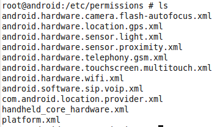
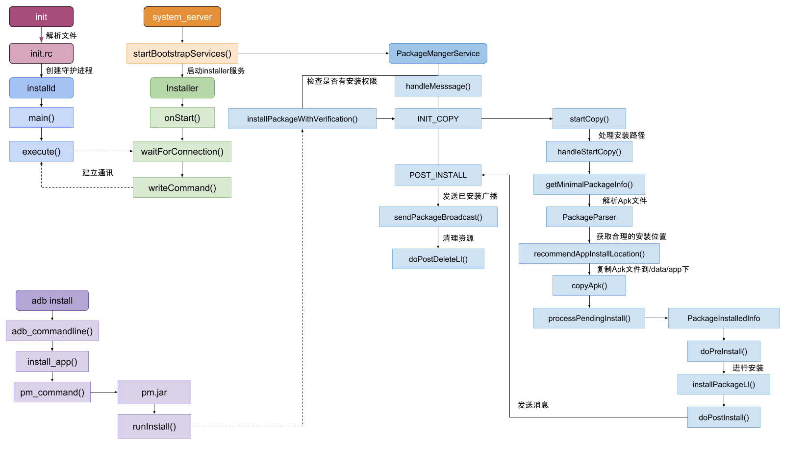
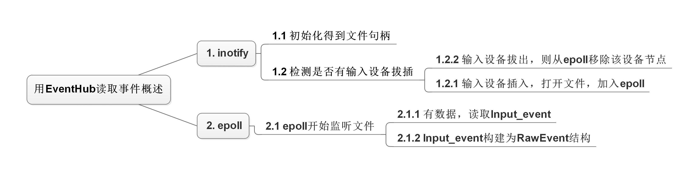

[]()


# Android启动模式

##### recovery升级模式：启动recovery分区内核和文件系统

##### 正常启动模式:引导内核和启动Android系统


# Android启动流程


Android 系统启动流程：

第一步：手机开机后，引导芯片启动，引导芯片开始从固化在ROM里的预设代码执行，加载引导程序到到RAM，bootloader检查RAM，初始化硬件参数等功能；
第二步：硬件等参数初始化完成后，进入到Kernel层，Kernel层主要加载一些硬件设备驱动，初始化进程管理等操作。在Kernel中首先启动swapper进程（pid=0），用于初始化进程管理、内管管理、加载Driver等操作，再启动kthread进程(pid=2),这些linux系统的内核进程，kthread是所有内核进程的鼻祖；
第三步：Kernel层加载完毕后，硬件设备驱动与HAL层进行交互。初始化进程管理等操作会启动INIT进程 ，这些在Native层中；
第四步：init进程(pid=1，init进程是所有进程的鼻祖，第一个启动)启动后，会启动adbd，logd等用户守护进程，并且会启动servicemanager(binder服务管家)等重要服务，同时孵化出zygote进程，这里属于C++ Framework，代码为C++程序；
第五步：zygote进程是由init进程解析init.rc文件后fork生成，它会加载虚拟机，启动System Server(zygote孵化的第一个进程)；System Server负责启动和管理整个Java Framework，包含ActivityManager，WindowManager，PackageManager，PowerManager等服务；
第六步：zygote同时会启动相关的APP进程，它启动的第一个APP进程为Launcher，然后启动Email，SMS等进程，所有的APP进程都有zygote fork生成。

# 引导阶段LOADER

当通电后，引导芯片开始从固化在ROM里的预设代码执行，加载BootLoader(uboot)到RAM,初始化硬件设备，把内核映像读入RAM，设置内核启动参数，为最终调用系统内核做好环境。

其实Bootloader主要的必须的作用只有一个：就是把操作系统映像文件拷贝到RAM中去，然后跳转到它的入口处去执行，我们称之为启动加载模式，该过程没有用户的介入，是它正常工作的模式。它的步骤如下：

Stage1:

1. **硬件设备初始化**。为stage2的执行及随后内核的执行准备好基本的硬件环境
2. 为加载stage2 准备ram空间。为了获得更好的执行速度，通常吧stage2加载到ram中执行
3. 复制stage2的代码到ram中
4. 设置好堆栈
5. 跳转到stage2的c程序入口

Stage2：（**本阶段使用到的硬件设备如网卡、nand、USB等硬件设备的初始化、检测系统内存映射以确定内存大小以及地址空间、将内核映像和根文件系统映像从flash中读到RAM中间中、为内核设置启动参数、执行内核**）。

https://blog.csdn.net/lzj_linux188/article/details/102556489?utm_medium=distribute.pc_relevant.none-task-blog-2~default~baidujs_baidulandingword~default-5-102556489-blog-108553858.pc_relevant_multi_platform_whitelistv1&spm=1001.2101.3001.4242.4&utm_relevant_index=8

1. 初始化本阶段要使用的硬件设备
2. 检测系统内存映射
3. 将内核映像和根文件系统映像从flash读到ram中
4. 为内核设置启动参数
5. 调用内核

# Kernel阶段

https://blog.csdn.net/marshal_zsx/article/details/80225854

通常，内核映像以压缩形式存储，并不是一个可以执行的内核。因此，内核阶段的首要工作是自解压内核映像。

在`kernel_init`线程函数中会调用`kernel_init_freeable（）`函数，在`kernel_init_freeable`函数中将调用`prepare_namespace（）`函数[挂载](https://so.csdn.net/so/search?q=挂载&spm=1001.2101.3001.7020)指定的根文件系统。(https://blog.csdn.net/marshal_zsx/article/details/80230123?ops_request_misc=%257B%2522request%255Fid%2522%253A%2522165933787116782425114455%2522%252C%2522scm%2522%253A%252220140713.130102334.pc%255Fblog.%2522%257D&request_id=165933787116782425114455&biz_id=0&utm_medium=distribute.pc_search_result.none-task-blog-2~blog~first_rank_ecpm_v1~rank_v31_ecpm-7-80230123-null-null.nonecase&utm_term=Android%208.0&spm=1018.2226.3001.4450)

#### 初始化进程管理、内存管理、加载驱动(DIsplay、Camera、Binder)，启动init进程和kthreadd进程。


。

```
static noinline void __init_refok rest_init(void)
{
    int pid;

    //启动RCU机制，这个与后面的rcu_read_lock和rcu_read_unlock是配套的，用于多核同步 
    rcu_scheduler_starting();
    smpboot_thread_init();
    /*
     * We need to spawn init first so that it obtains pid 1, however
     * the init task will end up wanting to create kthreads, which, if
     * we schedule it before we create kthreadd, will OOPS.
     */

    /* 函数名既可以表示函数，也可以表示函数指针；kernel_init却作为参数传递了过去，其实传递过去的是一个函数指针
     * 用kernel_thread方式创建init进程
     * CLONE_FS 子进程与父进程共享相同的文件系统，包括root、当前目录、umask，CLONE_SIGHAND  子进程与父进程共享相同的信号处理（signal handler）表
     */
    kernel_thread(kernel_init, NULL, CLONE_FS);
    // 设定NUMA系统的默认内存访问策略
    numa_default_policy();
    //用kernel_thread方式创建kthreadd进程，CLONE_FILES 子进程与父进程共享相同的文件描述符（file descriptor）表
    pid = kernel_thread(kthreadd, NULL, CLONE_FS | CLONE_FILES);
    //打开RCU读取锁，在此期间无法进行进程切换
    rcu_read_lock();
    // 获取kthreadd的进程描述符，期间需要检索进程pid的使用链表，所以要加锁
    kthreadd_task = find_task_by_pid_ns(pid, &init_pid_ns);
    //关闭RCU读取锁
    rcu_read_unlock();
    // complete和wait_for_completion是配套的同步机制，跟java的notify和wait差不多，
    // 之前kernel_init函数调用了wait_for_completion(&kthreadd_done)，这里调用complete就是通知kernel_init进程kthreadd进程已创建完成，可以继续执行
    complete(&kthreadd_done);

    /*
     * The boot idle thread must execute schedule()
     * at least once to get things moving:
     */
     //current表示当前进程，当前0号进程init_task设置为idle进程
    init_idle_bootup_task(current);
    //0号进程主动请求调度，让出cpu，1号进程kernel_init将会运行,并且禁止抢占
    schedule_preempt_disabled();
    /* Call into cpu_idle with preempt disabled */
    // 这个函数会调用cpu_idle_loop()使得idle进程进入自己的事件处理循环
    cpu_startup_entry(CPUHP_ONLINE);
}
```


```
do_basic_setup()函数：主要通过核心函数do_initcalls()调用所有编译内核的驱动模块中的初始化函数。完成外设及其驱动程序的加载和初始化 ；

挂载根文件系统[perpare_namespace函数]

最后调用init_post()函数启动用户空间的init进程。
```


启动idle进程（pid=0），这是系统初始化过程kernel创建的第一个进程，用于初始化进程管理、内存管理、加载Display、Camera、Binder等驱动相关工作。
启动kthreadd进程，这是Linux系统的内核进程，会创建内核工作线程kworkder、软中断线程ksoftirqd和thermal等内核守护进程。kthreadd是所有内核进程的鼻祖。
kernel开始启动时，设置缓存、被保护存储器、计划列表，加载驱动。
当kernel完成系统设置，它首先在系统文件中寻找”init”文件，然后启动root进程或者系统的第一个进程。

https://blog.csdn.net/marshal_zsx/article/details/80230123


#  init进程

nit进程被赋予了很多重要工作，init进程启动主要分为两个阶段：

### 第一个阶段完成以下内容：

ueventd/watchdogd跳转及环境变量设置  ueventd主要是负责设备节点的创建、权限设定等一些列工作  watchdogd俗称看门狗，用于系统出问题时重启系统

创建文件系统目录并挂载相关分区 屏蔽标准输入输出
初始化日志输出
启用SELinux安全策略
开始第二阶段前的准备

### 第二个阶段完成以下内容：

初始化属性服务
执行SELinux第二阶段并恢复一些文件安全上下文
新建epoll并初始化子进程终止信号处理函数
默认属性导入并开启属性服务

解析init.rc文件

#### 用户级别的第一个进程init(system/core/init/Init.c)

https://blog.csdn.net/skykingf/article/details/71171068

```
int main(int argc, char **argv)
{

    //如果参数中传入ueventd，执行ueventd_main
    if (!strcmp(basename(argv[0]), "ueventd"))
        return ueventd_main(argc, argv);
        
    if (!strcmp(basename(argv[0]), "watchdogd"))
        return watchdogd_main(argc, argv);
     
    bool is_first_stage = (getenv("INIT_SECOND_STAGE") == nullptr);
    //第一阶段
    if (is_first_stage) {
        boot_clock::time_point start_time = boot_clock::now();

        // Clear the umask.
        umask(0);

        clearenv();
        setenv("PATH", _PATH_DEFPATH, 1);
        //在initramdisk中获得需要的基本文件系统设置
        //让rc文件解决剩下的问题
        /* 创建基本文件系统目录并挂载相关的文件系统。Android分别挂载了tmpfs、devpts、proc、sysfs这四类文件系统，这几种文件系统的参考文档位于/kernel/common/Documentation/filesystems目录下*
        mount("tmpfs", "/dev", "tmpfs", MS_NOSUID, "mode=0755");
        mkdir("/dev/pts", 0755);
        mkdir("/dev/socket", 0755);
        mount("devpts", "/dev/pts", "devpts", 0, NULL);
        #define MAKE_STR(x) __STRING(x)
        mount("proc", "/proc", "proc", 0, "hidepid=2,gid=" MAKE_STR(AID_READPROC));
        // 不要将原始命令行暴露给非特权进程
        chmod("/proc/cmdline", 0440);
        gid_t groups[] = { AID_READPROC };
        setgroups(arraysize(groups), groups);
        mount("sysfs", "/sys", "sysfs", 0, NULL);
        mount("selinuxfs", "/sys/fs/selinux", "selinuxfs", 0, NULL);

        mknod("/dev/kmsg", S_IFCHR | 0600, makedev(1, 11));

        if constexpr (WORLD_WRITABLE_KMSG) {
            mknod("/dev/kmsg_debug", S_IFCHR | 0622, makedev(1, 11));
        }

        mknod("/dev/random", S_IFCHR | 0666, makedev(1, 8));
        mknod("/dev/urandom", S_IFCHR | 0666, makedev(1, 9));

       mount("tmpfs","/mnt","tmpfs",MS_NOEXEC | MS_NOSUID |MS_NODEV,"mode=0755,uid=0,gid=1000");
       mmkdir("/mnt/vendor",0755);
		//...省略
    }
    // 初始化的第二阶段
    InitKernelLogging(argv);
    LOG(INFO) << "init second stage started!";

    //设置所有进程都可以访问的会话密钥。它会保存FBE加密密钥之类的东西。任何进程都不应覆盖其会话密钥
    keyctl_get_keyring_ID(KEY_SPEC_SESSION_KEYRING, 1);

    // Indicate that booting is in progress to background fw loaders, etc.
    close(open("/dev/.booting", O_WRONLY | O_CREAT | O_CLOEXEC, 0000));
    //初始化属性服务
    property_init();

    // 如果参数同时在命令行和DT中传递，DT中设置的属性总是优先于命令行属性。
    process_kernel_dt();
    process_kernel_cmdline();

    //将内核变量传到内部变量由init使用，以及当前所需的属性
    export_kernel_boot_props();

    // Make the time that init started available for bootstat to log.
    property_set("ro.boottime.init", getenv("INIT_STARTED_AT"));
    property_set("ro.boottime.init.selinux", getenv("INIT_SELINUX_TOOK"));

    // Set libavb version for Framework-only OTA match in Treble build.
    const char* avb_version = getenv("INIT_AVB_VERSION");
    if (avb_version) property_set("ro.boot.avb_version", avb_version);

    // 清空设置的环境变量
    unsetenv("INIT_SECOND_STAGE");
    unsetenv("INIT_STARTED_AT");
    unsetenv("INIT_SELINUX_TOOK");
    unsetenv("INIT_AVB_VERSION");

    // 设置第二阶段的selinux
    SelinuxSetupKernelLogging();
    SelabelInitialize();
    SelinuxRestoreContext();
    // 创建epoll句柄
    epoll_fd = epoll_create1(EPOLL_CLOEXEC);
    if (epoll_fd == -1) {
        PLOG(FATAL) << "epoll_create1 failed";
    }
    //设置子进程处理函数
    sigchld_handler_init();

    if (!IsRebootCapable()) {
        // If init does not have the CAP_SYS_BOOT capability, it is running in a container.
        // In that case, receiving SIGTERM will cause the system to shut down.
        InstallSigtermHandler();
    }

    property_load_boot_defaults();
    export_oem_lock_status();
    //启动属性服务
    start_property_service();
    set_usb_controller();

    const BuiltinFunctionMap function_map;
    Action::set_function_map(&function_map);

    subcontexts = InitializeSubcontexts();

    ActionManager& am = ActionManager::GetInstance();
    ServiceList& sm = ServiceList::GetInstance();
    //加载解析init.rc
    LoadBootScripts(am, sm);
    //...省略

    return 0;
}


Parser CreateParser(ActionManager& action_manager, ServiceList& service_list) {
    Parser parser;

    parser.AddSectionParser("service", std::make_unique<ServiceParser>(&service_list, subcontexts));
    parser.AddSectionParser("on", std::make_unique<ActionParser>(&action_manager, subcontexts));
    parser.AddSectionParser("import", std::make_unique<ImportParser>(&parser));

    return parser;
}

static void LoadBootScripts(ActionManager& action_manager, ServiceList& service_list) {
    Parser parser = CreateParser(action_manager, service_list);

    std::string bootscript = GetProperty("ro.boot.init_rc", "");
    if (bootscript.empty()) {
        parser.ParseConfig("/init.rc");
        if (!parser.ParseConfig("/system/etc/init")) {
            late_import_paths.emplace_back("/system/etc/init");
        }
        if (!parser.ParseConfig("/product/etc/init")) {
            late_import_paths.emplace_back("/product/etc/init");
        }
        if (!parser.ParseConfig("/odm/etc/init")) {
            late_import_paths.emplace_back("/odm/etc/init");
        }
        if (!parser.ParseConfig("/vendor/etc/init")) {
            late_import_paths.emplace_back("/vendor/etc/init");
        }
    } else {
        parser.ParseConfig(bootscript);
    }
}
```


```

void property_init() {
    if (__system_property_area_init()) {
        ERROR("Failed to initialize property area\n");
        exit(1);
    }
}

//__system_property_area_init函数用来初始化属性内存区域。接下来查看start_property_service函数的具体代码

void start_property_service() {
    property_set_fd = create_socket(PROP_SERVICE_NAME, SOCK_STREAM | SOCK_CLOEXEC | SOCK_NONBLOCK,
                                    0666, 0, 0, NULL);//1
    if (property_set_fd == -1) {
        ERROR("start_property_service socket creation failed: %s\n", strerror(errno));
        exit(1);
    }
    listen(property_set_fd, 8);//2
    register_epoll_handler(property_set_fd, handle_property_set_fd);//3
}
注释1处用来创建非阻塞的socket。注释2处调用listen函数对property_set_fd进行监听，这样创建的socket就成为了server，也就是属性服务；listen函数的第二个参数设置8意味着属性服务最多可以同时为8个试图设置属性的用户提供服务。注释3处的代码将property_set_fd放入了epoll句柄中，用epoll来监听property_set_fd：当property_set_fd中有数据到来时，init进程将用handle_property_set_fd函数进行处理。
在linux新的内核中，epoll用来替换select，epoll最大的好处在于它不会随着监听fd数目的增长而降低效率。因为内核中的select实现是采用轮询来处理的，轮询的fd数目越多，自然耗时越多。

** 属性服务处理请求**
从上文我们得知，属性服务接收到客户端的请求时，会调用handle_property_set_fd函数进行处理：

static void handle_property_set_fd()
{  
...
 
        if(memcmp(msg.name,"ctl.",4) == 0) {
            close(s);
            if (check_control_mac_perms(msg.value, source_ctx, &cr)) {
                handle_control_message((char*) msg.name + 4, (char*) msg.value);
            } else {
                ERROR("sys_prop: Unable to %s service ctl [%s] uid:%d gid:%d pid:%d\n",
                        msg.name + 4, msg.value, cr.uid, cr.gid, cr.pid);
            }
        } else {
            //检查客户端进程权限
            if (check_mac_perms(msg.name, source_ctx, &cr)) {//1
                property_set((char*) msg.name, (char*) msg.value);//2
            } else {
                ERROR("sys_prop: permission denied uid:%d  name:%s\n",
                      cr.uid, msg.name);
            }
            close(s);
        }
        freecon(source_ctx);
        break;
    default:
        close(s);
        break;
    }
}
注释1处的代码用来检查客户端进程权限，在注释2处则调用property_set函数对属性进行修改，代码如下所示。

int property_set(const char* name, const char* value) {
    int rc = property_set_impl(name, value);
    if (rc == -1) {
        ERROR("property_set(\"%s\", \"%s\") failed\n", name, value);
    }
    return rc;
}
property_set函数主要调用了property_set_impl函数：
static int property_set_impl(const char* name, const char* value) {
    size_t namelen = strlen(name);
    size_t valuelen = strlen(value);
    if (!is_legal_property_name(name, namelen)) return -1;
    if (valuelen >= PROP_VALUE_MAX) return -1;
    if (strcmp("selinux.reload_policy", name) == 0 && strcmp("1", value) == 0) {
        if (selinux_reload_policy() != 0) {
            ERROR("Failed to reload policy\n");
        }
    } else if (strcmp("selinux.restorecon_recursive", name) == 0 && valuelen > 0) {
        if (restorecon_recursive(value) != 0) {
            ERROR("Failed to restorecon_recursive %s\n", value);
        }
    }
    //从属性存储空间查找该属性
    prop_info* pi = (prop_info*) __system_property_find(name);
    //如果属性存在
    if(pi != 0) {
       //如果属性以"ro."开头，则表示是只读，不能修改，直接返回
        if(!strncmp(name, "ro.", 3)) return -1;
       //更新属性值
        __system_property_update(pi, value, valuelen);
    } else {
       //如果属性不存在则添加该属性
        int rc = __system_property_add(name, namelen, value, valuelen);
        if (rc < 0) {
            return rc;
        }
    }
    /* If name starts with "net." treat as a DNS property. */
    if (strncmp("net.", name, strlen("net.")) == 0)  {
        if (strcmp("net.change", name) == 0) {
            return 0;
        }
      //以net.开头的属性名称更新后，需要将属性名称写入net.change中  
        property_set("net.change", name);
    } else if (persistent_properties_loaded &&
            strncmp("persist.", name, strlen("persist.")) == 0) {
        /*
         * Don't write properties to disk until after we have read all default properties
         * to prevent them from being overwritten by default values.
         */
        write_persistent_property(name, value);
    }
    property_changed(name, value);
    return 0;
}
```


```
handle_signal（） ，从fd中读出字符，然后进入wait_for_one_process（） 检查是否有必要重启这些关掉的进程，他会使用waitpid 取出所有关闭的最后一个子进程pid，然后用service_find_by_pid（） 找到对应的service对象，有设置SVC_ONESHOT的将pid所在进程组杀掉，然后进行清理unlink socket，去除SVC_RUNNING 标志等操作，对符合重启要求的，如设置为SVC_DISABLED | SVC_RESET 的不自动重启，对SVC_CRITICAL的在4分钟内崩溃4次以上的直接重启系统到recover模式，最后剩下的满足重启条件的，给设置上 SVC_RESTARING 标志。然后执行该service的每一条command，最后调用notify_service_state（） 通知属性服务添加一条属性如 init.svc.servername, value为restarting 的属性后退出。（什么时候启动这个restaring的服务呢？在这个死循环的restart_processes()中，也就是下一轮循环）

　　　

handle_property_set_fd()，当有握手的server socket可读时，用accept获取client socket 的fd，然后通过getsocketopt（） 获取对方的ucred，包括pid，uid，gid，然后通过recv 一个prop_msg 结构的消息，根据prop_msg.cmd == PROP_MSG_SETPROP时，获取msg.name作为属性名.

若是ctl.开头的非持久化控制命令，则判断对方权限，允许SYSTEM,ROOT操作,或服务为dumpstate 或ril-daemon时，要额外匹配UID和GID，然后根据操作要求调用对应服务的service_start/stop（）

另外一种是非控制命令,先检查权限，若name开头是ro.则掠过这3个字符，然后根据name的前缀查表property_perms匹配，比对 UID,GID是否符合权限，如果符合权限就通过property_set（）来设置属性。


```


#### signal_handler_init


```
void sigchld_handler_init() {
    int s[2];
  //利用socketpair创建出已经连接的两个socket，分别作为信号的读、写端
    if (socketpair(AF_UNIX, SOCK_STREAM | SOCK_NONBLOCK | SOCK_CLOEXEC, 0, s) == -1) {
        exit(1);
    }
    signal_write_fd = s[0];
    signal_read_fd = s[1];
    //当捕获信号SIGCHLD，则写入signal_write_fd
    struct sigaction act;
    memset(&act, 0, sizeof(act));
    //设置信号处理函数句柄,当有信号产生时,会向上面创建的socket写入数据,epoll监控到该socket对中的fd可读时,就会调用注册的函数去处理该事件
    act.sa_handler = SIGCHLD_handler;
    //SA_NOCLDSTOP使init进程只有在其子进程终止时才会受到SIGCHLD信号
    act.sa_flags = SA_NOCLDSTOP;
    //初始化SIGCHLD信号处理方式
    sigaction(SIGCHLD, &act, 0);
    //处理这之前退出的子进程
    reap_any_outstanding_children(); 
     //注册epoll处理函数handle_signal
    register_epoll_handler(signal_read_fd, handle_signal);  
}
我们通过sigaction()函数来初始化信号。在act参数中，指定了信号处理函数：SIGCHLD_handler()；如果有信号到来，就会调用该函数处理；同时，在参数act中，我们还设置了SA_NOCLDSTOP标志，表示只有当子进程终止时才接受SIGCHLD信号。

ReapAnyOutstandingChildren();函数中，会调用waitpid(-1, &status, WNOHANG)来获取退出的子进程id以便后续处理。

这里有两个重要的函数：SIGCHLD_handler和handle_signal，如下：
//写入数据
static void SIGCHLD_handler(int) {
    //向signal_write_fd写入1，直到成功为止
    if (TEMP_FAILURE_RETRY(write(signal_write_fd, "1", 1)) == -1) {
        ERROR("write(signal_write_fd) failed: %s\n", strerror(errno));
    }
}

//读取数据
static void handle_signal() {
    char buf[32];
    //读取signal_read_fd数据，放入buf
    read(signal_read_fd, buf, sizeof(buf));
    reap_any_outstanding_children(); 
}


static void reap_any_outstanding_children() {
    while (wait_for_one_process()) { }
}

static bool wait_for_one_process() {
    int status;
    //等待任意子进程，如果子进程没有退出则返回0，否则则返回该子进程pid。
    pid_t pid = TEMP_FAILURE_RETRY(waitpid(-1, &status, WNOHANG));
    if (pid == 0) {
        return false;
    } else if (pid == -1) {
        ERROR("waitpid failed: %s\n", strerror(errno));
        return false;
    }
    service* svc = service_find_by_pid(pid); //根据pid查找到相应的service
    std::string name;

    if (!svc) {
        return true;
    }

    //当flags为RESTART，且不是ONESHOT时，先kill进程组内所有的子进程或子线程
    if (!(svc->flags & SVC_ONESHOT) || (svc->flags & SVC_RESTART)) {
        kill(-pid, SIGKILL);
    }

    //移除当前服务svc中的所有创建过的socket
    for (socketinfo* si = svc->sockets; si; si = si->next) {
        char tmp[128];
        snprintf(tmp, sizeof(tmp), ANDROID_SOCKET_DIR"/%s", si->name);
        unlink(tmp);
    }

    //当flags为EXEC时，释放相应的服务
    if (svc->flags & SVC_EXEC) {
        waiting_for_exec = false;
        list_remove(&svc->slist);
        free(svc->name);
        free(svc);
        return true;
    }
    svc->pid = 0;
    svc->flags &= (~SVC_RUNNING);

    //对于ONESHOT服务，使其进入disabled状态
    if ((svc->flags & SVC_ONESHOT) && !(svc->flags & SVC_RESTART)) {
        svc->flags |= SVC_DISABLED;
    }
    //禁用和重置的服务，都不再自动重启
    if (svc->flags & (SVC_DISABLED | SVC_RESET))  {
        svc->NotifyStateChange("stopped"); //设置相应的service状态为stopped
        return true;
    }

    //服务在4分钟内重启次数超过4次，则重启手机进入recovery模式
    time_t now = gettime();
    if ((svc->flags & SVC_CRITICAL) && !(svc->flags & SVC_RESTART)) {
        if (svc->time_crashed + CRITICAL_CRASH_WINDOW >= now) {
            if (++svc->nr_crashed > CRITICAL_CRASH_THRESHOLD) {
                android_reboot(ANDROID_RB_RESTART2, 0, "recovery");
                return true;
            }
        } else {
            svc->time_crashed = now;
            svc->nr_crashed = 1;
        }
    }
    svc->flags &= (~SVC_RESTART);
    svc->flags |= SVC_RESTARTING;

    //执行当前service中所有onrestart命令
    struct listnode* node;
    list_for_each(node, &svc->onrestart.commands) {
        command* cmd = node_to_item(node, struct command, clist);
        cmd->func(cmd->nargs, cmd->args);
    }
    //设置相应的service状态为restarting
    svc->NotifyStateChange("restarting");
    return true;
}
另外：通过getprop | grep init.svc 可查看所有的service运行状态。状态总共分为：running, stopped, restarting

void register_epoll_handler(int fd, void (*fn)()) {
    epoll_event ev;
    ev.events = EPOLLIN; //可读
    ev.data.ptr = reinterpret_cast<void*>(fn);
    //将fd的可读事件加入到epoll_fd的监听队列中
    if (epoll_ctl(epoll_fd, EPOLL_CTL_ADD, fd, &ev) == -1) {
        ERROR("epoll_ctl failed: %s\n", strerror(errno));
    }
}
```


## init.rc启动脚本

#### init.rc语法介绍

一个完整的rc脚本由四种类型的行为声明而成

* Action(动作)
  action其实就是在响应某个事件的过程，当<trigger>描述的事件发生时，将会依次执行事件下面的command，语法如下：

```
on <trigger>    #触发条件
    <command1>  #执行命令1
    <command2>  #执行命令2
    <command3>  #执行命令3
    ...
```

* Commands（命令）
  常见的比如mkdir、chmod、chown、mount等
* Service（服务）
  service其实就是可执行程序，像后面要执行的zygote就是作为service执行的，在特定选项的约束下，会被执行或重启，格式如下

```
service <name> <path> <argument>
    <option>
    <option>
    ...
```

其中name表示服务名，path表示服务所在路径，argument启动参数，option对服务的约束项

* Option（选项）
  对服务的约束，常用有:

| Option                | Description                                                  |
| :-------------------- | :----------------------------------------------------------- |
| class <name>          | 当服务指定了class名，则同一个class的所有服务必须同时启动或停止，默认情况下，class名为default |
| user <username>       | 在服务启动前,将用户切换到<username>，默认情况下都是root      |
| group <groupname> ... | 启动服务前将用户组切换到<groupname>                          |
| socket <name> ...     | 将创建一个名为dev/socket/<name> 的unix domain socket,然后将fd值返回给启动它的进程 |
| onrestart             | 服务重启时执行某些命令                                       |

#### 关键服务的启动

init进程通过解析init.rc文件，会陆续启动其它关键的系统服务进程，而其中比较重要的就是ServiceManager，Zygote，SystemServer

```
311on post-fs
312    # Load properties from
313    #     /system/build.prop,
314    #     /odm/build.prop,
315    #     /vendor/build.prop and
316    #     /factory/factory.prop
317    load_system_props
318    # start essential services
319    start logd
320    start servicemanager
321    start hwservicemanager
322    start vndservicemanager
```


#### service及Action结构体

```
struct service {
 //listnode是一个特殊的结构体，在内核代码中用得非常多，主要用来将结构体链接成一个
  //双向链表。init中有一个全局的service_list，专门用来保存解析配置文件后得到的service。
   struct listnode slist; 
    constchar *name; //service的名字，对应我们这个例子就是”zygote”。
    constchar *classname; //service所属class的名字，默认是”defult”
   unsigned flags;//service的属性
    pid_tpid;    //进程号
    time_ttime_started;   //上一次启动的时间
    time_ttime_crashed;  //上一次死亡的时间
    intnr_crashed;        //死亡次数
     uid_tuid;     //uid,gid相关
    gid_tgid;
    gid_tsupp_gids[NR_SVC_SUPP_GIDS];
    size_tnr_supp_gids;
   /*
有些service需要使用socket，下面这个socketinfo用来描述socket的相关信息。
我们的zygote也使用了socket，配置文件中的内容是socket zygote stream 666。
它表示将创建一个AF_STREAM类型的socket（其实就是TCP socket），该socket的名为“zygote”，
读写权限是666。
   */
structsocketinfo *sockets; 
//service一般运行在单独的一个进程中，envvars用来描述创建这个进程时所需的环境变量信息。
    structsvcenvinfo *envvars; 
   /*
  虽然关键字onrestart标示一个OPTION，可是这个OPTION后面一般跟着COMMAND，
 下面这个action结构体可用来存储command信息，马上就会分析到它。
*/
    struct action onrestart;
   
    //和keychord相关的内容
    int* keycodes;
    int nkeycodes;
    int keychord_id;
    //io优先级设置
    int ioprio_class;
    int ioprio_pri;
    //参数个数
    int nargs;
    //用于存储参数
    char* args[1];
}; 

struct action {
/*
一个action结构体可存放在三个双向链表中，其中alist用于存储所有action，
qlist用于链接那些等待执行的action，tlist用于链接那些待某些条件满足后
就需要执行的action。
*/
    structlistnode alist;
   structlistnode qlist;
    structlistnode tlist;
 
   unsigned hash;
    constchar *name;
   
   //这个OPTION对应的COMMAND链表，以zygote为例，它有三个onrestart option，所以
  //它对应会创建三个command结构体。
    structlistnode commands;
    structcommand *current;
};
```


#### 1:init.c中调用init_parse_config_file("/init.rc")

```
int init_parse_config_file(const char *fn)
{
    char *data;
    data = read_file(fn, 0);//读文件数据
    if (!data) return -1;

    parse_config(fn, data);//解析数据
    DUMP();
    return 0;

}
```

#### 2:parse_config

```
static void parse_config(const char *fn, const std::string& data)
{
    struct listnode import_list;
    struct listnode *node;
    char *args[INIT_PARSER_MAXARGS];

    int nargs = 0;
     
    parse_state state;
    state.filename = fn;
    state.line = 0;
    state.ptr = strdup(data.c_str());  // TODO: fix this code!
    state.nexttoken = 0;
    state.parse_line = parse_line_no_op;
     
    list_init(&import_list);
    state.priv = &import_list;
     
    for (;;) {
        switch (next_token(&state)) { //next_token()根据从state.ptr开始遍历
        case T_EOF: //遍历到文件结尾，然后goto解析import的.rc文件
            state.parse_line(&state, 0, 0);
            goto parser_done;
        case T_NEWLINE: //到了一行结束
            state.line++;
            if (nargs) {
                int kw = lookup_keyword(args[0]); // 找到这一行的关键字
                if (kw_is(kw, SECTION)) { // 如果这是一个section的第一行
                    state.parse_line(&state, 0, 0);
                    parse_new_section(&state, kw, nargs, args);
                } else { //如果这不是一个section的第一行
                    state.parse_line(&state, nargs, args);
                }
                nargs = 0;
            }
            break;
        case T_TEXT: // 遇到普通字符
            if (nargs < INIT_PARSER_MAXARGS) {
                args[nargs++] = state.text;
            }
            break;
        }
    }

parser_done:
    list_for_each(node, &import_list) {
         struct import *import = node_to_item(node, struct import, list);
         int ret;

         ret = init_parse_config_file(import->filename);
         if (ret)
             ERROR("could not import file '%s' from '%s'\n",
                   import->filename, fn);
    }


```

#### 3.next_token

```
int next_token(  struct parse_state *state)
{
    char *x = state->ptr;
    char *s;
                                                                     
    if (state->nexttoken) {
      int t = state->nexttoken;
      state->nexttoken = 0;
      return t;
    }
    /* 在这里开始一个字符一个字符地分析 */
    for (;;) {
      switch (*x) {
      case 0:
        state->ptr = x;
        return T_EOF;
      case '\n'  :
        x++;
        state->ptr = x;
        return T_NEWLINE;
      case ' '  :
      case '\t'  :
      case '\r'  :
        x++;
        continue  ;
      case '#'  :
        while (*x && (*x !=   '\n'  )) x++;
        if (*x ==   '\n'  ) {
          state->ptr = x+1;
          return T_NEWLINE;
        }   else {
          state->ptr = x;
          return T_EOF;
        }
      default  :
        goto text;
      }
    }
                                                                     
textdone:
    state->ptr = x;
    *s = 0;
    return T_TEXT;
text:
    state->text = s = x;
textresume:
    for (;;) {
      switch (*x) {
      case 0:
        goto textdone;
      case ' '  :
      case '\t'  :
      case '\r'  :
        x++;
        goto textdone;
      case '\n'  :
        state->nexttoken = T_NEWLINE;
        x++;
        goto textdone;
      case '"'  :
        x++;
        for (;;) {
          switch (*x) {
          case 0:
              /* unterminated quoted thing */
            state->ptr = x;
            return T_EOF;
          case '"'  :
            x++;
            goto textresume;
          default  :
            *s++ = *x++;
          }
        }
        break  ;
      case '\\'  :
        x++;
        switch (*x) {
        case 0:
          goto textdone;
        case 'n'  :
          *s++ =   '\n'  ;
          break  ;
        case 'r'  :
          *s++ =   '\r'  ;
          break  ;
        case 't'  :
          *s++ =   '\t'  ;
          break  ;
        case '\\'  :
          *s++ =   '\\'  ;
          break  ;
        case '\r'  :
            /* \ <cr> <lf> -> line continuation */
          if (x[1] !=   '\n'  ) {
            x++;
            continue  ;
          }
        case '\n'  :
            /* \ <lf> -> line continuation */
          state->line++;
          x++;
            /* eat any extra whitespace */
          while  ((*x ==   ' '  ) || (*x ==   '\t'  )) x++;
          continue  ;
        default  :
            /* unknown escape -- just copy */
          *s++ = *x++;
        }
        continue  ;
      default  :
        *s++ = *x++;
      }
    }
    return T_EOF;
}
```

#### 4.parse_new_section

```
static void parse_new_section(struct parse_state *state, int kw,
                       int nargs, char **args)
{
    printf("[ %s %s ]\n", args[0],
           nargs > 1 ? args[1] : "");
    switch(kw) {
    case K_service: //解析service
        state->context = parse_service(state, nargs, args);
        if (state->context) {
            state->parse_line = parse_line_service; //Service 对应的parse_line
            return;
        }
        break;
    case K_on://解析 on 开头的action
        state->context = parse_action(state, nargs, args);
        if (state->context) {
            state->parse_line = parse_line_action; //action 对应的parse_line
            return;
        }
        break;
    case K_import: //解析import
        parse_import(state, nargs, args);
        break;
    }
    state->parse_line = parse_line_no_op;
```

#### 5.parse_service

```
static void *parse_service(struct parse_state*state, int nargs, char **args)
{
    structservice *svc; //声明一个service结构体
    ......
    //init维护了一个全局的service链表，先判断是否已经有同名的service了。
    svc =service_find_by_name(args[1]);
    if(svc) {
       ......  //如果有同名的service，则不能继续后面的操作。
       return 0;
    }
   
   nargs-= 2;
   svc =calloc(1, sizeof(*svc) + sizeof(char*) * nargs);
    ......
   svc->name = args[1];
   svc->classname= "default";//设置classname为”default”，这个很关键！
   memcpy(svc->args, args + 2, sizeof(char*) * nargs);
   svc->args[nargs] = 0;
   svc->nargs = nargs;
   svc->onrestart.name= "onrestart";
 
   list_init(&svc->onrestart.commands);

   list_add_tail(&service_list, &svc->slist);
    returnsvc;
}
```

parse_service函数只是搭建了一个service的架子，具体的内容尚需由后面的解析函数来填充。来看service的另外一个解析函数parse_line_service。

#### 6.parse_line_service

```
static void parse_line_service(structparse_state *state, int nargs,
char **args)
{
    structservice *svc = state->context;
    structcommand *cmd;
    int i,kw, kw_nargs;
    ......
   svc->ioprio_class = IoSchedClass_NONE;
    //其实还是根据关键字来做各种处理。
    kw =lookup_keyword(args[0]);
    switch(kw) {
    caseK_capability:
       break;
    caseK_class:
        if(nargs != 2) {
           ......
        }else {
           svc->classname = args[1];
        }
       break;
    ......
    caseK_oneshot:
   /*
这是service的属性，它一共有五个属性，分别为：
SVC_DISABLED：不随class自动启动。下面将会看到class的作用。
SVC_ONESHOT：退出后不需要重启，也就是这个service只启动一次就可以了。
SVC_RUNNING：正在运行，这是service的状态。
SVC_RESTARTING：等待重启，这也是service的状态。
SVC_CONSOLE：该service需要使用控制台 。
SVC_CRITICAL：如果在规定时间内该service不断重启，则系统会重启并进入恢复模式。
zygote没有使用任何属性，这表明它：会随着class的处理自动启动；
退出后会由init重启；不使用控制台；即使不断重启也不会导致系统进入恢复模式。
       */
       svc->flags |= SVC_ONESHOT;
       break;
    caseK_onrestart: //根据onrestart的内容，填充action结构体的内容
       nargs--;
       args++;
        kw= lookup_keyword(args[0]);
        ......
        //创建command结构体
       cmd = malloc(sizeof(*cmd) + sizeof(char*) * nargs);
       cmd->func = kw_func(kw);
       cmd->nargs = nargs;
       memcpy(cmd->args, args, sizeof(char*) * nargs);
        //把新建的command加入到双向链表中。
       list_add_tail(&svc->onrestart.commands, &cmd->clist);
       break;
    ......
    caseK_socket: { //创建socket相关信息
       struct socketinfo *si;
        ......
        si= calloc(1, sizeof(*si));
        if(!si) {
           parse_error(state, "out of memory\n");
           break;
        }
       si->name = args[1]; //socket的名字
       si->type = args[2]; //socket的类型
       si->perm = strtoul(args[3], 0, 8); //socket的读写权限
        if(nargs > 4)
           si->uid = decode_uid(args[4]);
        if(nargs > 5)
           si->gid = decode_uid(args[5]);
       si->next = svc->sockets;
       svc->sockets = si;
       break;
    }
    ......
   default:
       parse_error(state, "invalid option '%s'\n", args[0]);
    }
}
```

#### 7.execute_one_command

```
void execute_one_command(void)
{
    int ret, i;
    char cmd_str[256] = "";
    /**
      list_tail(&act->commands) == &cmd->clist
      判定是否到达cmd list的结尾，即是否是当前action的最后一个命令
      */
    if (!cur_action || !cur_command || is_last_command(cur_action, cur_command)) {
        /**
	      action_remove_queue_head
	      从action_queue{即qlist}中获取action
	      从原来链表中移除后重新初始化，返回该action
	      */
        cur_action = action_remove_queue_head();//获取当前的action
        cur_command = NULL;
        if (!cur_action)
            return;
        cur_command = get_first_command(cur_action);//获取当前action的第一个command
    } else {
        cur_command = get_next_command(cur_action, cur_command);//获取当前action的next command
    }
    if (!cur_command)
        return;
    //当前的action和command均有效，则执行command的func方法
    ret = cur_command->func(cur_command->nargs, cur_command->args);
    ...//日志处理相关
}

```

#### 8.do_class_start 当class_start <main/core/default> 这条command执行时调用

```
 　　\system\core\init\builtins.c
int do_class_start(int nargs, char **args)
{
/*
args为do_class_start的参数，init.rc中只有一个参数，就是default。
下面这个函数将从service_list中寻找classname为”default”的service，然后
调用service_start_if_not_disabled函数。现在读者明白了service结构体中
classname的作用了吗？
*/
service_for_each_class(args[1],service_start_if_not_disabled);
return 0;
}
```

#### 9.service_for_each_class

```
	/system/core/init/init_parser.cpp
  void service_for_each_class(const char *classname,
                            void (*func)(struct service *svc))
  {
      struct listnode *node;
      struct service *svc;
      list_for_each(node, &service_list) {
          svc = node_to_item(node, struct service, slist);
          if (!strcmp(svc->classname, classname)) {
              func(svc);
          }
      }
  }
```


#### 10.service_start_if_not_disabled

```
\system\core\initparser.c
static void service_start_if_not_disabled(structservice *svc)
{
if (!(svc->flags & SVC_DISABLED)) {
     service_start(svc,NULL); //zygote可没有设置SVC_DISABLED
 }
}
```


#### 11.**restart_processes**

```
//restart_processes->service_for_each_flags(SVC_RESTARTING,restart_service_if_needed)
void service_for_each_flags(unsigned matchflags,void (*func)(struct service *svc))
{
    struct listnode *node;
    struct service *svc;
    list_for_each(node, &service_list) {
        svc = node_to_item(node, struct service, slist);
        if (svc->flags & matchflags) {
			/**
			  这里传递的func是restart_service_if_needed，实现的核心是：
              restart_service_if_needed(svc)->service_start(svc, NULL);//在这里启动service
			  */
            func(svc);
			

        }
    }

}
```

#### 12.service_start

```
void service_start(struct service *svc, const char *dynamic_args)
{    
    ...//变量声明初始化
	...//标志位的处理
    ...//SELinux相关
    pid = fork();//fork进程
    if (pid == 0) {//子进程的处理
        ...//变量声明初始化
		...//属性context初始化
        ...//环境变量初始化
		...//socket创建并将其写入到环境变量
        if (svc->ioprio_class != IoSchedClass_NONE) {
            if (android_set_ioprio(getpid(), svc->ioprio_class, svc->ioprio_pri)) {
                ERROR("Failed to set pid %d ioprio = %d,%d: %s\n",
                      getpid(), svc->ioprio_class, svc->ioprio_pri, strerror(errno));
            }
        }
		...//是否需要控制台，输入输出是否重定向
        setpgid(0, getpid());
		...//设置gid,group,uid,seclabel等
		子进程中调用execve执行svc->args[0]{即对应的service},{如果传递了参数用传递的;如果没有用本身的svc->args}
    }
    if (pid < 0){}...//fork错误处理
    svc->time_started = gettime();
    svc->pid = pid;
    svc->flags |= SVC_RUNNING;
    if (properties_inited())
        //如果属性初始化完毕，则设置"init.svc.{$service_name}" "running"
        notify_service_state(svc->name, "running");
}

```


# ServiceManager进程启动

ServiceManager是Binder机制中非常重要的组成，负责Binder服务在其注册时提供的名称到驱动分配值的解析，看下它在init.rc中的描述

ServiceManager用来管理系统中所有的binder service，不管是本地的c++实现的还是java语言实现的都需要

这个进程来统一管理，最主要的管理就是，注册添加服务，获取服务。所有的Service使用前都必须先在servicemanager中进行注册。

```
　\frameworks\base\cmds\servicemanager\Service_manager.c

　　do_find_service( )

　　do_add_service( )

　　svcmgr_handler( )
```


```
on post-fs
    # Load properties from
    #     /system/build.prop,
    #     /odm/build.prop,
    #     /vendor/build.prop and
    #     /factory/factory.prop
    load_system_props
    # start essential services
    start logd
    //启动servicemanager
    start servicemanager
    start hwservicemanager
    start vndservicemanager
```

这里对应的是`/frameworks/native/cmds/servicemanager/servicemanager.rc`

```
service servicemanager /system/bin/servicemanager
    class core animation
    user system
    group system readproc
    critical
    onrestart restart healthd
    onrestart restart zygote
    onrestart restart audioserver
    onrestart restart media
    onrestart restart surfaceflinger
    onrestart restart inputflinger
    onrestart restart drm
    onrestart restart cameraserver
    onrestart restart keystore
    onrestart restart gatekeeperd
    writepid /dev/cpuset/system-background/tasks
    shutdown critical
```

critical选项说明它是系统的关键进程，表示如果在4分钟内该进程若异常退出超过四次，将重启设备并进入还原模式。当servicemanager每次重启的时候，其它进程zygote，audioserver等也会restart

# Zygote进程启动

由于硬件差异，64位和32位机器中Zygote会区别对待，在import时通过`ro.zygote`属性确认需要加载的zygote.rc脚本
init.rc的源码路径在`/system/core/rootdir/init.rc`下，部分内容如下

```
import /init.environ.rc
import /init.usb.rc
import /init.${ro.hardware}.rc
import /vendor/etc/init/hw/init.${ro.hardware}.rc
import /init.usb.configfs.rc
import /init.${ro.zygote}.rc

on early-init
    # Set init and its forked children's oom_adj.
    write /proc/1/oom_score_adj -1000
    //省略...
```

对应的zygote.rc在同级目录下可以找到：

| Name                |
| :------------------ |
| init.rc             |
| init.zygote32.rc    |
| init.zygote32_64.rc |
| init.zygote64.rc    |
| init.zygote64_32.rc |

这里已64位为例，打开对应的文件init.zygote64.rc

```
service zygote /system/bin/app_process64 -Xzygote /system/bin --zygote --start-system-server
    class main
    priority -20
    user root
    group root readproc reserved_disk
    socket zygote stream 660 root system
    onrestart write /sys/android_power/request_state wake
    onrestart write /sys/power/state on
    onrestart restart audioserver
    onrestart restart cameraserver
    onrestart restart media
    onrestart restart netd
    onrestart restart wificond
    writepid /dev/cpuset/foreground/tasks
```

从上面看出，zygote启动的其实是一个可执行文件`/system/bin/app_process64`，启动时会传入启动参数
`-Xzygote /system/bin --zygote --start-system-server`，同时会创建对应的socket


##### app_process64进程

上面可执行文件的实现其实是在`/frameworks/base/cmds/app_process/app_main.cpp`中，查看同级目录下的Android.mk就可以看出来。接下来看下它的main方法

```
int main(int argc, char* const argv[])
{
    //...
    // Parse runtime arguments.  Stop at first unrecognized option.
    bool zygote = false;
    bool startSystemServer = false;
    bool application = false;
    String8 niceName;
    String8 className;

    ++i;  // Skip unused "parent dir" argument.
    while (i < argc) {
        const char* arg = argv[i++];
        if (strcmp(arg, "--zygote") == 0) {
            zygote = true;
            niceName = ZYGOTE_NICE_NAME;
        } else if (strcmp(arg, "--start-system-server") == 0) {
            startSystemServer = true;
        } else if (strcmp(arg, "--application") == 0) {
            application = true;
        } else if (strncmp(arg, "--nice-name=", 12) == 0) {
            niceName.setTo(arg + 12);
        } else if (strncmp(arg, "--", 2) != 0) {
            className.setTo(arg);
            break;
        } else {
            --i;
            break;
        }
    }
    //...
    if (zygote) {
        runtime.start("com.android.internal.os.ZygoteInit", args, zygote);
    } else if (className) {
        runtime.start("com.android.internal.os.RuntimeInit", args, zygote);
    } else {
        fprintf(stderr, "Error: no class name or --zygote supplied.\n");
        app_usage();
        LOG_ALWAYS_FATAL("app_process: no class name or --zygote supplied.");
    }
}
```

这个代码还是很容易看懂的，首先是解析传入的启动参数，根据`--zygote`参数，来确认执行那个方法，这里有两种情况

* 执行ZygoteInit，也就是去初始化zygote进程
* 执行RuntimeInit，这里其实就是启动普通应用程序

我们现在是初次启动，会走入第一个分支，也就是去执行ZygoteInit，可以看到，这里是通过runtime变量去调用start方法，实际上调用的是其父类AndroidRuntime的start方法

##### AndroidRuntime

对应的源码位置是`/frameworks/base/core/jni/AndroidRuntime.cpp`

```
void AndroidRuntime::start(const char* className, const Vector<String8>& options, bool zygote)
{
    ALOGD(">>>>>> START %s uid %d <<<<<<\n",
            className != NULL ? className : "(unknown)", getuid());

    static const String8 startSystemServer("start-system-server");

    //判断是否是启动systemServer
    for (size_t i = 0; i < options.size(); ++i) {
        if (options[i] == startSystemServer) {
           /* track our progress through the boot sequence */
           const int LOG_BOOT_PROGRESS_START = 3000;
           LOG_EVENT_LONG(LOG_BOOT_PROGRESS_START,  ns2ms(systemTime(SYSTEM_TIME_MONOTONIC)));
        }
    }
    //从环境变量ANDROID_ROOT中读取系统目录
    const char* rootDir = getenv("ANDROID_ROOT");
    if (rootDir == NULL) {
        rootDir = "/system";
        if (!hasDir("/system")) {
            LOG_FATAL("No root directory specified, and /android does not exist.");
            return;
        }
        setenv("ANDROID_ROOT", rootDir, 1);
    }

    //const char* kernelHack = getenv("LD_ASSUME_KERNEL");
    //ALOGD("Found LD_ASSUME_KERNEL='%s'\n", kernelHack);

    /* start the virtual machine */
    JniInvocation jni_invocation;
    //初始化jni接口
    jni_invocation.Init(NULL);
    JNIEnv* env;
    //启动虚拟机
    if (startVm(&mJavaVM, &env, zygote) != 0) {
        return;
    }
    ///模板方法模式,只是为了创建VM之后释放slashClassName资源
    onVmCreated(env);
    //注册Jni函数
    if (startReg(env) < 0) {
        ALOGE("Unable to register all android natives\n");
        return;
    }
    // 6. 准备Java类的main函数的相关参数
   
   jclass stringClass;
    jobjectArray strArray;
    jstring classNameStr;

    stringClass = env->FindClass("java/lang/String");
    assert(stringClass != NULL);
    strArray = env->NewObjectArray(options.size() + 1, stringClass, NULL);
    assert(strArray != NULL);
    classNameStr = env->NewStringUTF(className);
    assert(classNameStr != NULL);
    env->SetObjectArrayElement(strArray, 0, classNameStr);

    for (size_t i = 0; i < options.size(); ++i) {<!-- -->
        jstring optionsStr = env->NewStringUTF(options.itemAt(i).string());
        assert(optionsStr != NULL);
        env->SetObjectArrayElement(strArray, i + 1, optionsStr);
    }
    
    // 7. 调用ZygoteInit类的main方法
    // 转化为全限定名
    char* slashClassName = toSlashClassName(className != NULL ? className : "");
    // 获取类的class对象
    jclass startClass = env->FindClass(slashClassName);
    if (startClass == NULL) {<!-- -->
        ALOGE("JavaVM unable to locate class '%s'\n", slashClassName);
        /* keep going */
    } else {<!-- -->
        jmethodID startMeth = env->GetStaticMethodID(startClass, "main",
            "([Ljava/lang/String;)V");
        if (startMeth == NULL) {<!-- -->
            ALOGE("JavaVM unable to find main() in '%s'\n", className);
            /* keep going */
        } else {<!-- -->
            // 执行main函数
            env->CallStaticVoidMethod(startClass, startMeth, strArray);
    }
    // 此处main函数执行完毕，执行一些结束操作
    free(slashClassName);
    ALOGD("Shutting down VM\n");
    if (mJavaVM->DetachCurrentThread() != JNI_OK)
        ALOGW("Warning: unable to detach main thread\n");
    if (mJavaVM->DestroyJavaVM() != 0)
        ALOGW("Warning: VM did not shut down cleanly\n");
}
```

整体来看，经历了以下几个步骤

* 判断是否启动SystemSever

* 从环境变量ANDROID_ROOT中读取系统目录

* 在main方法中通过runtime.start方法，启动虚拟机，然后通过JNI的方式，调用java 层的ZygoteInit的main方法

  首先，在AndroidRuntime的start函数中，会现在注释1处

  1. 使用startVm函数来启动弄Java虚拟机，
  2. 使用startReg函数为Java虚拟机注册JNI方法。

  解析com.android.internal.os.ZygoteInit字符串，通过jni调用该类的main方法，从native进入java世界

##### Zygoteinit

看一下他的主函数都做了什么操作，源码路径`/frameworks/base/core/java/com/android/internal/os/ZygoteInit.java`

```
    public static void main(String argv[]) {
    	//新建Zygote服务器端
        ZygoteServer zygoteServer = new ZygoteServer();

        // Mark zygote start. This ensures that thread creation will throw
        // an error.
        ZygoteHooks.startZygoteNoThreadCreation();

        // Zygote goes into its own process group.
        try {
            Os.setpgid(0, 0);
        } catch (ErrnoException ex) {
            throw new RuntimeException("Failed to setpgid(0,0)", ex);
        }

        final Runnable caller;
        try {
            // Report Zygote start time to tron unless it is a runtime restart
            //...
            
             boolean startSystemServer = false;
            String socketName = "zygote";
            String abiList = null;
            boolean enableLazyPreload = false;
            for (int i = 1; i < argv.length; i++) {
                if ("start-system-server".equals(argv[i])) {
                    startSystemServer = true;
                } else if ("--enable-lazy-preload".equals(argv[i])) {
                    enableLazyPreload = true;
                } else if (argv[i].startsWith(ABI_LIST_ARG)) {
                    abiList = argv[i].substring(ABI_LIST_ARG.length());
                } else if (argv[i].startsWith(SOCKET_NAME_ARG)) {
                    socketName = argv[i].substring(SOCKET_NAME_ARG.length());
                } else {
                    throw new RuntimeException("Unknown command line argument: " + argv[i]);
                }
            }

            if (abiList == null) {
                throw new RuntimeException("No ABI list supplied.");
            }
            //注册一个Socket
            zygoteServer.registerServerSocketFromEnv(socketName);
            // In some configurations, we avoid preloading resources and classes eagerly.
            // In such cases, we will preload things prior to our first fork.
            // 在有些情况下我们需要在第一个fork之前进行预加载资源
            //判断是否需要预加载
            if (!enableLazyPreload) {
                bootTimingsTraceLog.traceBegin("ZygotePreload");
                EventLog.writeEvent(LOG_BOOT_PROGRESS_PRELOAD_START,
                    SystemClock.uptimeMillis());
                //预加载各种资源类
                preload(bootTimingsTraceLog);
                EventLog.writeEvent(LOG_BOOT_PROGRESS_PRELOAD_END,
                    SystemClock.uptimeMillis());
                bootTimingsTraceLog.traceEnd(); // ZygotePreload
            } else {
                Zygote.resetNicePriority();
            }
            //...
            if (startSystemServer) {
                //启动SystemServer
                Runnable r = forkSystemServer(abiList, socketName, zygoteServer);

                // {@code r == null} in the parent (zygote) process, and {@code r != null} in the
                // child (system_server) process.
                if (r != null) {
                //ZygoteInit分裂产生的SS，其实就是为了调用com.android.server.SystemServer的main函数。
                    r.run();
                    return;
                }
            }
			//zygote调用这个函数，开始监听来自AMS的请求
            caller = zygoteServer.runSelectLoop(abiList);
        } catch (Throwable ex) {
            Log.e(TAG, "System zygote died with exception", ex);
            throw ex;
        } finally {
            zygoteServer.closeServerSocket();
        }
        
        if (caller != null) {
            //8 重点
            caller.run();
        }
       
        
    }
    
    

Runnable runSelectLoop(String abiList) {
        ArrayList<FileDescriptor> fds = new ArrayList<FileDescriptor>();
        ArrayList<ZygoteConnection> peers = new ArrayList<ZygoteConnection>();

        fds.add(mServerSocket.getFileDescriptor());
        peers.add(null);

        while (true) {
            StructPollfd[] pollFds = new StructPollfd[fds.size()];
            for (int i = 0; i < pollFds.length; ++i) {
                pollFds[i] = new StructPollfd();
                pollFds[i].fd = fds.get(i);
                pollFds[i].events = (short) POLLIN;
            }
            try {
                Os.poll(pollFds, -1);
            } catch (ErrnoException ex) {
                throw new RuntimeException("poll failed", ex);
            }
            for (int i = pollFds.length - 1; i >= 0; --i) {
                if ((pollFds[i].revents & POLLIN) == 0) {
                    continue;
                }

                if (i == 0) {
                    ZygoteConnection newPeer = acceptCommandPeer(abiList);
                    // 添加到监听数组 等待消息到来
                    peers.add(newPeer);
                    fds.add(newPeer.getFileDesciptor());
                } else {
                    try {
                        ZygoteConnection connection = peers.get(i);
                        // processOneCommand 方法处理读取的命令 处理完后面会断开链接，并从监听列表中移除
                        final Runnable command = connection.processOneCommand(this);

                        if (mIsForkChild) {
                            // We're in the child. We should always have a command to run at this
                            // stage if processOneCommand hasn't called "exec".
                            if (command == null) {
                                throw new IllegalStateException("command == null");
                            }

                            return command;
                        } else {
                            // We're in the server - we should never have any commands to run.
                            if (command != null) {
                                throw new IllegalStateException("command != null");
                            }

                            // We don't know whether the remote side of the socket was closed or
                            // not until we attempt to read from it from processOneCommand. This shows up as
                            // a regular POLLIN event in our regular processing loop.
                            // 判断是否处理完了事件，处理完则断开链接 移除监听
                            if (connection.isClosedByPeer()) {
                                connection.closeSocket();
                                peers.remove(i);
                                fds.remove(i);
                            }
                        }
                    }
                    // 。。。
            }
        }
    }
ZygoteConnnect 类中的 processOneCommand 负责创建子进程，首先调用args = readArgumentList(); 从 socket 中读入多个参数，参数样式为 “--setuid=1” 行与行之间用 /r /n 分割，读取完成后传入新建的 Arguments 对象 并调用parseArgs(args);解析成参数列表。

解析参数之后还会对参数进行校验和设置。
// 检查用户是否有权利指定进程用户id，组id和所属的组，以及一些安全检查等。
		applyUidSecurityPolicy(parsedArgs, peer);
        applyInvokeWithSecurityPolicy(parsedArgs, peer);

        applyDebuggerSystemProperty(parsedArgs);
        applyInvokeWithSystemProperty(parsedArgs);
上面检测通过后，processOneCommand 会调用下面代码来 fork 子进程
 pid = Zygote.forkAndSpecialize(parsedArgs.uid, parsedArgs.gid, parsedArgs.gids,
                parsedArgs.runtimeFlags, rlimits, parsedArgs.mountExternal, parsedArgs.seInfo,
                parsedArgs.niceName, fdsToClose, fdsToIgnore, parsedArgs.startChildZygote,
                parsedArgs.instructionSet, parsedArgs.appDataDir);
最终会调用 native 层的 nativeForkAndSpecialize() 的函数来完成 fork 操作

native private static int nativeForkAndSpecialize(int uid, int gid, int[] gids,int runtimeFlags,
          int[][] rlimits, int mountExternal, String seInfo, String niceName, int[] fdsToClose,
          int[] fdsToIgnore, boolean startChildZygote, String instructionSet, String appDataDir);

nativeForkAndSpecialize() 函数的主要工作：
- fork() 出子进程
- 在子进程中挂载 external storage
- 在子进程中设置用户 Id、组Id、所属进程id
- 在子进程中执行系统调用 setrlimit 来设置系统资源限制
- 在子进程中执行系统调用 capset 来设置进程的权限
- 在子进程中设置应用上下文

native 返回 Java 层后，processOneCommand 方法继续执行，如果 pid==0 则在子进程中，否则在父进程中。
			if (pid == 0) {
                // in child
                zygoteServer.setForkChild();

                zygoteServer.closeServerSocket();
                IoUtils.closeQuietly(serverPipeFd);
                serverPipeFd = null;

                return handleChildProc(parsedArgs, descriptors, childPipeFd,
                        parsedArgs.startChildZygote);
            } else {
                // In the parent. A pid < 0 indicates a failure and will be handled in
                // handleParentProc.
                IoUtils.closeQuietly(childPipeFd);
                childPipeFd = null;
                handleParentProc(pid, descriptors, serverPipeFd);
                return null;
            }
上面讲了如果是在子进程中，则执行 handleChildProc() 函数。来完成子进程的初始化，代码如下

private Runnable handleChildProc(Arguments parsedArgs, FileDescriptor[] descriptors,
            FileDescriptor pipeFd, boolean isZygote) {
        /**
         * By the time we get here, the native code has closed the two actual Zygote
         * socket connections, and substituted /dev/null in their place.  The LocalSocket
         * objects still need to be closed properly.
         */
		// 首先关闭了 socket 连接
        closeSocket();
        if (descriptors != null) {
            try {
                Os.dup2(descriptors[0], STDIN_FILENO);
                Os.dup2(descriptors[1], STDOUT_FILENO);
                Os.dup2(descriptors[2], STDERR_FILENO);

                for (FileDescriptor fd: descriptors) {
                    IoUtils.closeQuietly(fd);
                }
            } catch (ErrnoException ex) {
                Log.e(TAG, "Error reopening stdio", ex);
            }
        }

        if (parsedArgs.niceName != null) {
            Process.setArgV0(parsedArgs.niceName);
        }

        // End of the postFork event.
        Trace.traceEnd(Trace.TRACE_TAG_ACTIVITY_MANAGER);
        if (parsedArgs.invokeWith != null) {
            WrapperInit.execApplication(parsedArgs.invokeWith,
                    parsedArgs.niceName, parsedArgs.targetSdkVersion,
                    VMRuntime.getCurrentInstructionSet(),
                    pipeFd, parsedArgs.remainingArgs);

            // Should not get here.
            throw new IllegalStateException("WrapperInit.execApplication unexpectedly returned");
        } else {
            if (!isZygote) {
                return ZygoteInit.zygoteInit(parsedArgs.targetSdkVersion, parsedArgs.remainingArgs,
                        null /* classLoader */);
            } else {
                return ZygoteInit.childZygoteInit(parsedArgs.targetSdkVersion,
                        parsedArgs.remainingArgs, null /* classLoader */);
            }
        }
    }
parsedArgs.invokeWith 普遍为Null，如果不为 Null 则通过 exec 方式启动 app_process 进程来执行Java类（通过执行 exec 的区别前面文章有讲过，fork + exec 和 单独 fork 不执行 exec 的区别）。
正常情况会调用 ZygoteInit.zygoteInit ，主要执行的方法 是 RuntimeInit.commonInit，ZygoteInit.nativeZygoteInit() 和 RuntimeInit.applicationInit
1
2
    public static final Runnable zygoteInit(int targetSdkVersion, String[] argv, ClassLoader classLoader) {
        if (RuntimeInit.DEBUG) {
            Slog.d(RuntimeInit.TAG, "RuntimeInit: Starting application from zygote");
        }

        Trace.traceBegin(Trace.TRACE_TAG_ACTIVITY_MANAGER, "ZygoteInit");
        RuntimeInit.redirectLogStreams();

        RuntimeInit.commonInit();
        ZygoteInit.nativeZygoteInit();
        return RuntimeInit.applicationInit(targetSdkVersion, argv, classLoader);
    }


```

从上面看出，Zygote的主函数其实不复杂，主要完成了以下工作

```css
1.注册一个name为zygote 的socket,用来与其他进程通信，
    这里的其他进程主要指systemserver进程，
    用来接收AMS发送的socket消息，fork出用户app进程
  2.预加载安卓系统资源。
  3.fork systemserver 进程
  4.循环从socket里面取消息
```

###### 注册一个Socket

当有新程序需要时，系统会通过这个socket在第一时间通知ZygoteServer

###### 预加载各类资源

通过preload函数，加载虚拟机运行时需要的各类资源

```
    beginIcuCachePinning();
    preloadClasses();
    preloadResources();
    nativePreloadAppProcessHALs();
    preloadOpenGL();
    preloadSharedLibraries();
    preloadTextResources();
    WebViewFactory.prepareWebViewInZygote();
```

###### 启动SystemServer，过程中会调用nativeZygoteInit启动Binder

当启动zygote时，启动参数里面带有` --start-system-server`时，便会调用forkSystemServer来创建SystemServer，看下这个函数的实现：

```
    private static Runnable forkSystemServer(String abiList, String socketName,
            ZygoteServer zygoteServer) {
        //...
        //设置参数
        String args[] = {
            "--setuid=1000",
            "--setgid=1000",
            "--setgroups=1001,1002,1003,1004,1005,1006,1007,1008,1009,1010,1018,1021,1023,1024,1032,1065,3001,3002,3003,3006,3007,3009,3010",
            "--capabilities=" + capabilities + "," + capabilities,
            "--nice-name=system_server", //进程名，叫system_server
            "--runtime-args",
            "--target-sdk-version=" + VMRuntime.SDK_VERSION_CUR_DEVELOPMENT,
            "com.android.server.SystemServer",//启动的类名

        };
        ZygoteConnection.Arguments parsedArgs = null;
        int pid;
        try {
            parsedArgs = new ZygoteConnection.Arguments(args);
            ZygoteConnection.applyDebuggerSystemProperty(parsedArgs);
            ZygoteConnection.applyInvokeWithSystemProperty(parsedArgs);

            boolean profileSystemServer = SystemProperties.getBoolean(
                    "dalvik.vm.profilesystemserver", false);
            if (profileSystemServer) {
                parsedArgs.runtimeFlags |= Zygote.PROFILE_SYSTEM_SERVER;
            }

            /* Request to fork the system server process */
            //fork出SystemServer进程，返回pid,这里的pid为0, 后续代码运行在SystemServer进程
            pid = Zygote.forkSystemServer(
                    parsedArgs.uid, parsedArgs.gid,
                    parsedArgs.gids,
                    parsedArgs.runtimeFlags,
                    null,
                    parsedArgs.permittedCapabilities,
                    parsedArgs.effectiveCapabilities);
        } catch (IllegalArgumentException ex) {
            throw new RuntimeException(ex);
        }

        /* For child process */
        //pid为零，则表示处于子进程中，也就是处于system_server进程中
       if (pid == 0) {
            if (hasSecondZygote(abiList)) {
                waitForSecondaryZygote(socketName);
            }
            //下面代码运行在SystemServer进程
            //fork会将父进程的主线程的一切都复制过来
            // Socket 也复制过来了，SystemServer进程进程间通信使用binder，
            // 所以关掉Socket 
           
            zygoteServer.closeServerSocket();
            //处理SystemServer进程
            return handleSystemServerProcess(parsedArgs);
        }

        return null;
    }
```

上述代码通过调用Zygote.forkSystemServer去创建了一个新进程（具体的fork流程后续再出文章分析），并返回pid，而当`pid=0`时，将去执行handleSystemServerProcess，继续看这个函数的实现

```
    private static Runnable handleSystemServerProcess(ZygoteConnection.Arguments parsedArgs) {
        // set umask to 0077 so new files and directories will default to owner-only permissions.
        //...
        final String systemServerClasspath = Os.getenv("SYSTEMSERVERCLASSPATH");
        if (systemServerClasspath != null) {
            //...
        } else {
            ClassLoader cl = null;
            if (systemServerClasspath != null) {
                cl = createPathClassLoader(systemServerClasspath, parsedArgs.targetSdkVersion);

                Thread.currentThread().setContextClassLoader(cl);
            }

            /*
             * Pass the remaining arguments to SystemServer.
             */
            return ZygoteInit.zygoteInit(parsedArgs.targetSdkVersion, parsedArgs.remainingArgs, cl);
        }

        /* should never reach here */
    }
```

这里实际上是去调用ZygoteInit.zygoteInit

```
    public static final Runnable zygoteInit(int targetSdkVersion, String[] argv, ClassLoader classLoader) {
        if (RuntimeInit.DEBUG) {
            Slog.d(RuntimeInit.TAG, "RuntimeInit: Starting application from zygote");
        }

        Trace.traceBegin(Trace.TRACE_TAG_ACTIVITY_MANAGER, "ZygoteInit");
        RuntimeInit.redirectLogStreams();
        //初始化通用部分
        RuntimeInit.commonInit();
        //初始化native函数
        ZygoteInit.nativeZygoteInit();
        //初始化Application
        return RuntimeInit.applicationInit(targetSdkVersion, argv, classLoader);
    }
    
    
    
    
   **
  nativeZygoteInit{java->native调用关联}
  ->com_android_internal_os_RuntimeInit_nativeZygoteInit
  -->gCurRuntime->onZygoteInit();//app_process的main函数中的runtime
  {gCurRuntime类型为AppRuntime,由于SS是从Zygote fork出来的，所以它拥有Zygote进程的gCurRuntime}
  {AppRuntime继承AndroidRuntime，初始化时会执行gCurRuntime = this;的操作，即gCurRuntime被设置为AndroidRuntime对象自己}
*/

virtual void onZygoteInit()
{
    // 创建ProcessState对象，用来打开Binder 驱动，创建Binder线程池，让其进程里面的所有线程都能通过Binder通信
         sp<ProcessState> proc = ProcessState::self();
         ALOGV("App process: starting thread pool.\n");
        // 启动Binder线程池，最终会调用到
        //IPCThreadState实例的joinThreadPool()函数,
        //进行Binder线程池相关的处理
        proc->startThreadPool();。
}

    
private static void applicationInit(int targetSdkVersion, 
        String[] argv, ClassLoader classLoader)
        throws ZygoteInit.MethodAndArgsCaller {
    nativeSetExitWithoutCleanup(true);
    VMRuntime.getRuntime().setTargetHeapUtilization(0.75f);
    VMRuntime.getRuntime().setTargetSdkVersion(targetSdkVersion);
    final Arguments args;
    args = new Arguments(argv);
	...//异常处理
    //这里注意：startClass名为"com.android.server.SystemServer"
    invokeStaticMain(args.startClass,args.startArgs, classLoader);
}


private static void invokeStaticMain(String className, String[] argv, ClassLoader classLoader) throws ZygoteInit.MethodAndArgsCaller {
    //注意我们的参数，className为"com.android.server.SystemServer"
    Class<?> cl = Class.forName(className, true, classLoader);
    ...//异常处理
    //找到com.android.server.SystemServer类的main函数，肯定有地方要调用它
    Method m;        
    m = cl.getMethod("main", new Class[] { String[].class });
    
    int modifiers = m.getModifiers();
    if (! (Modifier.isStatic(modifiers) && Modifier.isPublic(modifiers))) {
        throw new RuntimeException("Main method is not public and static on " + className);
    }
    //抛出一个异常，为什么不在这里直接调用上面的main函数呢？
    //进入systemserver 的main方法
    throw new ZygoteInit.MethodAndArgsCaller(m, argv);
}

```

在这里有三个初始化函数：

* commonInit初始化通用部分
* nativeZygoteInit初始化native部分的服务，内部去调用startThreadPool开启了Binder线程池，保证其他进程能正确访问到zygote
* applicationInit初始化java服务部分，函数内部根据前面传入的参数，找到SystemServer的main方法，并调用

通过上述步骤，Zygote成功打开了虚拟机，并fock出新进程pid=0，最后去调用SystemServer的main方法

# SystemServer启动

这里的main方法，只是一个入口，里面通过`new SystemServer().run()`去调用了run方法，下面看一下该方法的实现

```
    private void run() {
        try {
            //...省略，一些初始化设置，包括记录VM信息，设置线程优先级，堆使用率等
            // 准备主线程的looper
            android.os.Process.setThreadPriority(
                android.os.Process.THREAD_PRIORITY_FOREGROUND);
            android.os.Process.setCanSelfBackground(false);
            Looper.prepareMainLooper();
            Looper.getMainLooper().setSlowLogThresholdMs(
                    SLOW_DISPATCH_THRESHOLD_MS, SLOW_DELIVERY_THRESHOLD_MS);

            // 加载本地服务库android_servers.so
            System.loadLibrary("android_servers");

            // Check whether we failed to shut down last time we tried.
            // This call may not return.
            performPendingShutdown();

            // 创建SystemContext
            createSystemContext();

            // 创建SystemServiceManager
            mSystemServiceManager = new SystemServiceManager(mSystemContext);
            mSystemServiceManager.setStartInfo(mRuntimeRestart,
                    mRuntimeStartElapsedTime, mRuntimeStartUptime);
            LocalServices.addService(SystemServiceManager.class, mSystemServiceManager);
            // 为可以并行的InitThread准备线程池
            SystemServerInitThreadPool.get();
        } finally {
            traceEnd();  // InitBeforeStartServices
        }

        // Start services.
        try {
            //打开一些列的其它服务
            traceBeginAndSlog("StartServices");
            //打开系统的核心服务
            startBootstrapServices();
            //启动优先级略低的服务
            startCoreServices();
            //这里面的服务优先级最低，但是很多
            startOtherServices();
            SystemServerInitThreadPool.shutdown();
        } catch (Throwable ex) {
            throw ex;
        } finally {
            traceEnd();
        }

        StrictMode.initVmDefaults(null);

        if (!mRuntimeRestart && !isFirstBootOrUpgrade()) {
            int uptimeMillis = (int) SystemClock.elapsedRealtime();
            MetricsLogger.histogram(null, "boot_system_server_ready", uptimeMillis);
            final int MAX_UPTIME_MILLIS = 60 * 1000;
            if (uptimeMillis > MAX_UPTIME_MILLIS) {
                Slog.wtf(SYSTEM_SERVER_TIMING_TAG,
                        "SystemServer init took too long. uptimeMillis=" + uptimeMillis);
            }
        }

        // 开启loop循环，直到系统关机
        Looper.loop();
        throw new RuntimeException("Main thread loop unexpectedly exited");
    }
    
   
    1.==============================================================================================================================
    
private void startBootstrapServices() {
	//服务必须提前加载的原因
	//installd完成启动它才有一个机会用适当的方法创建关键的目录，如数据/用户权限。
    Installer installer = mSystemServiceManager.startService(Installer.class);
    //AMS是核心显示相关
    mActivityManagerService = mSystemServiceManager.startService(
            ActivityManagerService.Lifecycle.class).getService();
    mActivityManagerService.setSystemServiceManager(mSystemServiceManager);
    mActivityManagerService.setInstaller(installer);
	//PowerMS很多服务需要使用它，被native daemon监听并很快处理binder回调
    mPowerManagerService = mSystemServiceManager.startService(PowerManagerService.class);
	//AMS关联PowerMS
    mActivityManagerService.initPowerManagement();
	//为PackageMS初始化准备
    mDisplayManagerService = mSystemServiceManager.startService(DisplayManagerService.class);
    mSystemServiceManager.startBootPhase(SystemService.PHASE_WAIT_FOR_DEFAULT_DISPLAY);
    // Only run "core" apps if we're encrypting the device.
    String cryptState = SystemProperties.get("vold.decrypt");
    if (ENCRYPTING_STATE.equals(cryptState)) {
        Slog.w(TAG, "Detected encryption in progress - only parsing core apps");
        mOnlyCore = true;
    } else if (ENCRYPTED_STATE.equals(cryptState)) {
        Slog.w(TAG, "Device encrypted - only parsing core apps");
        mOnlyCore = true;
    }
	//PackageMS启动初始化
    mPackageManagerService = PackageManagerService.main(mSystemContext, installer,
            mFactoryTestMode != FactoryTest.FACTORY_TEST_OFF, mOnlyCore);
    mFirstBoot = mPackageManagerService.isFirstBoot();
    mPackageManager = mSystemContext.getPackageManager();
    ServiceManager.addService(Context.USER_SERVICE, UserManagerService.getInstance());
    //用attribute cache来初始化packages的cache resources
    AttributeCache.init(mSystemContext);
    //为系统进程设置应用程序实例且启动
    mActivityManagerService.setSystemProcess();
}

2==============================================================================================================================

private void startCoreServices() {
    // Manages LEDs and display backlight.
    mSystemServiceManager.startService(LightsService.class);
    // Tracks the battery level.  Requires LightService.
    mSystemServiceManager.startService(BatteryService.class);
    // Tracks application usage stats.
    mSystemServiceManager.startService(UsageStatsService.class);
    mActivityManagerService.setUsageStatsManager(
            LocalServices.getService(UsageStatsManagerInternal.class));
			
    // Update after UsageStatsService is available, needed before performBootDexOpt.
    mPackageManagerService.getUsageStatsIfNoPackageUsageInfo();
    // Tracks whether the updatable WebView is in a ready state and watches for update installs.
    mSystemServiceManager.startService(WebViewUpdateService.class);
}


3==============================================================================================================================

private void startOtherServices() {
    final Context context = mSystemContext;
    AccountManagerService accountManager = null;
    ...
    AudioService audioService = null;
    MmsServiceBroker mmsService = null;
    ...
    try {
        Slog.i(TAG, "Reading configuration...");
        SystemConfig.getInstance();
        Slog.i(TAG, "Scheduling Policy");
        ServiceManager.addService("scheduling_policy", new SchedulingPolicyService());
        mSystemServiceManager.startService(TelecomLoaderService.class);
	...
    try {
        wm.displayReady();
    } catch (Throwable e) {
        reportWtf("making display ready", e);
    }
	...
    mActivityManagerService.systemReady(new Runnable() {
        @Override
        public void run() {
            Slog.i(TAG, "Making services ready");
            mSystemServiceManager.startBootPhase(
                    SystemService.PHASE_ACTIVITY_MANAGER_READY);
			...
            try {
                mActivityManagerService.startObservingNativeCrashes();
            } catch (Throwable e) {
                reportWtf("observing native crashes", e);
            }
			...
        }
    });
}

```

看完代码来总结一下，SystemServer的主要工作：

* 初始化设置
* 准备MainLooper
* 创建SystemServiceManager，通过它来统一管理
* 顺序启动系统的剩余服务，核心的PMS,AMS,WMS等所有需要启动的系统服务

最后调用`Looper.loop()`进入循环中，并且依托zygoteInit中启动的Binder服务接受外部的请求。随着一些列服务的启动Android系统就算是正式启动了，但是我们最终需要的是看到Launcher界面，而不是一堆系统服务所以，解析来继续看Launcher的启动

# Launcher的启动


在前面SystemServer启动完一系列系统服务之后，便会调用AMS的systemReady方法通知AMS可以启动第三方的代码了

```
private void startOtherServices(@NonNull TimingsTraceAndSlog t) {

    // 省略服务启动代码...
    mActivityManagerService.systemReady(() -> {
          Slog.i(TAG, "Making services ready");traceBeginAndSlog("StartActivityManagerReadyPhase");
           ....
            traceBeginAndSlog("StartSystemUI");
            try {
            //启动SystemUI的关键代码
                startSystemUi(context, windowManagerF);
            } catch (Throwable e) {
                reportWtf("starting System UI", e);
            }
           ....
        }, BOOT_TIMINGS_TRACE_LOG);
}
```

接下来看AMS的systemReady方法

```
    public void systemReady(final Runnable goingCallback, TimingsTraceLog traceLog) {
        //...
        //调用systemReady传入的参数，它是一个Runnable对象，下节将分析此函数
		if (goingCallback != null) goingCallback.run();
        synchronized (this) {
            //只启动支持加密的持久应用程序；一旦用户解锁我们会回来并启动无意识应用程序
            startPersistentApps(PackageManager.MATCH_DIRECT_BOOT_AWARE);

            // 启动初始Activity
            mBooting = true;
            //为系统用户启用home活动，以便系统始终可以启动
            //当系统用户未安装时，我们不会这样做，因为在这种情况下，安装向导应该是处理家庭活动的向导
            if (UserManager.isSplitSystemUser() &&
                    Settings.Secure.getInt(mContext.getContentResolver(),
                         Settings.Secure.USER_SETUP_COMPLETE, 0) != 0) {
                ComponentName cName = new ComponentName(mContext, SystemUserHomeActivity.class);
                try {
                    AppGlobals.getPackageManager().setComponentEnabledSetting(cName,
                            PackageManager.COMPONENT_ENABLED_STATE_ENABLED, 0,
                            UserHandle.USER_SYSTEM);
                } catch (RemoteException e) {
                    throw e.rethrowAsRuntimeException();
                }
            }
            startHomeActivityLocked(currentUserId, "systemReady");
            //...
```

这里是通过调用startHomeActivityLocked启动Launcher，看下方法实现

```
    Intent getHomeIntent() {
        Intent intent = new Intent(mTopAction, mTopData != null ? Uri.parse(mTopData) : null);
        intent.setComponent(mTopComponent);
        intent.addFlags(Intent.FLAG_DEBUG_TRIAGED_MISSING);
        if (mFactoryTest != FactoryTest.FACTORY_TEST_LOW_LEVEL) {
            intent.addCategory(Intent.CATEGORY_HOME);
        }
        return intent;
    }

    boolean startHomeActivityLocked(int userId, String reason) {
        //...省略
        Intent intent = getHomeIntent();
        //
        ActivityInfo aInfo = resolveActivityInfo(intent, STOCK_PM_FLAGS, userId);
        if (aInfo != null) {
            intent.setComponent(new ComponentName(aInfo.applicationInfo.packageName, aInfo.name));
            // Don't do this if the home app is currently being
            // instrumented.
            aInfo = new ActivityInfo(aInfo);
            aInfo.applicationInfo = getAppInfoForUser(aInfo.applicationInfo, userId);
            ProcessRecord app = getProcessRecordLocked(aInfo.processName,
                    aInfo.applicationInfo.uid, true);
            if (app == null || app.instr == null) {
                intent.setFlags(intent.getFlags() | FLAG_ACTIVITY_NEW_TASK);
                final int resolvedUserId = UserHandle.getUserId(aInfo.applicationInfo.uid);
                // For ANR debugging to verify if the user activity is the one that actually
                // launched.
                final String myReason = reason + ":" + userId + ":" + resolvedUserId;
                mActivityStartController.startHomeActivity(intent, aInfo, myReason);
            }
        } else {
            Slog.wtf(TAG, "No home screen found for " + intent, new Throwable());
        }

        return true;
    }
```

https://blog.csdn.net/qq_42986727/article/details/122308774

https://blog.csdn.net/qq_23547831/article/details/51224992

两个链接都是关于启动Launcher流程

这里分大概分三个步骤：

* 首先通过getHomeIntent创建了一个CATEGORY_HOME类型的Intent
* 通过resolveActivityInfo向PMS查询Category类型为HOME的Activity
* 通过startHomeActivity去打开Activity

到这里Launcher启动流程就结束了，至于Activity的详细启动流程我之前的文章已经分析过了，这里就不重复去看了，有兴趣的可以去看一下。接下来再去看一下，开机广播的发送地方


# Launcher界面点击App启动流程

六个大类：
ActivityManagerService：（AMS）AMS是Android中最核心的服务之一，主要负责系统中四大组件的启动、切换、调度及应用进程的管理和调度等工作，其职责与操作系统中的进程管理和调度模块相类似，因此它在Android中非常重要，它本身也是一个Binder的实现类。

Instrumentation：监控应用程序和系统的交互。

ActivityThread：应用的入口类，通过调用main方法，开启消息循环队列。ActivityThread所在的线程被称为主线程。

ApplicationThread：ApplicationThread提供Binder通讯接口，AMS则通过代理调用此App进程的本地方法。

ActivityManagerProxy：AMS服务在当前进程的代理类，负责与AMS通信。

ApplicationThreadProxy：ApplicationThread在AMS服务中的代理类，负责与ApplicationThread通信。

可以说，启动的流程就是通过这六个大类在这三个进程之间不断通信的过程。

Launcher调用startActivitySafely（Launcher进程）


dumpsys activity activities显示当前activity

既然Launcher是Activity，那就意味着我们点击桌面的事件可以表达为：呈现Android桌面视图（View）->点击View上某个应用图标->产生点击事件->点击事件被响应->通知Android系统的某个/某些进程->Android系统执行某些操作->启动App。

先看一下Launcher如何响应由我们产生的点击事件的：

```
/**
 * Launches the intent referred by the clicked shortcut.
 *
 * @param v The view representing the clicked shortcut.
 */
public void onClick(View v) {
    // Make sure that rogue clicks don't get through while allapps is launching, or after the
    // view has detached (it's possible for this to happen if the view is removed mid touch).
    if (v.getWindowToken() == null) {
        return;
    }
 
    if (!mWorkspace.isFinishedSwitchingState()) {
        return;
    }
 
    Object tag = v.getTag();
    if (tag instanceof ShortcutInfo) {
        // Open shortcut
        final Intent intent = ((ShortcutInfo) tag).intent;
        int[] pos = new int[2];
        v.getLocationOnScreen(pos);
        intent.setSourceBounds(new Rect(pos[0], pos[1],
                pos[0] + v.getWidth(), pos[1] + v.getHeight()));
 
        boolean success = startActivitySafely(v, intent, tag);
 
        if (success && v instanceof BubbleTextView) {
            mWaitingForResume = (BubbleTextView) v;
            mWaitingForResume.setStayPressed(true);
        }
    } else if (tag instanceof FolderInfo) {
        if (v instanceof FolderIcon) {
            FolderIcon fi = (FolderIcon) v;
            handleFolderClick(fi);
        }
    } else if (v == mAllAppsButton) {
        if (isAllAppsVisible()) {
            showWorkspace(true);
        } else {
            onClickAllAppsButton(v);
        }
    }
}
```


```
boolean startActivitySafely(View v, Intent intent, Object tag) {
    boolean success = false;
    try {
        success = startActivity(v, intent, tag);
    } catch (ActivityNotFoundException e) {
        Toast.makeText(this, R.string.activity_not_found, Toast.LENGTH_SHORT).show();
        Log.e(TAG, "Unable to launch. tag=" + tag + " intent=" + intent, e);
    }
    return success;
}
```

从上面代码来看，产生点击事件后，如果产生点击事件的View的Tag是ShortcutInfo（即启动应用的快捷方式），就会取得ShortcutInfo中保存的Intent（这个Intent指向我们要启动的App），然后执行startActivitySafely(v, intent, tag)方法，而startActivitySafely方法只是对startActivity方法的简单封装。

所以，Launcher响应我们产生的点击事件后，实际上就是启动一个新的Activity。

我们现在回想下在App开发时，每个App都需要有一个“MainActivity”，这个Activity必须在AndroidManifest.xml文件中有以下配置：

```
<intent-filter>    
    <action android:name="android.intent.action.MAIN" />    
    <category android:name="android.intent.category.LAUNCHER" />    
</intent-filter> 
```


在配置AndroidManifest.xml文件时，将Activity的Action指定为android.intent.action.MAIN，会使Activity在一个新的Task中启动（Task是一个Activity栈）。将category指定为android.intent.category.LAUNCHER，表示通过Intent启动此Activity时，只接受category为LAUNCHER的Intent。

所以，Launcher将会通过App的快捷方式（ShortcutInfo）得到应用的Intent，并通过这个Intent启动应用的“MainActivity”，从而启动应用。

到此我们研究的问题就从“App启动流程”变为“Activity启动流程”。

接下来我们就进入Launcher的startActivity方法里面探索“Activity启动流程”吧：在系统中其实Launcher是通过Binder通知ActivityManagerService启动Activity的。看下面的代码：

```
boolean startActivity(View v, Intent intent, Object tag) {
    intent.addFlags(Intent.FLAG_ACTIVITY_NEW_TASK);
 
    try {
        // Only launch using the new animation if the shortcut has not opted out (this is a
        // private contract between launcher and may be ignored in the future).
        boolean useLaunchAnimation = (v != null) &&
                !intent.hasExtra(INTENT_EXTRA_IGNORE_LAUNCH_ANIMATION);
        UserHandle user = (UserHandle) intent.getParcelableExtra(ApplicationInfo.EXTRA_PROFILE);
        LauncherApps launcherApps = (LauncherApps)
                this.getSystemService(Context.LAUNCHER_APPS_SERVICE);
        if (useLaunchAnimation) {
            ActivityOptions opts = ActivityOptions.makeScaleUpAnimation(v, 0, 0,
                    v.getMeasuredWidth(), v.getMeasuredHeight());
            if (user == null || user.equals(android.os.Process.myUserHandle())) {
                // Could be launching some bookkeeping activity
                startActivity(intent, opts.toBundle());
            } else {
                launcherApps.startMainActivity(intent.getComponent(), user,
                        intent.getSourceBounds(),
                        opts.toBundle());
            }
        } else {
            if (user == null || user.equals(android.os.Process.myUserHandle())) {
                startActivity(intent);
            } else {
                launcherApps.startMainActivity(intent.getComponent(), user,
                        intent.getSourceBounds(), null);
            }
        }
        return true;
    } catch (SecurityException e) {
        Toast.makeText(this, R.string.activity_not_found, Toast.LENGTH_SHORT).show();
        Log.e(TAG, "Launcher does not have the permission to launch " + intent +
                ". Make sure to create a MAIN intent-filter for the corresponding activity " +
                "or use the exported attribute for this activity. "
                + "tag="+ tag + " intent=" + intent, e);
    }
    return false;
}
```

在这个方法中，首先，将Intent的Flag设为Intent.FLAG_ACTIVITY_NEW_TASK，使得Android系统将创建一个新的Task来放置即将被打开的新Activity（应用的“MainActivity），然后获取一个布尔值以用于后续判断是否显示启动App的动画。

再然后获取Intent中是否传输了Parcelable格式的用户句柄，并通过Context.LAUNCHER_APPS_SERVICE获取用于在多用户情境下启动App的系统服务。

不管是否显示启动App的动画，最终都会执行startActivity(intent)或launcherApps.startMainActivity方法以启动应用的“MainActivity”。而launcherApps.startMainActivity只在用户句柄不为空且用户句柄不等于当前进程句柄时（其他用户的句柄）调用。

那为什么用户句柄会影响Activity的启动方式呢？

```
这一点和Android的多用户安全机制有关。

假设我们有用户A和用户B在使用同一台手机，用户A是无法访问到用户B的文件或者和用户B的App通信的。所以假如我们现在是用户A，但我们想启动用户B的App，是无法直接实现的，因为用户A没有权限访问到用户B的数据，即使我们在代码中强行把user id设为用户B的user id，交给内核执行时也会抛出SecurityException。因此我们需要取得用户A的句柄（和用户A相关的数据），将我们想启动的用户B的App的Intent、用户A的句柄交给内核，让拥有权限的Android系统服务（内核态进程）去访问用户B的数据并执行相关的操作。
```

假如是单用户情境，就会相对简单了。因为此时只有一个用户，而该用户始终有权限直接访问自己的数据。

接下来继续看startActivity(intent)如何启动Activity，进入Activity类后层层深入就可以看到最终调用的是startActivityForResult方法：

```
public void startActivityForResult(Intent intent, int requestCode, @Nullable Bundle options) {
    if (mParent == null) {
        Instrumentation.ActivityResult ar =
            mInstrumentation.execStartActivity(
                this, mMainThread.getApplicationThread(), mToken, this,
                intent, requestCode, options);
        if (ar != null) {
            mMainThread.sendActivityResult(
                mToken, mEmbeddedID, requestCode, ar.getResultCode(),
                ar.getResultData());
        }
        if (requestCode >= 0) {
            // If this start is requesting a result, we can avoid making
            // the activity visible until the result is received.  Setting
            // this code during onCreate(Bundle savedInstanceState) or onResume() will keep the
            // activity hidden during this time, to avoid flickering.
            // This can only be done when a result is requested because
            // that guarantees we will get information back when the
            // activity is finished, no matter what happens to it.
            mStartedActivity = true;
        }
 
        cancelInputsAndStartExitTransition(options);
        // TODO Consider clearing/flushing other event sources and events for child windows.
    } else {
        if (options != null) {
            mParent.startActivityFromChild(this, intent, requestCode, options);
        } else {
            // Note we want to go through this method for compatibility with
            // existing applications that may have overridden it.
            mParent.startActivityFromChild(this, intent, requestCode);
        }
    }
}
```

从代码上看，如果Launcher有mParent Activity，就会执行mParent.startActivityFromChild；如果没有，就会执行mInstrumentation.execStartActivity。进入mParent.startActivityFromChild方法会看到最终也是执行了mInstrumentation.execStartActivity。执行完成后，会取得一个ActivityResult对象，用于给调用者Activity传递一些数据，最后在Activity切换时显示Transition动画。

```
这里有一点需要指出的是：这里的ParentActivity指的是类似TabActivity、ActivityGroup关系的嵌套Activity。之所以要强调parent和child，是要避免混乱的Activity嵌套关系。
```

下面我们进入Instrumentation类看看execStartActivity方法：

```
public ActivityResult execStartActivity(
        Context who, IBinder contextThread, IBinder token, Activity target,
        Intent intent, int requestCode, Bundle options) {
    IApplicationThread whoThread = (IApplicationThread) contextThread;
    Uri referrer = target != null ? target.onProvideReferrer() : null;
    if (referrer != null) {
        intent.putExtra(Intent.EXTRA_REFERRER, referrer);
    }
    if (mActivityMonitors != null) {
        synchronized (mSync) {
            final int N = mActivityMonitors.size();
            for (int i=0; i<N; i++) {
                final ActivityMonitor am = mActivityMonitors.get(i);
                if (am.match(who, null, intent)) {
                    am.mHits++;
                    if (am.isBlocking()) {
                        return requestCode >= 0 ? am.getResult() : null;
                    }
                    break;
                }
            }
        }
    }
    try {
        intent.migrateExtraStreamToClipData();
        intent.prepareToLeaveProcess();
        int result = ActivityManagerNative.getDefault()
            .startActivity(whoThread, who.getBasePackageName(), intent,
                    intent.resolveTypeIfNeeded(who.getContentResolver()),
                    token, target != null ? target.mEmbeddedID : null,
                    requestCode, 0, null, options);
        checkStartActivityResult(result, intent);
    } catch (RemoteException e) {
        throw new RuntimeException("Failure from system", e);
    }
    return null;
}
```

首先，我们通过参数IBinder contextThread取得一个IApplicationThread类型的对象whoThread，而contextThread是由mMainThread.getApplicationThread()取得的ApplicationThread对象，此时mMainThread指的就是Launcher应用的主线程，所以whoThread指代的自然是Launcher的ApplicationThread。

因为Activity的onProvideReferrer()方法默认返回null，除非该方法被重写，而我们使用的Launcher并没有重写该方法，所以不用管referrer。

然后判断是否有ActivityMonitor，如果有，则即将要打开的Activity是否和ActivityMonitor中保存的IntentFilter匹配，如果匹配则增加ActivityMonitor的计数。大致是用于监控符合匹配规则的Activity的数量的。

最后调用ActivityManagerNative.getDefault().startActivity(whoThread, who.getBasePackageName(), intent, intent.resolveTypeIfNeeded(who.getContentResolver()), token, target != null ? target.mEmbeddedID : null, requestCode, 0, null, options);启动Activity，并检查启动是否成功。

换句话说，最终负责启动Activity的是ActivityManager，前面得到的ApplicationThread也是在这里使用的。

那么ActivityManager、ApplicationThread、ActivityThread都是什么呢？接下来进行解答。

友情提示：在启动Activity的时候ActivityManagerService会通过Binder将Launcher切换到pause状态。

接着往下看，首先，调用ActivityManagerNative.getDefault()方法实际调用的是asInterface(IBinder obj)方法，也就意味着我们使用的其实是ActivityManagerProxy，而ActivityManagerProxy则是ActivityManagerService的代理，详见下面的代码：

```
static public IActivityManager getDefault() {
        return gDefault.get();
    }

private static final Singleton<IActivityManager> gDefault = new Singleton<IActivityManager>() {
    protected IActivityManager create() {
        IBinder b = ServiceManager.getService("activity");
        if (false) {
            Log.v("ActivityManager", "default service binder = " + b);
        }
        IActivityManager am = asInterface(b);
        if (false) {
            Log.v("ActivityManager", "default service = " + am);
        }
        return am;
    }
};

static public IActivityManager asInterface(IBinder obj) {
    if (obj == null) {
        return null;
    }
    IActivityManager in =
        (IActivityManager)obj.queryLocalInterface(descriptor);
    if (in != null) {
        return in;
    }

    return new ActivityManagerProxy(obj);

}
```

那么继续进入ActivityManagerProxy看：

```
class ActivityManagerProxy implements IActivityManager
{
    public ActivityManagerProxy(IBinder remote)
    {
        mRemote = remote;
    }
 
    public IBinder asBinder()
    {
        return mRemote;
    }
 
    public int startActivity(IApplicationThread caller, String callingPackage, Intent intent,
            String resolvedType, IBinder resultTo, String resultWho, int requestCode,
            int startFlags, ProfilerInfo profilerInfo, Bundle options) throws RemoteException {
        // 创建两个Parcel对象，data用于传输启动Activity需要的数据，reply用于获取
        // 启动Activity操作执行后系统返回的响应
        Parcel data = Parcel.obtain();
        Parcel reply = Parcel.obtain();
        data.writeInterfaceToken(IActivityManager.descriptor);
        // caller 就是Launcher提供的ApplicationThread（也就是前面提到的whoThread）
        data.writeStrongBinder(caller != null ? caller.asBinder() : null);
        // 记录启动新Activity的应用的包名，也就是Launcher的包名
        data.writeString(callingPackage);
        intent.writeToParcel(data, 0);
        data.writeString(resolvedType);
        // 将resultTo这个IBinder对象写入data，实际写入的就是前面的参数——IBinder token
        // 而这个token是什么，我们暂时不管，后面会给出解释
        data.writeStrongBinder(resultTo);
        data.writeString(resultWho);
        data.writeInt(requestCode);
        data.writeInt(startFlags);
        if (profilerInfo != null) {
            data.writeInt(1);
            profilerInfo.writeToParcel(data, Parcelable.PARCELABLE_WRITE_RETURN_VALUE);
        } else {
            data.writeInt(0);
        }
        if (options != null) {
            data.writeInt(1);
            options.writeToParcel(data, 0);
        } else {
            data.writeInt(0);
        }
        mRemote.transact(START_ACTIVITY_TRANSACTION, data, reply, 0);
        reply.readException();
        int result = reply.readInt();
        reply.recycle();
        data.recycle();
        return result;
    }
……省略余下代码……
}
```

将数据都写入后，就通过mRemote.transact(START_ACTIVITY_TRANSACTION, data, reply, 0)传输数据并得到响应（写入reply）。

前面已经提到了，ActivityManagerProxy是ActivityManagerService的代理，那么调用mRemote.transact(START_ACTIVITY_TRANSACTION, data, reply, 0)实际上就是通过Binder建立Launcher所在的进程与system_server进程（Android Framework层的服务几乎都由system_server进程管理，因此ActivityManagerService运行在system_server进程中）的通信，并把我们写入data的数据通过Binder传递给ActivityManagerService。

ActivityManagerService得到我们用Parcelable封装的data后就会调用startActivity方法为Launcher启动Activity：

```
@Override
public final int startActivity(IApplicationThread caller, String callingPackage,
        Intent intent, String resolvedType, IBinder resultTo, String resultWho, int requestCode,
        int startFlags, ProfilerInfo profilerInfo, Bundle options) {
    return startActivityAsUser(caller, callingPackage, intent, resolvedType, resultTo,
        resultWho, requestCode, startFlags, profilerInfo, options,
        UserHandle.getCallingUserId());
}
 
@Override
public final int startActivityAsUser(IApplicationThread caller, String callingPackage,
        Intent intent, String resolvedType, IBinder resultTo, String resultWho, int requestCode,
        int startFlags, ProfilerInfo profilerInfo, Bundle options, int userId) {
    enforceNotIsolatedCaller("startActivity");
    userId = handleIncomingUser(Binder.getCallingPid(), Binder.getCallingUid(), userId,
            false, ALLOW_FULL_ONLY, "startActivity", null);
    // TODO: Switch to user app stacks here.
    return mStackSupervisor.startActivityMayWait(caller, -1, callingPackage, intent,
            resolvedType, null, null, resultTo, resultWho, requestCode, startFlags,
            profilerInfo, null, null, options, false, userId, null, null);
}
 
void enforceNotIsolatedCaller(String caller) {
    if (UserHandle.isIsolated(Binder.getCallingUid())) {
        throw new SecurityException("Isolated process not allowed to call " + caller);
    }
}
```

enforceNotIsolatedCaller("startActivity");作安全性检查，判断当前用户是否允许启动Activity，然后对之前传入的userId进行转换和安全性检查。最后调用mStackSupervisor.startActivityMayWait。这里的mStackSupervisor是ActivityStackSupervisor对象，前面提到过，Task是以堆栈形式组织Activity的集合，而Task又由ActivityStack管理，ActivityStackSupervisor则是管理ActivityStack的类。

源码太多，下面截取部分关键代码来说一下：

首先，通过下面代码段调用PackageManagerService解析Intent（我们想要打开的App的用于启动MainActivity的Intent），将解析的结果保存到ActivityInfo类型的对象里：

```
// Collect information about the target of the Intent.
        ActivityInfo aInfo =
                resolveActivity(intent, resolvedType, startFlags, profilerInfo, userId);
 
// Method - resolveActivity
    ActivityInfo resolveActivity(Intent intent, String resolvedType, int startFlags,
            ProfilerInfo profilerInfo, int userId) {
        // Collect information about the target of the Intent.
        ActivityInfo aInfo;
        try {
            ResolveInfo rInfo =
                AppGlobals.getPackageManager().resolveIntent(
                        intent, resolvedType,
                        PackageManager.MATCH_DEFAULT_ONLY
                                    | ActivityManagerService.STOCK_PM_FLAGS, userId);
            aInfo = rInfo != null ? rInfo.activityInfo : null;
        } catch (RemoteException e) {
            aInfo = null;
        }
 
……省略，大致是做一些安全性检查和相关信息的设置……
        return aInfo;
    }
```

然后互斥锁锁住ActivityManagerService的实例mService，如果解析的ActivityInfo不为空，且ApplicationInfo有ApplicationInfo.PRIVATE_FLAG_CANT_SAVE_STATE标记，意味着调用者App是属于heavy-weight process，如果现在有另一个heavy-weight process正在运行，则需要进行一些额外的处理，然后进入到startActivityLocked方法。

这里通过注释我们可以发现，若App有ApplicationInfo.PRIVATE_FLAG_CANT_SAVE_STATE标记，App就可视为heavy-weight process，该标记可以在AndroidManifest.xml中设置，它是用于声明App是否享受系统提供的Activity状态保存/恢复功能的。但是似乎没有App能成为heavy-weight process，因为PackageParser的parseApplication方法并不会解析该标签。

之后在startActivityLocked方法中，得到Launcher（Activity）的ActivityRecord（Activity相关的信息），并创建我们要启动的Activity的ActivityRecord，最终执行startActivityUncheckedLocked继续启动Activity：

```
ActivityRecord sourceRecord = null;
        ActivityRecord resultRecord = null;
        if (resultTo != null) {
            sourceRecord = isInAnyStackLocked(resultTo);
            if (DEBUG_RESULTS) Slog.v(TAG_RESULTS,
                    "Will send result to " + resultTo + " " + sourceRecord);
            if (sourceRecord != null) {
                if (requestCode >= 0 && !sourceRecord.finishing) {
                    resultRecord = sourceRecord;
                }
            }
        }
 
…………
 
ActivityRecord r = new ActivityRecord(mService, callerApp, callingUid, callingPackage,
                intent, resolvedType, aInfo, mService.mConfiguration, resultRecord, resultWho,
                requestCode, componentSpecified, voiceSession != null, this, container, options);
 
……
 
err = startActivityUncheckedLocked(r, sourceRecord, voiceSession, voiceInteractor,
                startFlags, true, options, inTask);
```

进入startActivityUncheckedLocked方法，完成一些简单的初始化后，向下执行到这段代码：如果Intent里有Intent.FLAG_ACTIVITY_NEW_DOCUMENT标记（在AndroidManifest.xml中声明），且即将要打开的Activity的启动模式又被声明为SingleInstance或SingleTask，那么Intent中携带的标记和AndroidManifest中声明的标记出现冲突，而AndroidManifest的优先级是高于Intent的，因此将launchFlags的对应位置为0。

然后是对launchFlags一系列的置位，目的是设置启动模式。


```
/**
 * Default launcher application.
 */
public final class Launcher extends Activity
        implements View.OnClickListener, OnLongClickListener, LauncherModel.Callbacks,
                   View.OnTouchListener {
                     ....
				/**
     * Launches the intent referred by the clicked shortcut.
     *
     * @param v The view representing the clicked shortcut.
     */
    public void onClick(View v) {
        // Make sure that rogue clicks don't get through while allapps is launching, or after the
        // view has detached (it's possible for this to happen if the view is removed mid touch).
        ...
        Object tag = v.getTag();
        if (tag instanceof ShortcutInfo) {
            // Open shortcut
            final Intent intent = ((ShortcutInfo) tag).intent;
            int[] pos = new int[2];
            v.getLocationOnScreen(pos);
            intent.setSourceBounds(new Rect(pos[0], pos[1],
                    pos[0] + v.getWidth(), pos[1] + v.getHeight()));

            boolean success = startActivitySafely(v, intent, tag);//注意这里

            if (success && v instanceof BubbleTextView) {
                mWaitingForResume = (BubbleTextView) v;
                mWaitingForResume.setStayPressed(true);
            }
        } else if (tag instanceof FolderInfo) {
           ...
        } else if (v == mAllAppsButton) {
           ...
        }
    }

```

    boolean startActivitySafely(View v, Intent intent, Object tag) {
        boolean success = false;
        try {
            success = startActivity(v, intent, tag);//注意这里
        } catch (ActivityNotFoundException e) {
            ...
        }
        return success;
    }
```
boolean startActivity(View v, Intent intent, Object tag) {
        intent.addFlags(Intent.FLAG_ACTIVITY_NEW_TASK);//这里表示要在新的task中启动activity

        try {
            // Only launch using the new animation if the shortcut has not opted out (this is a
            // private contract between launcher and may be ignored in the future).
             
            
            boolean useLaunchAnimation = (v != null) &&
                    !intent.hasExtra(INTENT_EXTRA_IGNORE_LAUNCH_ANIMATION);
            UserHandle user = (UserHandle) intent.getParcelableExtra(ApplicationInfo.EXTRA_PROFILE);
            LauncherApps launcherApps = (LauncherApps)
                    this.getSystemService(Context.LAUNCHER_APPS_SERVICE);
            if (useLaunchAnimation) {
                ActivityOptions opts = ActivityOptions.makeScaleUpAnimation(v, 0, 0,
                        v.getMeasuredWidth(), v.getMeasuredHeight());
                if (user == null || user.equals(android.os.Process.myUserHandle())) {
                    // Could be launching some bookkeeping activity
                    startActivity(intent, opts.toBundle());//注意这里
                } else {
                    launcherApps.startMainActivity(intent.getComponent(), user,
                            intent.getSourceBounds(),
                            opts.toBundle());
                }
            } else {
                ...
            }
            return true;
        } catch (SecurityException e) {
            ...
        }
        return false;
    }


```

intent.addFlags(Intent.FLAG_ACTIVITY_NEW_TASK);
表示要在一个新的Task(任务栈)中启动这个Activity

Android系统中的每一个Activity都位于一个Task中,一个Task可以包含多个Activity，同一个Activity也可能有多个实例。 在AndroidManifest.xml中，我们可以通过android:launchMode来控制Activity在Task中的实例。
在startActivity的时候，我们也可以通过setFlag 来控制启动的Activity在Task中的实例。

在Task之外，还有一层容器，这个容器应用开发者和用户可能都不会感觉到或者用到，但它却非常重要，那就是Stack，Android系统中的多窗口管理，就是建立在Stack的数据结构上的。 一个Stack中包含了多个Task，一个Task中包含了多个Activity（Window)。

Launcher进程采用Binder向system_server进程发起startActivity请求，现在我们从最熟悉的startAcitivty开始分析（养成先有点，再有线，最后成面的思路，防止看完懵逼）。startActivity有好几种重载方式，跟源码一层一层跟下去，发现最后都会调用startActivityForResult

```
public void startActivityForResult(@RequiresPermission Intent intent, int requestCode,
            @Nullable Bundle options) {
        if (mParent == null) {
            options = transferSpringboardActivityOptions(options);
            Instrumentation.ActivityResult ar =
                mInstrumentation.execStartActivity(
                    this, mMainThread.getApplicationThread(), mToken, this,
                    intent, requestCode, options);//注意这里
            if (ar != null) {
                mMainThread.sendActivityResult(
                    mToken, mEmbeddedID, requestCode, ar.getResultCode(),
                    ar.getResultData());
            }
            ...
        } else {
            ...
        }
    }
```

我们这里关注mParent == null条件的即可，mParent 代表的是ActivityGroup，ActivityGroup最开始被用来在一个界面中嵌入多个子Activity，但是在API13中已经被废弃了，系统推荐采用 Fragment来代替ActivityGroup。

继续跟下去，查看mInstrumentation.execStartActivity，mInstrumentation是Instrumentation的实例，Instrumentation拥有跟踪application及activity的功能。

```
public ActivityResult execStartActivity(
            Context who, IBinder contextThread, IBinder token, Activity target,
            Intent intent, int requestCode, Bundle options) {
        IApplicationThread whoThread = (IApplicationThread) contextThread;
        ...
        try {
            ...
            int result = ActivityManager.getService()
                .startActivity(whoThread, who.getBasePackageName(), intent,
                        intent.resolveTypeIfNeeded(who.getContentResolver()),
                        token, target != null ? target.mEmbeddedID : null,
                        requestCode, 0, null, options);//注意这里
            checkStartActivityResult(result, intent);
        } catch (RemoteException e) {
            ...
        }
        return null;
    }
```

最后调用

ActivityManager.getService().startActivity来完成启动。

点进ActivityManager.getService()查看

```
/**

   * @hide
     /
         public static IActivityManager getService() {
     return IActivityManagerSingleton.get();
         }

private static final Singleton<IActivityManager> IActivityManagerSingleton =
        new Singleton<IActivityManager>() {
            @Override
            protected IActivityManager create() {
                final IBinder b = ServiceManager.getService(Context.ACTIVITY_SERVICE);
                final IActivityManager am = IActivityManager.Stub.asInterface(b);
                return am;
            }
        };
```

IActivityManager是一个Binder接口，而ActivityManagerService（AMS）继承IActivityManager.Stub，IActivityManager.Stub是IActivityManager.aidl生成的接口类，Android8.0开始，把一些Binder代码转化为了AIDL模板方式。这里生成一个Launcher进程的AMS代理，AMS是IActivityManager的具体实现，所以这里，就需要去看AMS的startActivity方法。（在system_server进程中调用）

```
@Override
    public final int startActivity(IApplicationThread caller, String callingPackage,
            Intent intent, String resolvedType, IBinder resultTo, String resultWho, int requestCode,
            int startFlags, ProfilerInfo profilerInfo, Bundle bOptions) {
        return startActivityAsUser(caller, callingPackage, intent, resolvedType, resultTo,
                resultWho, requestCode, startFlags, profilerInfo, bOptions,
                UserHandle.getCallingUserId());
    }

    @Override
    public final int startActivityAsUser(IApplicationThread caller, String callingPackage,
            Intent intent, String resolvedType, IBinder resultTo, String resultWho, int requestCode,
            int startFlags, ProfilerInfo profilerInfo, Bundle bOptions, int userId) {
        return startActivityAsUser(caller, callingPackage, intent, resolvedType, resultTo,
                resultWho, requestCode, startFlags, profilerInfo, bOptions, userId,
                true /*validateIncomingUser*/);
    }
    
    public final int startActivityAsUser(IApplicationThread caller, String callingPackage,
            Intent intent, String resolvedType, IBinder resultTo, String resultWho, int requestCode,
            int startFlags, ProfilerInfo profilerInfo, Bundle bOptions, int userId,
            boolean validateIncomingUser) {
        enforceNotIsolatedCaller("startActivity");
    
        userId = mActivityStartController.checkTargetUser(userId, validateIncomingUser,
                Binder.getCallingPid(), Binder.getCallingUid(), "startActivityAsUser");
    
        // TODO: Switch to user app stacks here.
        return mActivityStartController.obtainStarter(intent, "startActivityAsUser")
                .setCaller(caller)
                .setCallingPackage(callingPackage)
                .setResolvedType(resolvedType)
                .setResultTo(resultTo)
                .setResultWho(resultWho)
                .setRequestCode(requestCode)
                .setStartFlags(startFlags)
                .setProfilerInfo(profilerInfo)
                .setActivityOptions(bOptions)
                .setMayWait(userId)
                .execute();
    
    }


mActivityStartController是ActivityStartController的实例
/**
 * @return A starter to configure and execute starting an activity. It is valid until after
 * {@link ActivityStarter#execute} is invoked. At that point, the starter should be
 * considered invalid and no longer modified or used.
 */
ActivityStarter obtainStarter(Intent intent, String reason) {
    return mFactory.obtain().setIntent(intent).setReason(reason);
}


mFactory是ActivityStarter的一个内部接口，我们再来看看ActivityStarter的execute方法
/**
     * Starts an activity based on the request parameters provided earlier.
     * @return The starter result.
     */
    int execute() {
        try {
            // TODO(b/64750076): Look into passing request directly to these methods to allow
            // for transactional diffs and preprocessing.
            if (mRequest.mayWait) {
                return startActivityMayWait(mRequest.caller, mRequest.callingUid,
                        ...
            } else {
                return startActivity(mRequest.caller, mRequest.intent, mRequest.ephemeralIntent,
                        ...
            }
        } finally {
            ...
        }
    }
   因为之前调用了ActivityStarter的setMayWait方法
ActivityStarter setMayWait(int userId) {
        mRequest.mayWait = true;
        mRequest.userId = userId;

        return this;
    }
    
private int startActivityMayWait(IApplicationThread caller, int callingUid,
            String callingPackage, Intent intent, String resolvedType,
            IVoiceInteractionSession voiceSession, IVoiceInteractor voiceInteractor,
            IBinder resultTo, String resultWho, int requestCode, int startFlags,
            ProfilerInfo profilerInfo, WaitResult outResult,
            Configuration globalConfig, SafeActivityOptions options, boolean ignoreTargetSecurity,
            int userId, TaskRecord inTask, String reason,
            boolean allowPendingRemoteAnimationRegistryLookup) {
        ...
            final ActivityRecord[] outRecord = new ActivityRecord[1];
            int res = startActivity(caller, intent, ephemeralIntent, resolvedType, aInfo, rInfo,
                    voiceSession, voiceInteractor, resultTo, resultWho, requestCode, callingPid,
                    callingUid, callingPackage, realCallingPid, realCallingUid, startFlags, options,
                    ignoreTargetSecurity, componentSpecified, outRecord, inTask, reason,
                    allowPendingRemoteAnimationRegistryLookup);

            Binder.restoreCallingIdentity(origId);
         ...
            return res;
        }
    }

```

接着，连进三个startActivity的重载方法，然后到startActivityUnchecked，后面一串调用startActivityUnchecked->ActivityStackSupervisor.resumeFocusedStackTopActivityLocked->ActivityStack.resumeTopActivityUncheckedLocked->ActivityStack.resumeTopActivityUncheckedLocked->ActivityStack.resumeTopActivityInnerLocked->ActivityStackSupervisor.startSpecificActivityLocked

```
void startSpecificActivityLocked(ActivityRecord r,
        boolean andResume, boolean checkConfig) {
    // 该活动的应用程序是否已经在运行?
    ProcessRecord app = mService.getProcessRecordLocked(r.processName,
            r.info.applicationInfo.uid, true);

    getLaunchTimeTracker().setLaunchTime(r);

    if (app != null && app.thread != null) {//ProcessRecord类型的对象记录了进程相关的信息，app.thread为IApplicationThread，这两个对象在进程为创建时，都是为null的
        try {
            ...
            realStartActivityLocked(r, app, andResume, checkConfig);//热启动走向，注意这里，进入分支二
            return;
        } catch (RemoteException e) {
            ...
        }

        // If a dead object exception was thrown -- fall through to
        // restart the application.
    }

    mService.startProcessLocked(r.processName, r.info.applicationInfo, true, 0,
            "activity", r.intent.getComponent(), false, false, true);//冷启动走向，注意这里，进入分支一
}


https://budaye.blog.csdn.net/article/details/105689516?spm=1001.2101.3001.6650.17&utm_medium=distribute.pc_relevant.none-task-blog-2%7Edefault%7EOPENSEARCH%7ERate-17-105689516-blog-93722772.pc_relevant_default&depth_1-utm_source=distribute.pc_relevant.none-task-blog-2%7Edefault%7EOPENSEARCH%7ERate-17-105689516-blog-93722772.pc_relevant_default&utm_relevant_index=23 连接中有剩余相关
```


# 开机广播的发送及BootAnim结束

https://blog.csdn.net/kc58236582/article/details/52794846

https://blog.csdn.net/kc58236582/article/details/52921978

当Activity启动成功后，会调用AMS的activityIdle通知AMS：

```
    @Override
    public final void activityIdle(IBinder token, Configuration config, boolean stopProfiling) {
        final long origId = Binder.clearCallingIdentity();
        synchronized (this) {
            ActivityStack stack = ActivityRecord.getStackLocked(token);
            if (stack != null) {
                ActivityRecord r =
                        mStackSupervisor.activityIdleInternalLocked(token, false /* fromTimeout */,
                                false /* processPausingActivities */, config);
                if (stopProfiling) {
                    if ((mProfileProc == r.app) && mProfilerInfo != null) {
                        clearProfilerLocked();
                    }
                }
            }
        }
        Binder.restoreCallingIdentity(origId);
    }
```

这里实际调用的mStackSupervisor.activityIdleInternalLocked方法

```
    final ActivityRecord activityIdleInternalLocked(final IBinder token, boolean fromTimeout,
            boolean processPausingActivities, Configuration config) {
        if (DEBUG_ALL) Slog.v(TAG, "Activity idle: " + token);

        ArrayList<ActivityRecord> finishes = null;
        ArrayList<UserState> startingUsers = null;
        int NS = 0;
        int NF = 0;
        boolean booting = false;
        boolean activityRemoved = false;

        ActivityRecord r = ActivityRecord.forTokenLocked(token);
        if (r != null) {
            //...
            if (isFocusedStack(r.getStack()) || fromTimeout) {
                booting = checkFinishBootingLocked();
            }
        }

        //...

        return r;
    }
```

因为刚开机，所以会去调用checkFinishBootingLocked方法

```
    private boolean checkFinishBootingLocked() {
        //mService.mBooting是AMS在AMS.systemRead()中，调用startHomeActivityLocked()之前设置为ture的
        final boolean booting = mService.mBooting;
        boolean enableScreen = false;
        mService.mBooting = false;
        //这时候因为没有系统还未启动完毕，因此该值为false
        if (!mService.mBooted) {
            mService.mBooted = true;
            enableScreen = true;
        }
        if (booting || enableScreen) {
            mService.postFinishBooting(booting, enableScreen);
        }
        return booting;
    }

    void postFinishBooting(boolean finishBooting, boolean enableScreen) {
        mHandler.sendMessage(mHandler.obtainMessage(FINISH_BOOTING_MSG,
                finishBooting ? 1 : 0, enableScreen ? 1 : 0));
    }
```

这里发送了一个FINISH_BOOTING_MSG的消息，找到对应的handleMessage方法：

```
        public void handleMessage(Message msg) {

            case FINISH_BOOTING_MSG: {
                if (msg.arg1 != 0) {
                    Trace.traceBegin(Trace.TRACE_TAG_ACTIVITY_MANAGER, "FinishBooting");
                    finishBooting();
                    Trace.traceEnd(Trace.TRACE_TAG_ACTIVITY_MANAGER);
                }
                if (msg.arg2 != 0) {
                    enableScreenAfterBoot();
                }
                break;
            }
    };
```

从上面方法可以知道，msg.arg1和msg.arg2都不为0，所以会先执行finishBooting再执行enableScreenAfterBoot，先看下finishBooting：

```
    final void finishBooting() {
        synchronized (this) {
            if (!mBootAnimationComplete) {
                mCallFinishBooting = true;
                return;
            }
            mCallFinishBooting = false;
        }

        //...

        synchronized (this) {
            //...
            SystemProperties.set("sys.boot_completed", "1");

            // And trigger dev.bootcomplete if we are not showing encryption progress
            if (!"trigger_restart_min_framework".equals(SystemProperties.get("vold.decrypt"))
                    || "".equals(SystemProperties.get("vold.encrypt_progress"))) {
                SystemProperties.set("dev.bootcomplete", "1");
            }
            mUserController.sendBootCompleted(
                    new IIntentReceiver.Stub() {
                        @Override
                        public void performReceive(Intent intent, int resultCode,
                                String data, Bundle extras, boolean ordered,
                                boolean sticky, int sendingUser) {
                            synchronized (ActivityManagerService.this) {
                                requestPssAllProcsLocked(SystemClock.uptimeMillis(), true, false);
                            }
                        }
                    });
            mUserController.scheduleStartProfiles();
        }
    }

    @Override
    public void bootAnimationComplete() {
        final boolean callFinishBooting;
        synchronized (this) {
            callFinishBooting = mCallFinishBooting;
            mBootAnimationComplete = true;
        }
        if (callFinishBooting) {
            Trace.traceBegin(Trace.TRACE_TAG_ACTIVITY_MANAGER, "FinishBooting");
            finishBooting();
            Trace.traceEnd(Trace.TRACE_TAG_ACTIVITY_MANAGER);
        }
    }
```

通过mBootAnimationComplete来判断开机动画是否结束播放，当为false时，则会直接返回并设置mCallFinishBooting为true，此时待开机动画播放结束后，执行到函数bootAnimationComplete时，将mBootAnimationComplete设置为true，并且再次调用finishBooting方法

当一切都就绪后，会调用mUserController.sendBootCompleted，内部经过一些列调用最终到finishUserUnlockedCompleted，并在此发送开机广播ACTION_BOOT_COMPLETED。

```
    private void finishUserUnlockedCompleted(UserState uss) {
        //...省略
        final Intent bootIntent = new Intent(Intent.ACTION_BOOT_COMPLETED, null);
        bootIntent.putExtra(Intent.EXTRA_USER_HANDLE, userId);
        bootIntent.addFlags(Intent.FLAG_RECEIVER_NO_ABORT
                | Intent.FLAG_RECEIVER_INCLUDE_BACKGROUND);
        mInjector.broadcastIntent(bootIntent, null, new IIntentReceiver.Stub() {
                    @Override
                    public void performReceive(Intent intent, int resultCode, String data,
                            Bundle extras, boolean ordered, boolean sticky, int sendingUser)
                            throws RemoteException {
                        Slog.i(UserController.TAG, "Finished processing BOOT_COMPLETED for u" + userId);
                    }
                }, 0, null, null,
                new String[]{android.Manifest.permission.RECEIVE_BOOT_COMPLETED},
                AppOpsManager.OP_NONE, null, true, false, MY_PID, SYSTEM_UID, userId);
    }
```

你以为到这儿就完了吗？别忘了上面还有个函数enableScreenAfterBoot，看下它都做了啥：

```
    void enableScreenAfterBoot() {
        EventLog.writeEvent(EventLogTags.BOOT_PROGRESS_ENABLE_SCREEN,
                SystemClock.uptimeMillis());
        mWindowManager.enableScreenAfterBoot();

        synchronized (this) {
            updateEventDispatchingLocked();
        }
    }
```

进入WindowManager.enableScreenAfterBoot方法查看

```
    public void enableScreenAfterBoot() {
        synchronized(mWindowMap) {
            if (DEBUG_BOOT) {
                RuntimeException here = new RuntimeException("here");
                here.fillInStackTrace();
                Slog.i(TAG_WM, "enableScreenAfterBoot: mDisplayEnabled=" + mDisplayEnabled
                        + " mForceDisplayEnabled=" + mForceDisplayEnabled
                        + " mShowingBootMessages=" + mShowingBootMessages
                        + " mSystemBooted=" + mSystemBooted, here);
            }
            //保证该函数只调用一次
            if (mSystemBooted) {
                return;
            }
            mSystemBooted = true;
            hideBootMessagesLocked();
            // If the screen still doesn't come up after 30 seconds, give
            // up and turn it on.
            mH.sendEmptyMessageDelayed(H.BOOT_TIMEOUT, 30 * 1000);
        }

        mPolicy.systemBooted();

        performEnableScreen();
    }
```

可以看到这里将会发送一个延时30s的消息，最后也会执行performEnableScreen方法，看一下这个方法的实现

```
    private void performEnableScreen() {
            //...
            if (!mBootAnimationStopped) {
                Trace.asyncTraceBegin(TRACE_TAG_WINDOW_MANAGER, "Stop bootanim", 0);
                // stop boot animation
                // formerly we would just kill the process, but we now ask it to exit so it
                // can choose where to stop the animation.
                SystemProperties.set("service.bootanim.exit", "1");
                mBootAnimationStopped = true;
            }
            //检查开机动画是否播放完成
            if (!mForceDisplayEnabled && !checkBootAnimationCompleteLocked()) {
                if (DEBUG_BOOT) Slog.i(TAG_WM, "performEnableScreen: Waiting for anim complete");
                return;
            }

            try {
                //调用SurfaceFlinger的bootFinished()方法
                IBinder surfaceFlinger = ServiceManager.getService("SurfaceFlinger");
                if (surfaceFlinger != null) {
                    Slog.i(TAG_WM, "******* TELLING SURFACE FLINGER WE ARE BOOTED!");
                    Parcel data = Parcel.obtain();
                    data.writeInterfaceToken("android.ui.ISurfaceComposer");
                    surfaceFlinger.transact(IBinder.FIRST_CALL_TRANSACTION, // BOOT_FINISHED
                            data, null, 0);
                    data.recycle();
                }
            } catch (RemoteException ex) {
                Slog.e(TAG_WM, "Boot completed: SurfaceFlinger is dead!");
            }

            EventLog.writeEvent(EventLogTags.WM_BOOT_ANIMATION_DONE, SystemClock.uptimeMillis());
            Trace.asyncTraceEnd(TRACE_TAG_WINDOW_MANAGER, "Stop bootanim", 0);
            mDisplayEnabled = true;
            if (DEBUG_SCREEN_ON || DEBUG_BOOT) Slog.i(TAG_WM, "******************** ENABLING SCREEN!");

            // Enable input dispatch.
            mInputMonitor.setEventDispatchingLw(mEventDispatchingEnabled);
        }

        try {
            mActivityManager.bootAnimationComplete();
        } catch (RemoteException e) {
        }

        mPolicy.enableScreenAfterBoot();

        // Make sure the last requested orientation has been applied.
        updateRotationUnchecked(false, false);
    }
```

这里先检测开机动画是否播放完成，若未完成则将通过Binder调用SurfaceFlinger的bootFinished方法，并且设置属性service.bootanim.exit值为1，同时bootanimation在播放开机动画的时候，会去检测该值是否为1。如果值为1并且动画播放完成，则会退出开机动画，此时如果bootanimation没有退出，则又会继续循环调用。最终当bootanimation播放完成后，则去调用mActivityManager.bootAnimationComplete()。然后就回到我们上面分析的过程了

看着有点弯弯绕绕，总结一下其实就是一个检测开机动画播放完成的过程，我们需要等到开机动画结束播放后再去发送开机广播，并且如果30s之后开机动画未完成播放则会强制停止播放，并发送开机广播


# BootAnim启动细节


动画的开始与结束是由属性值控制的，由/system/bin/surfaceflinger来控制，然后相关的动画处理程序为/system/bin/bootanimation，在init.rc中指定。

Init.rc 文件在加载的时候会加载所有的core服务

```csharp
on boot

......

class_start core
    
**查看下surfaceflinger.rc文件 **路径: frameworks/native/services/surfaceflinger/surfaceflinger.rc
    
service surfaceflinger /system/bin/surfaceflinger
class core animation
user system
group graphics drmrpc readproc
capabilities SYS_NICE
onrestart restart zygote
....
Surfaceflinger.rc中可以看到class core，所以Init.rc 中 class_start core ,就会执行surfaceflinger.rc这个文件。之后会执行Main_surfaceflinger.cpp


```

a、bootanimation 需要由property_set(“ctl.start”, “bootanim”);来启动，由property_set(“ctl.stop”, “bootanim”);来关掉进程。

b、“service.bootanim.exit”：这个属性在bootanimation进程里会周期检查，=1时就退出动画，这里=0表示要播放动画。

启动和关闭的地方在frameworks/native/services/surfaceflinger/SurfaceFlinger.cpp中调用：


c、property_get(“debug.sf.nobootanimation”, value, “0”);该字段如果=1，则不会显示动画。

d、有时希望能等待开机动画全部帧播放完才进入Launcher，可以去修改frameworks\base\cmds\bootanimation.cpp中bool BootAnimation::movie()函数下的这个部分，将part.playUntilComplete设置为1即可。


# 总结

到这儿Android的整个开机过程也就算结束了，最后再整体梳理一下整个过程，加深印象：

* 加载并启动bootloader
* 启动kernel
* init进程通过解析init.rc文件，启动Zygote进程
* Zygote经过一系列调用，启动虚拟机，fork系统进程，等最后启动SysyemServer
* SystemServer启动后续系统服务，比如AMS,PMS,WMS等
* 服务启动完成后通知AMS，AMS开始启动launcher，发送开机广播
* AMS启动Launcher,并且在开机动画结束之后，发送开机广播
* 启动完成，显示Launcher


#### ActivityStack TaskRecord ActivityRecord ActivityStackSupervisor 详解

ActivityRecord：一个ActivityRecord对应着一个Activity，保存着一个Activity的所有信息；但是一个Activity可能会有多个ActivityRecord；因为Activity可能会被启动多次，主要是取决于Activity的启动模式；
TaskRecord：一个或者多个ActivityRecord组成，这就是我们经常说的任务栈或者是task栈，具有先进后出的特征；
ActivityStack：使用于管理TaskRecord的，包含了一个或者多个TaskRecord，具有先进后出的栈特征；对应于一个应用的activity栈；
ActivityStackSupervisor：AMS初始化的时候，会创建一个ActivityStackSupervisor对象用于统一创建或者管理所有的ActivityStack；

https://www.shuzhiduo.com/A/gVdne8Bl5W/

dumpsys activity activities观察ActivityStack等活动状态，这儿可以看到实际的组织如前面所说，ActivityStack包含Task，而Task包含Activity；


# Binder详解


- 首先需要注册服务端，只有注册了服务端，客户端才有通讯的目标，服务端通过 ServiceManager 注册服务，注册的过程就是向 Binder 驱动的全局链表 binder_procs 中插入服务端的信息（binder_proc 结构体，每个 binder_proc 结构体中都有 todo 任务队列），然后向 ServiceManager 的 svcinfo 列表中缓存一下注册的服务。

- 有了服务端，客户端就可以跟服务端通讯了，通讯之前需要先获取到服务，拿到服务的代理，也可以理解为引用。比如下面的代码：

  ```
   //获取WindowManager服务引用
   WindowManager wm = (WindowManager)getSystemService(getApplication().WINDOW_SERVICE);
  ```

  获取服务端的方式就是通过 ServiceManager 向 svcinfo 列表中查询一下返回服务端的代理，svcinfo 列表就是所有已注册服务的通讯录，保存了所有注册的服务信息。

- 有了服务端的引用我们就可以向服务端发送请求了，通过 BinderProxy 将我们的请求参数发送给 ServiceManager，通过共享内存的方式使用内核方法 copy_from_user() 将我们的参数先拷贝到内核空间，这时我们的客户端进入等待状态，然后 Binder 驱动向服务端的 todo 队列里面插入一条事务，执行完之后把执行结果通过 copy_to_user() 将内核的结果拷贝到用户空间（这里只是执行了拷贝命令，并没有拷贝数据，binder只进行一次拷贝），唤醒等待的客户端并把结果响应回来，这样就完成了一次通讯。

  ## Binder 进程与线程


对于底层Binder驱动，通过 binder_procs 链表记录所有创建的 binder_proc 结构体，binder 驱动层的每一个 binder_proc 结构体都与用户空间的一个用于 binder 通信的进程一一对应，且每个进程有且只有一个 ProcessState 对象，这是通过单例模式来保证的。在每个进程中可以有很多个线程，每个线程对应一个 IPCThreadState 对象，IPCThreadState 对象也是单例模式，即一个线程对应一个 IPCThreadState 对象，在 Binder 驱动层也有与之相对应的结构，那就是 Binder_thread 结构体。在 binder_proc 结构体中通过成员变量 rb_root threads，来记录当前进程内所有的 binder_thread。

Binder 线程池：每个 Server 进程在启动时创建一个 binder 线程池，并向其中注册一个 Binder 线程；之后 Server 进程也可以向 binder 线程池注册新的线程，或者 Binder 驱动在探测到没有空闲 binder 线程时主动向 Server 进程注册新的的 binder 线程。对于一个 Server 进程有一个最大 Binder 线程数限制，默认为16个 binder 线程，例如 Android 的 system_server 进程就存在16个线程。对于所有 Client 端进程的 binder 请求都是交由 Server 端进程的 binder 线程来处理的。


# 各大服务详解

## Installd

https://blog.csdn.net/yangwen123/article/details/11104397

1.installd  在init进程解析inir.rc  中创建，Android APK的安装和卸载主要是由Installer和Installd完成的

2.PackageManageService这么大的组件了，为什么还需要intalld这个守护进程?这是因为权限的问题，PackageManagerService只有system权限。installd却是在init.rc 中启动的，具有root权限

3.frameworks/native/cmds/installd/installd.cpp
  frameworks/base/services/core/java/com/android/server/pm/Installer.java

4.installd 会创建/data/app/ ， /data/app-private/ ， /data/app-lib/ ， /mnt/asec/ , /data/media , /mnt/expand , /system/app , /system/app-lib , /vendor/app/  等目录。

5.installd 也创建了  /data/media/0  目录。

6.PKMS <----> Installer <----> socket<---->Installd


Android APK的安装和卸载主要是由Installer和Installd完成的。Installer是Java层提供的Java API接口，Installd则是init进程启动的Daemon Service。Installer与Installd通过Socket通信，Installer是Socket的Client端，Installd则是Socket的Server端。通过Socket通信，将Installer的API调用转化为Installd中具体命令

## PackageManageService

创建Settings对象，将PMS中的mPackage集合传入，此集合保存所有apk的解析数据
调用readLPw（）方法解析系统配置文件package.xml
调用scanDirTracedLI（）扫描系统app
调用scanDirTracedLI（）扫描/data/app/下安装的第三方啊app
执行mSettings.writeLPr()将扫描后的结果，重新写入配置文件


```
PMS是在SystemServer中启动的

private void startBootstrapServices() {
    ...
    //(1)启动Installer
    //阻塞等待installd完成启动，以便有机会创建具有适当权限的关键目录，如/data/user。
    //我们需要在初始化其他服务之前完成此任务。
    Installer installer = mSystemServiceManager.startService(Installer.class);
    mActivityManagerService.setInstaller(installer);
    ...
    //(2)获取设别是否加密(手机设置密码)，如果设备加密了，则只解析"core"应用，mOnlyCore = true，后面会频繁使用该变量进行条件判断
    String cryptState = VoldProperties.decrypt().orElse("");
    if (ENCRYPTING_STATE.equals(cryptState)) {
        Slog.w(TAG, "Detected encryption in progress - only parsing core apps");
        mOnlyCore = true;
    } else if (ENCRYPTED_STATE.equals(cryptState)) {
        Slog.w(TAG, "Device encrypted - only parsing core apps");
        mOnlyCore = true;
    }
    
    //(3)调用main方法初始化PackageManagerService，参考[4.1.3]
    mPackageManagerService = PackageManagerService.main(mSystemContext, installer,
                mFactoryTestMode != FactoryTest.FACTORY_TEST_OFF, mOnlyCore);
 
    //PKMS是否是第一次启动
    mFirstBoot = mPackageManagerService.isFirstBoot();
    
    //(4)如果设备没有加密，操作它。管理A/B OTA dexopting。
    if (!mOnlyCore) {
        boolean disableOtaDexopt = SystemProperties.getBoolean("config.disable_otadexopt",
                false);
        OtaDexoptService.main(mSystemContext, mPackageManagerService);
    }
    ...
}


 
private void startOtherServices() {
    ...
    if (!mOnlyCore) {
        ...
        //(5)如果设备没有加密，执行performDexOptUpgrade，完成dex优化；[参考4.3]
        mPackageManagerService.updatePackagesIfNeeded();
    }
    ...
    //(6) 最终执行performFstrim，完成磁盘维护,[参考4.4]
    mPackageManagerService.performFstrimIfNeeded();
    ...
    //(7)PKMS准备就绪,[参考4.5]
    mPackageManagerService.systemReady();
    ...
}

```

#### PKMS.main()函数主要工作

(1)检查Package编译相关系统属性

(2)调用PackageManagerService构造方法

(3)启用部分应用服务于多用户场景

(4)往ServiceManager中注册”package”和”package_native”。

```
public static PackageManagerService main(Context context, Installer installer,
        boolean factoryTest, boolean onlyCore) {
    // (1)检查Package编译相关系统属性
    PackageManagerServiceCompilerMapping.checkProperties();
 
    //(2)调用PackageManagerService构造方法,参考[4.2]
    PackageManagerService m = new PackageManagerService(context, installer,
            factoryTest, onlyCore);
    //(3)启用部分应用服务于多用户场景
    m.enableSystemUserPackages();
    
    //(4)往ServiceManager中注册”package”和”package_native”。
    ServiceManager.addService("package", m);
    final PackageManagerNative pmn = m.new PackageManagerNative();
    ServiceManager.addService("package_native", pmn);
    return m;
}

```

该方法的主要功能创建 PKMS 对象，并将其注册到 ServiceManager 中，内部是一个 HashMap 的集合，存储了很多相关的 binder 服务，缓存起来，我们在使用的时候， 会通过 getService(key) 的方式去 map中获取。

##### 开始阶段

(1)构造 DisplayMetrics ，保存分辨率等相关信息；

(2)创建Installer对象，与installd交互；

(3)创建mPermissionManager对象，进行权限管理；

(4)构造Settings类，保存安装包信息，清除路径不存在的孤立应用，主要涉及/data/system/目录的packages.xml，packages-backup.xml，packages.list，packages-stopped.xml，packages-stopped-backup.xml等文件。

(5)构造PackageDexOptimizer及DexManager类，处理dex优化；

(6)创建SystemConfig实例，获取系统配置信息，配置共享lib库；

(7)创建PackageManager的handler线程，循环处理外部安装相关消息。

```
public PackageManagerService(Context context, Installer installer, 
	boolean factoryTest, boolean onlyCore) {
LockGuard.installLock(mPackages, LockGuard.INDEX_PACKAGES);
    EventLog.writeEvent(EventLogTags.BOOT_PROGRESS_PMS_START,
                SystemClock.uptimeMillis());
    mContext = context;
 
    mFactoryTest = factoryTest; // 一般为false，即非工厂生产模式
    mOnlyCore = onlyCore; //标记是否只加载核心服务
    mMetrics = new DisplayMetrics(); // 分辨率配置
    mInstaller = installer; //保存installer对象
 
    //创建提供服务/数据的子组件。这里的顺序很重要,使用到了两个重要的同步锁：mInstallLock、mPackages
    synchronized (mInstallLock) {
    synchronized (mPackages) {
        // 公开系统组件使用的私有服务
        // 本地服务
        LocalServices.addService(
                PackageManagerInternal.class, new PackageManagerInternalImpl());
        // 多用户管理服务
        sUserManager = new UserManagerService(context, this,
                new UserDataPreparer(mInstaller, mInstallLock, mContext, mOnlyCore), mPackages);
        mComponentResolver = new ComponentResolver(sUserManager,
                LocalServices.getService(PackageManagerInternal.class),
                mPackages);
        // 权限管理服务
        mPermissionManager = PermissionManagerService.create(context,
                mPackages /*externalLock*/);
        mDefaultPermissionPolicy = mPermissionManager.getDefaultPermissionGrantPolicy();
        
        //创建Settings对象
        mSettings = new Settings(Environment.getDataDirectory(),
                mPermissionManager.getPermissionSettings(), mPackages);
    }
    }
    
    // 添加system, phone, log, nfc, bluetooth, shell，se，networkstack 这8种shareUserId到mSettings；
    mSettings.addSharedUserLPw("android.uid.system", Process.SYSTEM_UID,
            ApplicationInfo.FLAG_SYSTEM, ApplicationInfo.PRIVATE_FLAG_PRIVILEGED);
    mSettings.addSharedUserLPw("android.uid.phone", RADIO_UID,
            ApplicationInfo.FLAG_SYSTEM, ApplicationInfo.PRIVATE_FLAG_PRIVILEGED);
    mSettings.addSharedUserLPw("android.uid.log", LOG_UID,
            ApplicationInfo.FLAG_SYSTEM, ApplicationInfo.PRIVATE_FLAG_PRIVILEGED);
    mSettings.addSharedUserLPw("android.uid.nfc", NFC_UID,
            ApplicationInfo.FLAG_SYSTEM, ApplicationInfo.PRIVATE_FLAG_PRIVILEGED);
    mSettings.addSharedUserLPw("android.uid.bluetooth", BLUETOOTH_UID,
            ApplicationInfo.FLAG_SYSTEM, ApplicationInfo.PRIVATE_FLAG_PRIVILEGED);
    mSettings.addSharedUserLPw("android.uid.shell", SHELL_UID,
            ApplicationInfo.FLAG_SYSTEM, ApplicationInfo.PRIVATE_FLAG_PRIVILEGED);
    mSettings.addSharedUserLPw("android.uid.se", SE_UID,
            ApplicationInfo.FLAG_SYSTEM, ApplicationInfo.PRIVATE_FLAG_PRIVILEGED);
    mSettings.addSharedUserLPw("android.uid.networkstack", NETWORKSTACK_UID,
            ApplicationInfo.FLAG_SYSTEM, ApplicationInfo.PRIVATE_FLAG_PRIVILEGED);
    ...
    // DexOpt优化
    mPackageDexOptimizer = new PackageDexOptimizer(installer, mInstallLock, context,
                "*dexopt*");
    mDexManager = new DexManager(mContext, this, mPackageDexOptimizer, installer, mInstallLock);
    // ART虚拟机管理服务
    mArtManagerService = new ArtManagerService(mContext, this, installer, mInstallLock);
    mMoveCallbacks = new MoveCallbacks(FgThread.get().getLooper());
 
    mViewCompiler = new ViewCompiler(mInstallLock, mInstaller);
    // 权限变化监听器
    mOnPermissionChangeListeners = new OnPermissionChangeListeners(
            FgThread.get().getLooper());
    mProtectedPackages = new ProtectedPackages(mContext);
    mApexManager = new ApexManager(context);
    
    // 获取默认分辨率
    getDefaultDisplayMetrics(context, mMetrics);
    //拿到SystemConfig()的对象，其中会调用SystemConfig的readPermissions()完成权限的读取，参考[5 权限管理]
    SystemConfig systemConfig = SystemConfig.getInstance();
    synchronized (mInstallLock) {
            // writer
            synchronized (mPackages) {
                // 启动"PackageManager"线程，负责apk的安装、卸载
                mHandlerThread = new ServiceThread(TAG,
                        Process.THREAD_PRIORITY_BACKGROUND, true /*allowIo*/);
                mHandlerThread.start();
                // 应用handler
                mHandler = new PackageHandler(mHandlerThread.getLooper());
                // 进程记录handler
                mProcessLoggingHandler = new ProcessLoggingHandler();
                // Watchdog监听ServiceThread是否超时：10分钟
                Watchdog.getInstance().addThread(mHandler, WATCHDOG_TIMEOUT);
                // Instant应用注册
                mInstantAppRegistry = new InstantAppRegistry(this);
                 // 共享lib库配置
                ArrayMap<String, SystemConfig.SharedLibraryEntry> libConfig
                        = systemConfig.getSharedLibraries();
                final int builtInLibCount = libConfig.size();
                for (int i = 0; i < builtInLibCount; i++) {
                    String name = libConfig.keyAt(i);
                    SystemConfig.SharedLibraryEntry entry = libConfig.valueAt(i);
                    addBuiltInSharedLibraryLocked(entry.filename, name);
                }
                ...
                // 读取安装相关SELinux策略
                SELinuxMMAC.readInstallPolicy();
 
                // 返回栈加载
                FallbackCategoryProvider.loadFallbacks();
                //读取并解析/data/system下的XML文件
                //读取packages.xml中 上次的包信息，解析后将数据存放到mSettings中
                mFirstBoot = !mSettings.readLPw(sUserManager.getUsers(false));
 
                // 清理代码路径不存在的孤立软件包
                final int packageSettingCount = mSettings.mPackages.size();
                for (int i = packageSettingCount - 1; i >= 0; i--) {
                    PackageSetting ps = mSettings.mPackages.valueAt(i);
                    if (!isExternal(ps) && (ps.codePath == null || !ps.codePath.exists())
                            && mSettings.getDisabledSystemPkgLPr(ps.name) != null) {
                        mSettings.mPackages.removeAt(i);
                        mSettings.enableSystemPackageLPw(ps.name);
                    }
                }
 
                // 如果不是首次启动，也不是CORE应用，则拷贝预编译的DEX文件
                if (!mOnlyCore && mFirstBoot) {
                    requestCopyPreoptedFiles();
                }
                ...
            } // synchronized (mPackages)
        }

```

readLPw()会扫描下面5个文件

1) "/data/system/packages.xml"

2) "/data/system/packages-backup.xml"

3) "/data/system/packages.list"

4) "/data/system/packages-stopped.xml"

5) "/data/system/packages-stopped-backup.xml"

 

个文件共分为三组，简单的作用描述如下：

packages.xml：PKMS 扫描完目标文件夹后会创建该文件。当系统进行程序安装、卸载和更新等操作时，均会更新该文件。该文件保存了系统中与 package 相关的一些信息。

packages.list：描述系统中存在的所有非系统自带的 APK 的信息。当这些程序有变动时，PKMS 就会更新该文件。

packages-stopped.xml：从系统自带的设置程序中进入应用程序页面，然后在选择强制停止（ForceStop）某个应用时，系统会将该应用的相关信息记录到此文件中。也就是该文件保存系统中被用户强制停止的 Package 的信息。

这些目录的指向，都在Settings中的构造函数完成， 如下所示，得到目录后调用readLPw()进行扫描

```
Settings(File dataDir, PermissionSettings permission,
        Object lock) {
    mLock = lock;
    mPermissions = permission;
    mRuntimePermissionsPersistence = new RuntimePermissionPersistence(mLock);

    mSystemDir = new File(dataDir, "system");  //mSystemDir指向目录"/data/system"
    mSystemDir.mkdirs();  //创建 "/data/system"
    //设置权限
    FileUtils.setPermissions(mSystemDir.toString(),
            FileUtils.S_IRWXU|FileUtils.S_IRWXG
            |FileUtils.S_IROTH|FileUtils.S_IXOTH,
            -1, -1);
     
    //(1)指向目录"/data/system/packages.xml"
    mSettingsFilename = new File(mSystemDir, "packages.xml");
    //(2)指向目录"/data/system/packages-backup.xml"
    mBackupSettingsFilename = new File(mSystemDir, "packages-backup.xml");
    //(3)指向目录"/data/system/packages.list"
    mPackageListFilename = new File(mSystemDir, "packages.list");
    FileUtils.setPermissions(mPackageListFilename, 0640, SYSTEM_UID, PACKAGE_INFO_GID);
    //(4)指向目录"/data/system/packages-stopped.xml"
    mStoppedPackagesFilename = new File(mSystemDir, "packages-stopped.xml");
    //(5)指向目录"/data/system/packages-stopped-backup.xml"
    mBackupStoppedPackagesFilename = new File(mSystemDir, "packages-stopped-backup.xml");

}
```

解析上面这个几个xml的内容，建立对应的数据结构 //读取packages.xml中 上次的包信息，解析后将数据存放到mSettings中

```
[Settings.java]
boolean readLPw(@NonNull List<UserInfo> users) {
    FileInputStream str = null;
    ...
    if (str == null) {
        str = new FileInputStream(mSettingsFilename);
    }
    //解析"/data/system/packages.xml"
    XmlPullParser parser = Xml.newPullParser();
    parser.setInput(str, StandardCharsets.UTF_8.name());
 
    int type;
    while ((type = parser.next()) != XmlPullParser.START_TAG
            && type != XmlPullParser.END_DOCUMENT) {
        ;
    }
    int outerDepth = parser.getDepth();
    while ((type = parser.next()) != XmlPullParser.END_DOCUMENT
            && (type != XmlPullParser.END_TAG || parser.getDepth() > outerDepth)) {
        if (type == XmlPullParser.END_TAG || type == XmlPullParser.TEXT) {
            continue;
        }
        //根据XML的各个节点进行各种操作，例如读取权限、shared-user等
       
        String tagName = parser.getName();
        if (tagName.equals("package")) {
        	//直接将package添加到Settings中的mPackages
            readPackageLPw(parser);
        } else if (tagName.equals("permissions")) {
            mPermissions.readPermissions(parser);
        } else if (tagName.equals("permission-trees")) {
            mPermissions.readPermissionTrees(parser);
        } else if (tagName.equals("shared-user")) {
            readSharedUserLPw(parser);
        }...
    }
    str.close();
    ...
    return true;
}
```


##### 扫描系统阶段

(1)从init.rc中获取环境变量BOOTCLASSPATH和SYSTEMSERVERCLASSPATH；

(2)对于旧版本升级的情况，将安装时获取权限变更为运行时申请权限；

(3)扫描system/vendor/product/odm/oem等目录的priv-app、app、overlay包；

(4)清除安装时临时文件以及其他不必要的信息。

```
public PackageManagerService(Context context, Installer installer,
            boolean factoryTest, boolean onlyCore) {
    synchronized (mInstallLock) {
        synchronized (mPackages) {
            // 记录扫描开始时间
            long startTime = SystemClock.uptimeMillis();
            EventLog.writeEvent(EventLogTags.BOOT_PROGRESS_PMS_SYSTEM_SCAN_START,
                    startTime);
            
            //获取环境变量，init.rc
            final String bootClassPath = System.getenv("BOOTCLASSPATH");
            final String systemServerClassPath = System.getenv("SYSTEMSERVERCLASSPATH");
            ...
            // 获取system/framework目录
            File frameworkDir = new File(Environment.getRootDirectory(), "framework");
            // 获取内部版本
            final VersionInfo ver = mSettings.getInternalVersion();
            // 判断fingerprint是否有更新
            mIsUpgrade = !Build.FINGERPRINT.equals(ver.fingerprint);
            ...
            // 对于Android M之前版本升级上来的情况，需将系统应用程序权限从安装升级到运行时
            mPromoteSystemApps =
                    mIsUpgrade && ver.sdkVersion <= Build.VERSION_CODES.LOLLIPOP_MR1;
            // 对于Android N之前版本升级上来的情况，需像首次启动一样处理package
            mIsPreNUpgrade = mIsUpgrade && ver.sdkVersion < Build.VERSION_CODES.N;
            mIsPreNMR1Upgrade = mIsUpgrade && ver.sdkVersion < Build.VERSION_CODES.N_MR1;
            mIsPreQUpgrade = mIsUpgrade && ver.sdkVersion < Build.VERSION_CODES.Q;
            // 在扫描之前保存预先存在的系统package的名称，不希望自动为新系统应用授予运行时权限
            if (mPromoteSystemApps) {
                Iterator<PackageSetting> pkgSettingIter = mSettings.mPackages.values().iterator();
                while (pkgSettingIter.hasNext()) {
                    PackageSetting ps = pkgSettingIter.next();
                    if (isSystemApp(ps)) {
                        mExistingSystemPackages.add(ps.name);
                    }
                }
            }
            // 准备解析package的缓存 通过preparePackageParserCache()创建一个缓存目录，用来缓存扫描APK结果。如此一来，下次开机，如果缓存有效，就可以直接从缓存中获取apk信息，而不用再扫描APK了，这样加快了不是首次开机的速度。
            mCacheDir = preparePackageParserCache();
            // 设置flag，而不在扫描安装时更改文件路径
            int scanFlags = SCAN_BOOTING | SCAN_INITIAL;
            ...
            //扫描以下路径：
            /vendor/overlay
            /product/overlay
            /product_services/overlay
            /odm/overlay
            /oem/overlay
            /system/framework
            /system/priv-app
            /system/app
            /vendor/priv-app
            /vendor/app
            /odm/priv-app
            /odm/app
            /oem/app
            /oem/priv-app
            /product/priv-app
            /product/app
            /product_services/priv-app
            /product_services/app
            /product_services/priv-app
      //参考[6 PMS jar包、apk的安装]
            scanDirTracedLI(new File(VENDOR_OVERLAY_DIR),...);
            scanDirTracedLI(new File(PRODUCT_OVERLAY_DIR),...);
            scanDirTracedLI(new File(PRODUCT_SERVICES_OVERLAY_DIR),...);
            scanDirTracedLI(new File(ODM_OVERLAY_DIR),...);
            scanDirTracedLI(new File(OEM_OVERLAY_DIR),...);
            ...
            final List<String> possiblyDeletedUpdatedSystemApps = new ArrayList<>();
            final List<String> stubSystemApps = new ArrayList<>();
            // 删掉不存在的package
            if (!mOnlyCore) {
                final Iterator<PackageParser.Package> pkgIterator = mPackages.values().iterator();
                while (pkgIterator.hasNext()) {
                    final PackageParser.Package pkg = pkgIterator.next();
                    if (pkg.isStub) {
                        stubSystemApps.add(pkg.packageName);
                    }
                }
                final Iterator<PackageSetting> psit = mSettings.mPackages.values().iterator();
                while (psit.hasNext()) {
                    PackageSetting ps = psit.next();
                    // 如果不是系统应用，则不被允许disable
                    if ((ps.pkgFlags & ApplicationInfo.FLAG_SYSTEM) == 0) {
                        continue;
                    }
                    
                    // 如果应用被扫描，则不允许被擦除
                    final PackageParser.Package scannedPkg = mPackages.get(ps.name);
                    if (scannedPkg != null) {
                        // 如果系统应用被扫描且存在disable应用列表中，则只能通过OTA升级添加
                        if (mSettings.isDisabledSystemPackageLPr(ps.name)) {
                            ...
                            removePackageLI(scannedPkg, true);
                            mExpectingBetter.put(ps.name, ps.codePath);
                        }
                        continue;
                    }
                    ...
                }
            }
            // 删除临时文件
            deleteTempPackageFiles();
            // 删除没有关联应用的共享UID标识
            mSettings.pruneSharedUsersLPw();
            ...
        }
        ...
    }
    ...
}


/frameworks/base/services/core/java/com/android/server/pm/PackageManagerService.java


private void scanDirTracedLI(File scanDir, final int parseFlags, int scanFlags, long currentTime) {
        Trace.traceBegin(TRACE_TAG_PACKAGE_MANAGER, "scanDir [" + scanDir.getAbsolutePath() + "]");
        try {
            scanDirLI(scanDir, parseFlags, scanFlags, currentTime);
        } finally {
            Trace.traceEnd(TRACE_TAG_PACKAGE_MANAGER);
        }
    }


private void scanDirLI(File scanDir, int parseFlags, int scanFlags, long currentTime) {
    final File[] files = scanDir.listFiles();
    if (ArrayUtils.isEmpty(files)) {
        Log.d(TAG, "No files in app dir " + scanDir);
        return;
    }
 
    if (DEBUG_PACKAGE_SCANNING) {
        Log.d(TAG, "Scanning app dir " + scanDir + " scanFlags=" + scanFlags
                + " flags=0x" + Integer.toHexString(parseFlags));
    }
    //parallelPackageParser是一个队列，收集系统 apk 文件，调用 PackageParser 解析
    // mCacheDir用于缓存apk信息
    // mParallelPackageParserCallback用于在解析时提供overlay资源
     try (ParallelPackageParser parallelPackageParser = new ParallelPackageParser(
            mSeparateProcesses, mOnlyCore, mMetrics, mCacheDir,
            mParallelPackageParserCallback)) {
        // Submit files for parsing in parallel
        int fileCount = 0;
        for (File file : files) {
            //是Apk文件，或者是目录
            final boolean isPackage = (isApkFile(file) || file.isDirectory())
                    && !PackageInstallerService.isStageName(file.getName());
            过滤掉非　apk　文件，如果不是则跳过继续扫描
            if (!isPackage) {
                // Ignore entries which are not packages
                continue;
            }
             //把APK信息存入parallelPackageParser中的对象mQueue，PackageParser()函数赋给了队列中的pkg成员
       //参考[6.3] // 1 提交APK文件，并行解析
            parallelPackageParser.submit(file, parseFlags);
            fileCount++;
        }
 
        // Process results one by one
        for (; fileCount > 0; fileCount--) {
        // APK数据保存在ParseResult.pkg中，类型为PackageParser.Package
      //循环取解析结果parseResult  scanPackageChildLI调用 addForInitLI()处理解析结果parseResult。
            ParallelPackageParser.ParseResult parseResult = parallelPackageParser.take();
            Throwable throwable = parseResult.throwable;
            int errorCode = PackageManager.INSTALL_SUCCEEDED;
 
            if (throwable == null) {
                // TODO(toddke): move lower in the scan chain
                // Static shared libraries have synthetic package names
                 // 使用<static-library>生成的静态库，需要重新设置包名，形式为package_libVersion
                if (parseResult.pkg.applicationInfo.isStaticSharedLibrary()) {
                    renameStaticSharedLibraryPackage(parseResult.pkg);
                }
                try {
                    //调用 scanPackageChildLI 方法扫描一个特定的 apk 文件
                    // 该类的实例代表一个 APK 文件，所以它就是和 apk 文件对应的数据结构。
          			//参考[6.4]
                    scanPackageChildLI(parseResult.pkg, parseFlags, scanFlags,
                            currentTime, null);
                } catch (PackageManagerException e) {
                    errorCode = e.error;
                    Slog.w(TAG, "Failed to scan " + parseResult.scanFile + ": " + e.getMessage());
                }
            } else if (throwable instanceof PackageParser.PackageParserException) {
                PackageParser.PackageParserException e = (PackageParser.PackageParserException)
                        throwable;
                errorCode = e.error;
                Slog.w(TAG, "Failed to parse " + parseResult.scanFile + ": " + e.getMessage());
            } else {
                throw new IllegalStateException("Unexpected exception occurred while parsing "
                        + parseResult.scanFile, throwable);
            }
 
            // Delete invalid userdata apps
            //如果是非系统 apk 并且解析失败
            if ((scanFlags & SCAN_AS_SYSTEM) == 0 &&
                    errorCode != PackageManager.INSTALL_SUCCEEDED) {
                logCriticalInfo(Log.WARN,
                        "Deleting invalid package at " + parseResult.scanFile);
                 // 非系统 Package 扫描失败，删除文件
                removeCodePathLI(parseResult.scanFile);
            }
        }
    }
}


[ParallelPackageParser.java] submit
把扫描路径中的APK等内容，放入队列mQueue，并把parsePackage()赋给ParseResult，用于后面的调用
使用 ParallelPackageParser 对目录内的所有apk进行解析 然后使用 addForInitLI()处理解析结果parseResult。

public void submit(File scanFile, int parseFlags) {
    mService.submit(() -> {
    		// ParseResult只有三个变量
            // pkg变量保存扫描的结果
            // scanFile保存扫描的文件
            // throwable保存扫描出现的异常
        ParseResult pr = new ParseResult();
        Trace.traceBegin(TRACE_TAG_PACKAGE_MANAGER, "parallel parsePackage [" + scanFile + "]");
        try {
            PackageParser pp = new PackageParser();
            pp.setSeparateProcesses(mSeparateProcesses);
            pp.setOnlyCoreApps(mOnlyCore);
            pp.setDisplayMetrics(mMetrics);
            pp.setCacheDir(mCacheDir);
            pp.setCallback(mPackageParserCallback);
            pr.scanFile = scanFile;
            // 通过PackageParser解析APK，并返回解析结果
              // 解析结果的类型为 PackageParser.Package
            pr.pkg = parsePackage(pp, scanFile, parseFlags);
        } catch (Throwable e) {
            pr.throwable = e;
        } finally {
            Trace.traceEnd(TRACE_TAG_PACKAGE_MANAGER);
        }
        try {
        	// 把解析的结果添加到队列中
            mQueue.put(pr);
        } catch (InterruptedException e) {
            Thread.currentThread().interrupt();
            // Propagate result to callers of take().
            // This is helpful to prevent main thread from getting stuck waiting on
            // ParallelPackageParser to finish in case of interruption
            mInterruptedInThread = Thread.currentThread().getName();
        }
    });
}


现在来看下 parsePackage() 是如何解析APK的
protected PackageParser.Package parsePackage(PackageParser packageParser, File scanFile,
            int parseFlags) throws PackageParser.PackageParserException {
             // 第三个参数表示是否使用缓存，这样会提升开机效率
        return packageParser.parsePackage(scanFile, parseFlags, true /* useCaches */);
    }
.通过parsePackage 进行apk解析，如果传入的packageFile是目录，调用parseClusterPackage()解析，

如果传入的是APK文件，就调用parseMonolithicPackage()解析

public Package parsePackage(File packageFile, int flags, boolean useCaches)
        throws PackageParserException 
         // 1. 获取有效的缓存结果
   Package parsed = useCaches ? getCachedResult(packageFile, flags) : null;
        if (parsed != null) {
            return parsed;
        }

    if (packageFile.isDirectory()) {
    //如果传入的packageFile是目录，调用parseClusterPackage()解析
        parsed = parseClusterPackage(packageFile, flags);
    } else {
    //如果是APK文件，就调用parseMonolithicPackage()解析
        parsed = parseMonolithicPackage(packageFile, flags);
    }
  long cacheTime = LOG_PARSE_TIMINGS ? SystemClock.uptimeMillis() : 0;
       	// 3. 把解析的结果进行缓存
        // 原理是把解析的数据分解为字节数组，然后写入到缓存文件中
        cacheResult(packageFile, flags, parsed);
        return parsed;
}


我们先来看看parseClusterPackage()

作用：解析给定目录中包含的所有apk，将它们视为单个包。这还可以执行完整性检查，比如需要相同的包名和版本代码、单个基本APK和惟一的拆分名称

首先通过parseClusterPackageLite()对目录下的apk文件进行初步分析，主要区别是核心应用还是非核心应用。核心应用只有一个，非核心应用可以没有，或者多个，非核心应用的作用主要用来保存资源和代码。然后对核心应用调用parseBaseApk分析并生成Package。对非核心应用调用parseSplitApk，分析结果放在前面的Package对象中

private Package parseClusterPackage(File packageDir, int flags) throws PackageParserException {
    //获取应用目录的PackageLite对象，这个对象分开保存了目录下的核心应用以及非核心应用的名称
    final PackageLite lite = parseClusterPackageLite(packageDir, 0);
    //如果lite中没有核心应用，退出
    if (mOnlyCoreApps && !lite.coreApp) {
        throw new PackageParserException(INSTALL_PARSE_FAILED_MANIFEST_MALFORMED,
                "Not a coreApp: " + packageDir);
    }
 
    // Build the split dependency tree.
    //构建分割的依赖项树
    SparseArray<int[]> splitDependencies = null;
    final SplitAssetLoader assetLoader;
    if (lite.isolatedSplits && !ArrayUtils.isEmpty(lite.splitNames)) {
        try {
            splitDependencies = SplitAssetDependencyLoader.createDependenciesFromPackage(lite);
            assetLoader = new SplitAssetDependencyLoader(lite, splitDependencies, flags);
        } catch (SplitAssetDependencyLoader.IllegalDependencyException e) {
            throw new PackageParserException(INSTALL_PARSE_FAILED_BAD_MANIFEST, e.getMessage());
        }
    } else {
        assetLoader = new DefaultSplitAssetLoader(lite, flags);
    }
 
    try {
        final AssetManager assets = assetLoader.getBaseAssetManager();
        final File baseApk = new File(lite.baseCodePath);
        //对核心应用解析
        final Package pkg = parseBaseApk(baseApk, assets, flags);
        if (pkg == null) {
            throw new PackageParserException(INSTALL_PARSE_FAILED_NOT_APK,
                    "Failed to parse base APK: " + baseApk);
        }
 
        if (!ArrayUtils.isEmpty(lite.splitNames)) {
            final int num = lite.splitNames.length;
            pkg.splitNames = lite.splitNames;
            pkg.splitCodePaths = lite.splitCodePaths;
            pkg.splitRevisionCodes = lite.splitRevisionCodes;
            pkg.splitFlags = new int[num];
            pkg.splitPrivateFlags = new int[num];
            pkg.applicationInfo.splitNames = pkg.splitNames;
            pkg.applicationInfo.splitDependencies = splitDependencies;
            pkg.applicationInfo.splitClassLoaderNames = new String[num];
 
            for (int i = 0; i < num; i++) {
                final AssetManager splitAssets = assetLoader.getSplitAssetManager(i);
                //对非核心应用的处理
                parseSplitApk(pkg, i, splitAssets, flags);
            }
        }
 
        pkg.setCodePath(packageDir.getCanonicalPath());
        pkg.setUse32bitAbi(lite.use32bitAbi);
        return pkg;
    } catch (IOException e) {
        throw new PackageParserException(INSTALL_PARSE_FAILED_UNEXPECTED_EXCEPTION,
                "Failed to get path: " + lite.baseCodePath, e);
    } finally {
        IoUtils.closeQuietly(assetLoader);
    }
}


再看parseMonolithicPackage()，它的作用是解析给定的APK文件，将其作为单个单块包处理。

最终也是调用parseBaseApk()进行解析，我们接下来看下parseBaseApk()

 
 
 
 
 
public Package parseMonolithicPackage(File apkFile, int flags) throws PackageParserException {
    final PackageLite lite = parseMonolithicPackageLite(apkFile, flags);
    if (mOnlyCoreApps) {
        if (!lite.coreApp) {
            throw new PackageParserException(INSTALL_PARSE_FAILED_MANIFEST_MALFORMED,
                    "Not a coreApp: " + apkFile);
        }
    }
 
    final SplitAssetLoader assetLoader = new DefaultSplitAssetLoader(lite, flags);
    try {
    //对核心应用解析
        final Package pkg = parseBaseApk(apkFile, assetLoader.getBaseAssetManager(), flags);
        // PackageParser.Package.codePath存储了apk的全路径
        pkg.setCodePath(apkFile.getCanonicalPath());
        pkg.setUse32bitAbi(lite.use32bitAbi);
        return pkg;
    } catch (IOException e) {
        throw new PackageParserException(INSTALL_PARSE_FAILED_UNEXPECTED_EXCEPTION,
                "Failed to get path: " + apkFile, e);
    } finally {
        IoUtils.closeQuietly(assetLoader);
    }
}


parseBaseApk()主要是对AndroidManifest.xml进行解析，解析后所有的信息放在Package对象中。

 
 
 
private Package parseBaseApk(File apkFile, AssetManager assets, int flags)
        throws PackageParserException {
    final String apkPath = apkFile.getAbsolutePath();
  ...
    XmlResourceParser parser = null;
  ...
        final int cookie = assets.findCookieForPath(apkPath);
        if (cookie == 0) {
            throw new PackageParserException(INSTALL_PARSE_FAILED_BAD_MANIFEST,
                    "Failed adding asset path: " + apkPath);
        }
        //获得一个 XML 资源解析对象，该对象解析的是 APK 中的 AndroidManifest.xml 文件。
        parser = assets.openXmlResourceParser(cookie, ANDROID_MANIFEST_FILENAME);
         // 2. 获取APK的资源
        final Resources res = new Resources(assets, mMetrics, null);
 
        final String[] outError = new String[1];
    	//再调用重载函数parseBaseApk()最终到parseBaseApkCommon()，解析AndroidManifest.xml 后得到一个Package对象
         // 3. 解析AndroidManifest.xml
        final Package pkg = parseBaseApk(apkPath, res, parser, flags, outError);
    ...
        pkg.setVolumeUuid(volumeUuid);
        pkg.setApplicationVolumeUuid(volumeUuid);
        pkg.setBaseCodePath(apkPath);
        pkg.setSigningDetails(SigningDetails.UNKNOWN);
 
        return pkg;
  ...
}


    private Package parseBaseApk(String apkPath, Resources res, XmlResourceParser parser, int flags,
                                 String[] outError) throws XmlPullParserException, IOException {
        // 省略Split APK功能的代码...

        if (mCallback != null) {
            // 这里获取的就是刚才解析的静态RRO路径
            String[] overlayPaths = mCallback.getOverlayPaths(pkgName, apkPath);
            if (overlayPaths != null && overlayPaths.length > 0) {
                for (String overlayPath : overlayPaths) {
                    // 向Resource添加Overlay资源，如此一来，RRO资源是生效了
                    res.getAssets().addOverlayPath(overlayPath);
                }
            }
        }

        // 这个Package就是保存解析APK结果的地方
        final Package pkg = new Package(pkgName);

        // 以下解析并保存了<manifest>标签的属性
        TypedArray sa = res.obtainAttributes(parser,
                com.android.internal.R.styleable.AndroidManifest);

        pkg.mVersionCode = sa.getInteger(
                com.android.internal.R.styleable.AndroidManifest_versionCode, 0);
        pkg.mVersionCodeMajor = sa.getInteger(
                com.android.internal.R.styleable.AndroidManifest_versionCodeMajor, 0);
        pkg.applicationInfo.setVersionCode(pkg.getLongVersionCode());
        pkg.baseRevisionCode = sa.getInteger(
                com.android.internal.R.styleable.AndroidManifest_revisionCode, 0);
        pkg.mVersionName = sa.getNonConfigurationString(
                com.android.internal.R.styleable.AndroidManifest_versionName, 0);
        if (pkg.mVersionName != null) {
            pkg.mVersionName = pkg.mVersionName.intern();
        }

        pkg.coreApp = parser.getAttributeBooleanValue(null, "coreApp", false);

        pkg.mCompileSdkVersion = sa.getInteger(
                com.android.internal.R.styleable.AndroidManifest_compileSdkVersion, 0);
        pkg.applicationInfo.compileSdkVersion = pkg.mCompileSdkVersion;
        pkg.mCompileSdkVersionCodename = sa.getNonConfigurationString(
                com.android.internal.R.styleable.AndroidManifest_compileSdkVersionCodename, 0);
        if (pkg.mCompileSdkVersionCodename != null) {
            pkg.mCompileSdkVersionCodename = pkg.mCompileSdkVersionCodename.intern();
        }
        pkg.applicationInfo.compileSdkVersionCodename = pkg.mCompileSdkVersionCodename;

        sa.recycle();

        // 继续解析
        return parseBaseApkCommon(pkg, null, res, parser, flags, outError);
    }


从AndroidManifest.xml中获取标签名，解析标签中的各个item的内容，存入Package对象中
 
例如获取标签"application"、"permission"
 
 
 
 
private Package parseBaseApkCommon(Package pkg, Set<String> acceptedTags, Resources res,
        XmlResourceParser parser, int flags, String[] outError) throws XmlPullParserException,
        IOException {
  TypedArray sa = res.obtainAttributes(parser,
            com.android.internal.R.styleable.AndroidManifest);
  //拿到AndroidManifest.xml 中的sharedUserId, 一般情况下有“android.uid.system”等信息
  String str = sa.getNonConfigurationString(
            com.android.internal.R.styleable.AndroidManifest_sharedUserId, 0);
      
  while ((type = parser.next()) != XmlPullParser.END_DOCUMENT
            && (type != XmlPullParser.END_TAG || parser.getDepth() > outerDepth)) {
    //从AndroidManifest.xml中获取标签名
    String tagName = parser.getName();
    //如果读到AndroidManifest.xml中的tag是"application",执行parseBaseApplication()进行解析
    if (tagName.equals(TAG_APPLICATION)) {
            if (foundApp) {
        ...
            }
            foundApp = true;
      //解析"application"的信息，赋值给pkg
            if (!parseBaseApplication(pkg, res, parser, flags, outError)) {
                return null;
            }
      ...
      //如果标签是"permission"
      else if (tagName.equals(TAG_PERMISSION)) {
      //进行"permission"的解析
            if (!parsePermission(pkg, res, parser, outError)) {
                return null;
            }
      ....
        } 
        }
  }
}


上面解析AndroidManifest.xml，

会得到"application"、"overlay"、"permission"、"uses-permission"等信息

我们下面就针对"application"进行展开分析一下，进入parseBaseApplication()函数
 
 
 
 

private boolean parseBaseApplication(Package owner, Resources res,
            XmlResourceParser parser, int flags, String[] outError)
  while ((type = parser.next()) != XmlPullParser.END_DOCUMENT
                && (type != XmlPullParser.END_TAG || parser.getDepth() > innerDepth)) {
    //获取"application"子标签的标签内容
    String tagName = parser.getName();
    //如果标签是"activity"
        if (tagName.equals("activity")) {
      //解析Activity的信息，把activity加入Package对象
            Activity a = parseActivity(owner, res, parser, flags, outError, cachedArgs, false,
                    owner.baseHardwareAccelerated);
            if (a == null) {
                mParseError = PackageManager.INSTALL_PARSE_FAILED_MANIFEST_MALFORMED;
                return false;
            }
 
            hasActivityOrder |= (a.order != 0);
            owner.activities.add(a);
 
        } else if (tagName.equals("receiver")) {
      //如果标签是"receiver"，获取receiver信息，加入Package对象
            Activity a = parseActivity(owner, res, parser, flags, outError, cachedArgs,
                    true, false);
            if (a == null) {
                mParseError = PackageManager.INSTALL_PARSE_FAILED_MANIFEST_MALFORMED;
                return false;
            }
 
            hasReceiverOrder |= (a.order != 0);
            owner.receivers.add(a);
 
        }else if (tagName.equals("service")) {
      //如果标签是"service"，获取service信息，加入Package对象
            Service s = parseService(owner, res, parser, flags, outError, cachedArgs);
            if (s == null) {
                mParseError = PackageManager.INSTALL_PARSE_FAILED_MANIFEST_MALFORMED;
                return false;
            }
 
            hasServiceOrder |= (s.order != 0);
            owner.services.add(s);
 
        }else if (tagName.equals("provider")) {
      //如果标签是"provider"，获取provider信息，加入Package对象
            Provider p = parseProvider(owner, res, parser, flags, outError, cachedArgs);
            if (p == null) {
                mParseError = PackageManager.INSTALL_PARSE_FAILED_MANIFEST_MALFORMED;
                return false;
            }
 
            owner.providers.add(p);
        }
    ...
  }
}


在 PackageParser 扫描完一个 APK 后，此时系统已经根据该 APK 中 AndroidManifest.xml，创建了一个完整的 Package 对象，

下一步就是将该 Package 加入到系统中。此时调用的函数就是另外一个 scanPackageChildLI


 
6.4 [PackageManagerService.java] scanPackageChildLI()
调用addForInitLI()在platform初始化时，把Package内容加入到内部数据结构
private PackageParser.Package scanPackageChildLI(PackageParser.Package pkg,
    final @ParseFlags int parseFlags, @ScanFlags int scanFlags, long currentTime,
    @Nullable UserHandle user)
            throws PackageManagerException {
  
        if ((scanFlags & SCAN_CHECK_ONLY) == 0) {
            // <application>下的<package>标签只对debug版本有用
            // 可以发现SCAN_CHECK_ONLY与<package>相关，也就是与debug版本有关
            if (pkg.childPackages != null && pkg.childPackages.size() > 0) {
                scanFlags |= SCAN_CHECK_ONLY;
            }
        } else {
            scanFlags &= ~SCAN_CHECK_ONLY;
        }

        // Scan the parent
        // 继续处理扫描的结果
        PackageParser.Package scannedPkg = addForInitLI(pkg, parseFlags,
                scanFlags, currentTime, user);
 
 	 // Scan the children
        // <application>下的<package>标签只对debug版本有用
    final int childCount = (pkg.childPackages != null) ? pkg.childPackages.size() : 0;
    for (int i = 0; i < childCount; i++) {
        PackageParser.Package childPackage = pkg.childPackages.get(i);
    //在平台初始化期间向内部数据结构添加新包。
    //在platform初始化时，把Package内容加入到内部数据结构，
        addForInitLI(childPackage, parseFlags, scanFlags,
                currentTime, user);
    }
  
    if ((scanFlags & SCAN_CHECK_ONLY) != 0) {
        return scanPackageChildLI(pkg, parseFlags, scanFlags, currentTime, user);
    }
}


在addForInitLI()中，进行安装包校验、签名检查、apk更新等操作，把Package加入系统

    /**
     *  注意，第一个参数pkg指的是解析APK的结果
     */
     
     
     
     
private PackageParser.Package addForInitLI(PackageParser.Package pkg,
        @ParseFlags int parseFlags, @ScanFlags int scanFlags, long currentTime,
        @Nullable UserHandle user)
                throws PackageManagerException {
  // 判断系统应用是否需要更新
    synchronized (mPackages) {
      // 更新子应用
        if (isSystemPkgUpdated) {
        ...
            }
        if (isSystemPkgBetter) {
             // 更新安装包到 system 分区中
            synchronized (mPackages) {
                // just remove the loaded entries from package lists
                mPackages.remove(pkgSetting.name);
            }
      ...
            // 创建安装参数 InstallArgs
            final InstallArgs args = createInstallArgsForExisting(
                    pkgSetting.codePathString,
                    pkgSetting.resourcePathString, getAppDexInstructionSets(pkgSetting));
            args.cleanUpResourcesLI();
            synchronized (mPackages) {
                mSettings.enableSystemPackageLPw(pkgSetting.name);
            }
        }
    // 安装包校验
        collectCertificatesLI(pkgSetting, pkg, forceCollect, skipVerify);
    ...
     if (scanSystemPartition && isSystemPkgUpdated && !isSystemPkgBetter) {
            // The version of the application on the /system partition is less than or
            // equal to the version on the /data partition. Even though the disabled system package
            // is likely to be replaced by a version on the /data partition, we make assumptions
            // that it's part of the mPackages collection during package manager initialization. So,
            // add it to mPackages if there isn't already a package in the collection and then throw
            // an exception to use the application already installed on the /data partition.
            synchronized (mPackages) {
                if (!mPackages.containsKey(pkg.packageName)) {
                	//将Package放入PKMS中的mPackages
                    mPackages.put(pkg.packageName, pkg);
                }
            }
            throw new PackageManagerException(Log.WARN, "Package " + pkg.packageName + " at "
                    + pkg.codePath + " ignored: updated version " + pkgSetting.versionCode
                    + " better than this " + pkg.getLongVersionCode());
        }
	...
    
    
    try (PackageFreezer freezer = freezePackage(pkg.packageName,
                        "scanPackageInternalLI")) {
             // 如果两个 apk 签名不匹配，则调用 deletePackageLIF 方法清除 apk 文件及其数据
            deletePackageLIF(pkg.packageName, null, true, null, 0, null, false, null);
        }
    ...
    // 更新系统 apk 程序
        InstallArgs args = createInstallArgsForExisting(
                pkgSetting.codePathString,
                pkgSetting.resourcePathString, getAppDexInstructionSets(pkgSetting));
        synchronized (mInstallLock) {
            args.cleanUpResourcesLI();
        }
  }
   final PackageParser.Package scannedPkg = scanPackageNewLI(pkg, parseFlags, scanFlags
               | SCAN_UPDATE_SIGNATURE, currentTime, user);

  // 如果新安装的系统APP 会被旧的APP 数据覆盖，所以需要隐藏隐藏系统应用程序，并重新扫描 /data/app 目录
    if (shouldHideSystemApp) {
        synchronized (mPackages) {
            mSettings.disableSystemPackageLPw(pkg.packageName, true);
        }
    }
     return scannedPkg;
}

scanPackageNewLI()用于重新扫描，记住，第一个参数pkg的类型为PackageParser.Package，它代表首次扫描的结果。


可以看到扫描参数scanFlags添加了一个标志位SCAN_UPDATE_SIGNATURE，这表示在这次重新扫描的过程中，需要更新签名信息。

private PackageParser.Package scanPackageNewLI(@NonNull PackageParser.Package pkg,
            final @ParseFlags int parseFlags, @ScanFlags int scanFlags, long currentTime,
            @Nullable UserHandle user) throws PackageManagerException {

        final String renamedPkgName = mSettings.getRenamedPackageLPr(pkg.mRealPackage);
        final String realPkgName = getRealPackageName(pkg, renamedPkgName);
        if (realPkgName != null) {
            ensurePackageRenamed(pkg, renamedPkgName);
        }
        final PackageSetting originalPkgSetting = getOriginalPackageLocked(pkg, renamedPkgName);
        final PackageSetting pkgSetting = mSettings.getPackageLPr(pkg.packageName);
        final PackageSetting disabledPkgSetting =
                mSettings.getDisabledSystemPkgLPr(pkg.packageName);

        if (mTransferedPackages.contains(pkg.packageName)) {
            Slog.w(TAG, "Package " + pkg.packageName
                    + " was transferred to another, but its .apk remains");
        }

        scanFlags = adjustScanFlags(scanFlags, pkgSetting, disabledPkgSetting, user, pkg);
        synchronized (mPackages) {
            applyPolicy(pkg, parseFlags, scanFlags, mPlatformPackage);
            assertPackageIsValid(pkg, parseFlags, scanFlags);

            SharedUserSetting sharedUserSetting = null;
            if (pkg.mSharedUserId != null) {
                // SIDE EFFECTS; may potentially allocate a new shared user
                sharedUserSetting = mSettings.getSharedUserLPw(
                        pkg.mSharedUserId, 0 /*pkgFlags*/, 0 /*pkgPrivateFlags*/, true /*create*/);
                if (DEBUG_PACKAGE_SCANNING) {
                    if ((parseFlags & PackageParser.PARSE_CHATTY) != 0)
                        Log.d(TAG, "Shared UserID " + pkg.mSharedUserId
                                + " (uid=" + sharedUserSetting.userId + "):"
                                + " packages=" + sharedUserSetting.packages);
                }
            }

            boolean scanSucceeded = false;
            try {
                final ScanRequest request = new ScanRequest(pkg, sharedUserSetting,
                        pkgSetting == null ? null : pkgSetting.pkg, pkgSetting, disabledPkgSetting,
                        originalPkgSetting, realPkgName, parseFlags, scanFlags,
                        (pkg == mPlatformPackage), user);
                final ScanResult result = scanPackageOnlyLI(request, mFactoryTest, currentTime);
                if (result.success) {
                //是真正完成向PackageManagerService注册pkg和四大组件的方法,调用此方法之后,Android系统就可以查询该apk的信息了
                //commitScanResultsLocked-> commitPackageSettings
                    commitScanResultsLocked(request, result);
                }
                scanSucceeded = true;
            } finally {
                  if (!scanSucceeded && (scanFlags & SCAN_DELETE_DATA_ON_FAILURES) != 0) {
                      // DELETE_DATA_ON_FAILURES is only used by frozen paths
                      destroyAppDataLIF(pkg, UserHandle.USER_ALL,
                              StorageManager.FLAG_STORAGE_DE | StorageManager.FLAG_STORAGE_CE);
                      destroyAppProfilesLIF(pkg, UserHandle.USER_ALL);
                  }
            }
        }
        return pkg;
    }
    

    在开始再次扫描前，通过adjustScanFlags()调整了一下标志位，但是对于首次开机，只对一种特殊情况进行调整。这种情况就是，当扫描vendor/app目录，也就是扫描非特权应用，而这个非特权应用通过sharedUserId属性共享了一个有特权的应用，并且这个应用拥有平台签名，那么扫描的标志位会添加SCAN_AS_PRIVILEGED。

然后通过applyPolicy()向上一次的扫描结果中添加一些标志位，例如

扫描的是系统APK，会为PackageParser.Package.applicationInfo.flags添加ApplicationInfo.FLAG_SYSTEM标志位。
扫描的是特权目录下的APK，会为PackageParser.Package.applicationInfo.privateFlags添加ApplicationInfo.PRIVATE_FLAG_PRIVILEGED标志位。
如果APK拥有平台签名，那么会为PackageParser.Package.applicationInfo.privateFlags添加ApplicationInfo.PRIVATE_FLAG_SIGNED_WITH_PLATFORM_KEY标志位。


commitScanResultsLocked（）中直接调用commitPackageSettings（）调教apk的解析数据
 private void commitScanResultsLocked(@NonNull ScanRequest request, @NonNull ScanResult result)
           throws PackageManagerException {
           ..
           if ((scanFlags & SCAN_CHECK_ONLY) != 0) {
            if (oldPkgSetting != null) {
                synchronized (mPackages) {
                    mSettings.mPackages.put(oldPkgSetting.name, oldPkgSetting);
                }
            }
        } else {
            final int userId = user == null ? 0 : user.getIdentifier();
            // Modify state for the given package setting
            commitPackageSettings(pkg, oldPkg, pkgSetting, user, scanFlags,
                    (parseFlags & PackageParser.PARSE_CHATTY) != 0 /*chatty*/);
            if (pkgSetting.getInstantApp(userId)) {
                mInstantAppRegistry.addInstantAppLPw(userId, pkgSetting.appId);
            }
        }
        ..
  }

commitPackageSettings(pkg, oldPkg, pkgSetting, user, scanFlags,
(parseFlags & PackageParser.PARSE_CHATTY) != 0 /*chatty*/); // 提交包解析数据
	final String pkgName = pkg.packageName;
	if (pkg.packageName.equals("android")) { // 1、针对系统包，特殊处理属性的初始化
                   mPlatformPackage = pkg;
                   pkg.mVersionCode = mSdkVersion;
                   mAndroidApplication = pkg.applicationInfo;
                   mResolveActivity.applicationInfo = mAndroidApplication;
                   mResolveActivity.name = ResolverActivity.class.getName();
                   
                   mResolveComponentName = new ComponentName(
                   mAndroidApplication.packageName, mResolveActivity.name);
		}
                int N = pkg.usesLibraries != null ? pkg.usesLibraries.size() : 0;
                for (int i=0; i<N; i++) {
                String file = mSharedLibraries.get(pkg.usesLibraries.get(i)); 
                mTmpSharedLibraries[num] = file;   // 遍历所有的user-library标签保存在数组中
                num++;
                }
            if (!verifySignaturesLP(pkgSetting, pkg)) { // 校验签名文件
 				 ……. 
			}
                int N = pkg.providers.size();
            StringBuilder r = null;
            int i;
            for (i=0; i<N; i++) {
            PackageParser.Provider p = pkg.providers.get(i); //遍历提取每个provider
                p.info.processName = fixProcessName(pkg.applicationInfo.processName,
                        p.info.processName, pkg.applicationInfo.uid);
                mProvidersByComponent.put(new ComponentName(p.info.packageName,
                        p.info.name), p); // 针对Provider创建ComponentName对象，保存在mProvidersByComponent集合中
                if (p.info.authority != null) {
                    String names[] = p.info.authority.split(";”); // 获取Provider的权限信息
                    p.info.authority = null;
                    for (int j = 0; j < names.length; j++) {
                        if (j == 1 && p.syncable) {
                            p = new PackageParser.Provider(p);
                            p.syncable = false;
                        }
                        if (!mProviders.containsKey(names[j])) {
                            mProviders.put(names[j], p); // 将权限和对应的Provider以键值对保存在 mProviders 集合中
                    }
                }
            }
            }

			N = pkg.services.size();
            r = null;
            for (i=0; i<N; i++) {
                PackageParser.Service s = pkg.services.get(i);
                s.info.processName = fixProcessName(pkg.applicationInfo.processName,
                        s.info.processName, pkg.applicationInfo.uid);
                mServices.addService(s);
			N = pkg.receivers.size();
            r = null;
            for (i=0; i<N; i++) {
                PackageParser.Activity a = pkg.receivers.get(i);
                a.info.processName = fixProcessName(pkg.applicationInfo.processName,
                        a.info.processName, pkg.applicationInfo.uid);
                mReceivers.addActivity(a, "receiver");
            }

			 N = pkg.activities.size();
            r = null;
            for (i=0; i<N; i++) {
                PackageParser.Activity a = pkg.activities.get(i);
                a.info.processName = fixProcessName(pkg.applicationInfo.processName,
                        a.info.processName, pkg.applicationInfo.uid);
                mActivities.addActivity(a, "activity");
}


final String pkgName = pkg.packageName;
if (pkg.packageName.equals("android")) { // 1、针对系统包，特殊处理属性的初始化
                   mPlatformPackage = pkg;
                pkg.mVersionCode = mSdkVersion;
                mAndroidApplication = pkg.applicationInfo;
                mResolveActivity.applicationInfo = mAndroidApplication;
                mResolveActivity.name = ResolverActivity.class.getName();
                mResolveComponentName = new ComponentName(
             mAndroidApplication.packageName, mResolveActivity.name);
}
                int N = pkg.usesLibraries != null ? pkg.usesLibraries.size() : 0;
                for (int i=0; i<N; i++) {
                String file = mSharedLibraries.get(pkg.usesLibraries.get(i)); 
                mTmpSharedLibraries[num] = file;   // 遍历所有的user-library标签保存在数组中
                num++;
                }
            if (!verifySignaturesLP(pkgSetting, pkg)) { // 校验签名文件
  ……. 
}
                int N = pkg.providers.size();
            StringBuilder r = null;
            int i;
            for (i=0; i<N; i++) {
            PackageParser.Provider p = pkg.providers.get(i); //遍历提取每个provider
                p.info.processName = fixProcessName(pkg.applicationInfo.processName,
                        p.info.processName, pkg.applicationInfo.uid);
                mProvidersByComponent.put(new ComponentName(p.info.packageName,
                        p.info.name), p); // 针对Provider创建ComponentName对象，保存在mProvidersByComponent集合中
                if (p.info.authority != null) {
                    String names[] = p.info.authority.split(";”); // 获取Provider的权限信息
                    p.info.authority = null;
                    for (int j = 0; j < names.length; j++) {
                        if (j == 1 && p.syncable) {
                            p = new PackageParser.Provider(p);
                            p.syncable = false;
                        }
                        if (!mProviders.containsKey(names[j])) {
                            mProviders.put(names[j], p); // 将权限和对应的Provider以键值对保存在 mProviders 集合中
                    }
                }
            }
            }

			N = pkg.services.size();
            r = null;
            for (i=0; i<N; i++) {
                PackageParser.Service s = pkg.services.get(i);
                s.info.processName = fixProcessName(pkg.applicationInfo.processName,
                        s.info.processName, pkg.applicationInfo.uid);
                mServices.addService(s);
			N = pkg.receivers.size();
            r = null;
            for (i=0; i<N; i++) {
                PackageParser.Activity a = pkg.receivers.get(i);
                a.info.processName = fixProcessName(pkg.applicationInfo.processName,
                        a.info.processName, pkg.applicationInfo.uid);
                mReceivers.addActivity(a, "receiver");
            }

			 N = pkg.activities.size();
            r = null;
            for (i=0; i<N; i++) {
                PackageParser.Activity a = pkg.activities.get(i);
                a.info.processName = fixProcessName(pkg.applicationInfo.processName,
                        a.info.processName, pkg.applicationInfo.uid);
                mActivities.addActivity(a, "activity");
}

在commitPackageSettings中，主要是将每个apk文件获得的Package对象中保存的四大组件信息分别提取保存在PMS内部对应的属性中，在PMS内部有4个专门储存四大组件的属性：

final ActivityIntentResolver mActivities = new ActivityIntentResolver();
final ActivityIntentResolver mReceivers = new ActivityIntentResolver();
final ServiceIntentResolver mServices = new ServiceIntentResolver();
final ProviderIntentResolver mProviders = new ProviderIntentResolver();


回顾一下整个APK的扫描过程：

按照core app >system app > other app 优先级扫描APK，解析AndroidManifest.xml文件，得到各个标签内容

解析XML文件得到的信息由 Package 保存。从该类的成员变量可看出，和 Android 四大组件相关的信息分别由 activites、receivers、providers、services 保存。由于一个 APK 可声明多个组件，因此 activites 和 receivers等均声明为 ArrayList。

在 PackageParser 扫描完一个 APK 后，此时系统已经根据该 APK 中 AndroidManifest.xml，创建了一个完整的 Package 对象，下一步就是将该 Package 加入到系统中

非系统 Package 扫描失败，删除文件
 

```

/system可以称作为System分区，里面主要存储谷歌和其他厂商提供的Android系统相关文件和框架。Android系统架构分为应用层、应用框架层、系统运行库层（Native 层）、硬件抽象层（HAL层）和Linux内核层，除了Linux内核层在Boot分区，其他层的代码都在System分区。下面列出 System分区的部分子目录。

```
目录	含义
app	存放系统App，包括了谷歌内置的App也有厂商或者运营商提供的App
framework	存放应用框架层的jar包
priv-app	存放特权App
lib	存放so文件
fonts	存放系统字体文件
media	存放系统的各种声音，比如铃声、提示音，以及系统启动播放的动画
```


上面的代码还涉及到/vendor 目录，它用来存储厂商对Android系统的定制部分。

系统扫描阶段的主要工作有以下3点：

创建/system的子目录，比如/system/framework、/system/priv-app和/system/app等等
扫描系统文件，比如/vendor/overlay、/system/framework、/system/app等等目录下的文件。
对扫描到的系统文件做后续处理。
主要来说第3点，一次OTA升级对于一个系统App会有三种情况：

这个系统APP无更新。
这个系统APP有更新。
新的OTA版本中，这个系统APP已经被删除。
当系统App升级，PMS会将该系统App的升级包设置数据（PackageSetting）存储到Settings的mDisabledSysPackages列表中（具体见PMS的replaceSystemPackageLIF方法），mDisabledSysPackages的类型为ArrayMap<String, PackageSetting>。mDisabledSysPackages中的信息会被PMS保存到packages.xml中的标签下（具体见Settings的writeDisabledSysPackageLPr方法）。

注释2处说明这个系统App有升级包，那么就将该系统App的PackageSetting从mDisabledSysPackages列表中移除，并将系统App的升级包的路径添加到mExpectingBetter列表中，mExpectingBetter的类型为ArrayMap<String, File>等待后续处理。
注释3处如果这个系统App的升级包信息存储在mDisabledSysPackages列表中，但是没有发现这个升级包存在，则将它加入到possiblyDeletedUpdatedSystemApps列表中，意为“系统App的升级包可能被删除”，之所以是“可能”，是因为系统还没有扫描Data分区，只能暂放到possiblyDeletedUpdatedSystemApps列表中，等到扫描完Data分区后再做处理。

##### 扫描Data分区阶段	

对于不仅仅解析核心应用的情况下，还处理data目录的应用信息，及时更新，祛除不必要的数据。

```
public PackageManagerService(Context context, Installer installer,
            boolean factoryTest, boolean onlyCore) {
    synchronized (mInstallLock) {
        synchronized (mPackages) {
            ...
            if (!mOnlyCore) {
                EventLog.writeEvent(EventLogTags.BOOT_PROGRESS_PMS_DATA_SCAN_START,
                        SystemClock.uptimeMillis());
                // /data/app
                scanDirTracedLI(sAppInstallDir, 0, scanFlags | SCAN_REQUIRE_KNOWN, 0);
  				// /data/priv-app
                scanDirTracedLI(sDrmAppPrivateInstallDir, mDefParseFlags
                        | PackageParser.PARSE_FORWARD_LOCK,
                        scanFlags | SCAN_REQUIRE_KNOWN, 0);

                // Remove disable package settings for updated system apps that were
                // removed via an OTA. If the update is no longer present, remove the
                // app completely. Otherwise, revoke their system privileges.
                for (String deletedAppName : possiblyDeletedUpdatedSystemApps) {
                    PackageParser.Package deletedPkg = mPackages.get(deletedAppName);
                    mSettings.removeDisabledSystemPackageLPw(deletedAppName);
                    final String msg;
                    if (deletedPkg == null) {
                        // should have found an update, but, we didn't; remove everything
                        msg = "Updated system package " + deletedAppName
                                + " no longer exists; removing its data";
                        // Actual deletion of code and data will be handled by later
                        // reconciliation step
                    } else {
                        // found an update; revoke system privileges
                        msg = "Updated system package + " + deletedAppName
                                + " no longer exists; revoking system privileges";

                        // Don't do anything if a stub is removed from the system image. If
                        // we were to remove the uncompressed version from the /data partition,
                        // this is where it'd be done.

                        final PackageSetting deletedPs = mSettings.mPackages.get(deletedAppName);
                        deletedPkg.applicationInfo.flags &= ~ApplicationInfo.FLAG_SYSTEM;
                        deletedPs.pkgFlags &= ~ApplicationInfo.FLAG_SYSTEM;
                    }
                    logCriticalInfo(Log.WARN, msg);
                }
                // 确保期望在userdata分区上显示的所有系统应用程序实际显示
                // 如果从未出现过，需要回滚以恢复系统版本
                for (int i = 0; i < mExpectingBetter.size(); i++) {
                    final String packageName = mExpectingBetter.keyAt(i);
                    if (!mPackages.containsKey(packageName)) {
                        final File scanFile = mExpectingBetter.valueAt(i);
                        ...
                        mSettings.enableSystemPackageLPw(packageName);
                        try {
              //扫描APK scanPackageTracedLI ->scanPackageLI ->scanPackageChildLI ->addForInitLI
                            scanPackageTracedLI(scanFile, reparseFlags, rescanFlags, 0, null);
                        } catch (PackageManagerException e) {
                            Slog.e(TAG, "Failed to parse original system package: "
                                    + e.getMessage());
                        }
                    }
                }
                // 解压缩并安装任何存根系统应用程序。必须最后执行此操作以确保替换或禁用所有存根
                installSystemStubPackages(stubSystemApps, scanFlags);
                ...
                // 获取storage manager包名
                mStorageManagerPackage = getStorageManagerPackageName();
                // 解决受保护的action过滤器。只允许setup wizard（开机向导）为这些action设置高优先级过滤器
                mSetupWizardPackage = getSetupWizardPackageName();
                ...
                // 更新客户端以确保持有正确的共享库路径
                updateAllSharedLibrariesLocked(null, Collections.unmodifiableMap(mPackages));
                ...
                // 读取并更新要保留的package的上次使用时间
                mPackageUsage.read(mPackages);
                mCompilerStats.read();
            }
        }
    }
}
```

/data可以称为Data分区，它用来存储所有用户的个人数据和配置文件。下面列出Data分区部分子目录：

```
目录	含义
app	存储用户自己安装的App
data	存储所有已安装的App数据的目录，每个App都有自己单独的子目录
app-private	App的私有存储空间
app-lib	存储所有App的Jni库
system	存放系统配置文件
anr	用于存储ANR发生时系统生成的traces.txt文件
```


扫描Data分区阶段主要做了以下几件事：

扫描/data/app和/data/app-private目录下的文件。
遍历possiblyDeletedUpdatedSystemApps列表，注释1处如果这个系统App的包信息不在PMS的变量mPackages中，说明是残留的App信息，后续会删除它的数据。注释2处如果这个系统App的包信息在mPackages中，说明是存在于Data分区，不属于系统App，那么移除其系统权限。
遍历mExpectingBetter列表，注释3处根据系统App所在的目录设置扫描的解析参数，注释4处的方法内部会将packageName对应的包设置数据（PackageSetting）添加到mSettings的mPackages中。注释5处扫描系统App的升级包，最后清除mExpectingBetter列表。

##### 扫描结束阶段

(1)sdk版本变更，更新权限；

(2)OTA升级后首次启动，清除不必要的缓存数据；

(3)权限等默认项更新完后，清理相关数据；

(4)更新package.xml

```
public PackageManagerService(Context context, Installer installer,
            boolean factoryTest, boolean onlyCore) {
    synchronized (mInstallLock) {
        synchronized (mPackages) {
            ...
            EventLog.writeEvent(EventLogTags.BOOT_PROGRESS_PMS_SCAN_END,
                    SystemClock.uptimeMillis());
            // 如果自上次启动以来，平台SDK已改变，则需要重新授予应用程序权限以捕获出现的任何新权限
            final boolean sdkUpdated = (ver.sdkVersion != mSdkVersion);
            mPermissionManager.updateAllPermissions(
                    StorageManager.UUID_PRIVATE_INTERNAL, sdkUpdated, mPackages.values(),
                    mPermissionCallback);
            ...
            // 如果这是第一次启动或来自Android M之前的版本的升级，并且它是正常启动，那需要在所有已定义的用户中初始化默认的首选应用程序
            if (!onlyCore && (mPromoteSystemApps || mFirstBoot)) {
                for (UserInfo user : sUserManager.getUsers(true)) {
                    mSettings.applyDefaultPreferredAppsLPw(user.id);
                    primeDomainVerificationsLPw(user.id);
                }
            }
            // 在启动期间确实为系统用户准备存储，因为像SettingsProvider和SystemUI这样的核心系统应用程序无法等待用户启动
            final int storageFlags;
            if (StorageManager.isFileEncryptedNativeOrEmulated()) {
                storageFlags = StorageManager.FLAG_STORAGE_DE;
            } else {
                storageFlags = StorageManager.FLAG_STORAGE_DE | StorageManager.FLAG_STORAGE_CE;
            }
            ...
            // 如果是在OTA之后首次启动，并且正常启动，那需要清除代码缓存目录，但不清除应用程序配置文件
            if (mIsUpgrade && !onlyCore) {
                Slog.i(TAG, "Build fingerprint changed; clearing code caches");
                for (int i = 0; i < mSettings.mPackages.size(); i++) {
                    final PackageSetting ps = mSettings.mPackages.valueAt(i);
                    if (Objects.equals(StorageManager.UUID_PRIVATE_INTERNAL, ps.volumeUuid)) {
                        // No apps are running this early, so no need to freeze
                        clearAppDataLIF(ps.pkg, UserHandle.USER_ALL,
                                FLAG_STORAGE_DE | FLAG_STORAGE_CE | FLAG_STORAGE_EXTERNAL
                                        | Installer.FLAG_CLEAR_CODE_CACHE_ONLY);
                    }
                }
                ver.fingerprint = Build.FINGERPRINT;
            }
            
            //安装Android-Q前的非系统应用程序在Launcher中隐藏他们的图标
            if (!onlyCore && mIsPreQUpgrade) {
                Slog.i(TAG, "Whitelisting all existing apps to hide their icons");
                int size = mSettings.mPackages.size();
                for (int i = 0; i < size; i++) {
                    final PackageSetting ps = mSettings.mPackages.valueAt(i);
                    if ((ps.pkgFlags & ApplicationInfo.FLAG_SYSTEM) != 0) {
                        continue;
                    }
                    ps.disableComponentLPw(PackageManager.APP_DETAILS_ACTIVITY_CLASS_NAME,
                            UserHandle.USER_SYSTEM);
                }
            }
 
            // 仅在权限或其它默认配置更新后清除
            mExistingSystemPackages.clear();
            mPromoteSystemApps = false;
            ...
             // 所有变更均在扫描过程中完成
            ver.databaseVersion = Settings.CURRENT_DATABASE_VERSION;
             //把新的 mSettings 内容更新到 packages.xml
            mSettings.writeLPr();
        }
    }
}
writeLPr（）：将mPackages中的数据分别写入package.xml和package.list文件中

void writeLPr() {
        if (mSettingsFilename.exists()) {
            if (!mBackupSettingsFilename.exists()) { // 重命名文件
                if (!mSettingsFilename.renameTo(mBackupSettingsFilename)) {
                    Slog.wtf(PackageManagerService.TAG,
                            "Unable to backup package manager settings, "
                            + " current changes will be lost at reboot");
                    return;
                }
            } else {
                mSettingsFilename.delete(); //删除package文件
            }
        }
FileOutputStream fstr = new FileOutputStream(mSettingsFilename);
BufferedOutputStream str = new BufferedOutputStream(fstr);
 。。。。。。
 for (final PackageSetting pkg : mPackages.values()) {
 writePackageLPr(serializer, pkg); // 写入配置信息
 }
 .......
}
writePackageListLPr(); // 更新package.list文件

先判断package.xml和backup.xml文件是否存在，如果两个都存在则删除package.xml
如果backup.xml文件不存在，则将package.xml重命名为backup。xml
创建新的package.xml文件，并将mSetting中的内容写入文件夹
删除backup文件，并重新生成package.list文件
```

扫描结束结束阶段主要做了以下几件事：

如果当前平台SDK版本和上次启动时的SDK版本不同，重新更新APK的授权。
如果是第一次启动或者是Android M升级后的第一次启动，需要初始化所有用户定义的默认首选App。
OTA升级后的第一次启动，会清除代码缓存目录。
把Settings的内容保存到packages.xml中，这样此后PMS再次创建时会读到此前保存的Settings的内容。

##### 准备阶段

(1)创建PackageInstallerService对象

(2)GC回收内存

```
public PackageManagerService(Context context, Installer installer,
            boolean factoryTest, boolean onlyCore) {
    synchronized (mInstallLock) {
        synchronized (mPackages) {
            ...
            EventLog.writeEvent(EventLogTags.BOOT_PROGRESS_PMS_READY,
                    SystemClock.uptimeMillis());
            ...
            //PermissionController 主持 缺陷许可证的授予和角色管理，所以这是核心系统的一个关键部分。
            mRequiredPermissionControllerPackage = getRequiredPermissionControllerLPr();
            ...
            //创建PackageInstallerService服务 用于安装apk
			mInstallerService = new PackageInstallerService(context, this);
            
            ...
            updateInstantAppInstallerLocked(null);
            // 阅读并更新dex文件的用法
            // 在PM init结束时执行此操作，以便所有程序包都已协调其数据目录
            // 此时知道了包的代码路径，因此可以验证磁盘文件并构建内部缓存
            // 使用文件预计很小，因此与其他活动（例如包扫描）相比，加载和验证它应该花费相当小的时间
            final Map<Integer, List<PackageInfo>> userPackages = new HashMap<>();
            for (int userId : userIds) {
                userPackages.put(userId, getInstalledPackages(/*flags*/ 0, userId).getList());
            }
            mDexManager.load(userPackages);
            if (mIsUpgrade) {
                MetricsLogger.histogram(null, "ota_package_manager_init_time",
                        (int) (SystemClock.uptimeMillis() - startTime));
            }
        }
    }
    ...
    // 打开应用之后，及时回收处理
    Runtime.getRuntime().gc();
    // 上面的初始扫描在持有mPackage锁的同时对installd进行了多次调用
    mInstaller.setWarnIfHeld(mPackages);
    ...
}
```


### Settings

先分析 addSharedUserLPw 函数。如下所示：

```
mSettings.addSharedUserLPw("android.uid.system",//字符串
    Process.SYSTEM_UID, //系统进程使用的用户id，值为1000
    ApplicationInfo.FLAG_SYSTEM//标志系统 Package
);
```

在进入对addSharedUserLPw 函数的分析前，先介绍一下 SYSTEM_UID 及相关知识。

Android 系统中 UID/GID 介绍：

UID 为用户 ID 的缩写，GID 为用户组 ID 的缩写，这两个概念均与 Linux 系统中进程的权限管理有关。一般说来，每一个进程都会有一个对应的 UID（即表示该进程属于哪个 user，不同 user 有不同权限）。一个进程也可分属不同的用户组（每个用户组都有对应的权限）。

> 提示 Linux 的 UID/GID 还可细分为几种类型，此处我们仅考虑普适意义的 UID/GID。

下面分析 addSharedUserLPw 函数，代码如下：

```
SharedUserSetting addSharedUserLPw(String name, int uid, int pkgFlags) {
    /*
        注意这里的参数：name 为字符串”android.uid.system”，uid 为 1000，pkgFlags 为
        ApplicationInfo.FLAG_SYSETM (以后简写为FLAG_SYSTEM)
      */
    //mSharedUsers 是一个 HashMap，key 为字符串，值为 SharedUserSetting 对象
    SharedUserSetting s = mSharedUsers.get(name);
    if (s != null) {
        if (s.userId == uid) {
            return s;
        }
        //...
        return null;
    }

    //创建一个新的 SharedUserSettings 对象，并设置的 userId 为 uid
    s = new SharedUserSetting(name, pkgFlags);
    s.userId = uid;
    if (addUserIdLPw(uid, s, name)) {
        mSharedUsers.put(name, s);//将name与s键值对添加到mSharedUsers中保存
        return s;
    }
    return null;
}
```

从以上代码可知，Settings 中有一个 mSharedUsers 成员，该成员存储的是字符串与 SharedUserSetting 键值对，也就是说以字符串为 key 得到对应的 SharedUserSetting 对象。

那么 SharedUserSettings 是什么？它的目的是什么？来看一个例子。

该例子来源于 SystemUI 的 AndroidManifest.xml，如下所示：


```
<manifestxmlns:android="http://schemas.android.com/apk/res/android"
       package="com.android.systemui"
       coreApp="true"
       android:sharedUserId="android.uid.system"
       android:process="system">
...
```

在 xml 中，声明了一个名为 `android:sharedUserId` 的属性，其值为 `android.uid.system`。 sharedUserId 看起来和 UID 有关，确实如此，它有两个作用：

- 两个或多个声明了同一种 sharedUserIds 的 APK 可共享彼此的数据，并且可运行在同一进程中。
- 更重要的是，通过声明特定的 sharedUserId，该 APK 所在进程将被赋予指定的 UID。例如，本例中的 SystemUI 声明了 system 的 uid，运行 SystemUI 的进程就可享有 system 用户所对应的权限（实际上就是将该进程的 uid 设置为 system 的 uid）了。

> 提示：除了在 AndroidManifest.xml 中声明 sharedUserId 外，Apk 在编译时还必须使用对应的证书进行签名。例如，本例的 SystemUI，在其 Android.mk 中需要额外声明 LOCAL_CERTIFICATE := platform，如此，才可获得指定的 UID。

通过以上介绍，我们能了解到如何组织一种数据结构来包括上面的内容。此处有三个关键点需注意：

- XML 中 sharedUserId 属性指定了一个字符串，它是 UID 的字符串描述，故对应数据结构中也应该有这样一个字符串，这样就把代码和 XML 中的属性联系起来了。

- 在 Linux 系统中，真正的 UID 是一个整数，所以该数据结构中必然有一个整型变量。

- 多个 Package 可声明同一个 sharedUserId，因此该数据结构必然会保存那些声明了相同 sharedUserId的 Package 的某些信息。

  了解了上面三个关键点，再来看 Android 是如何设计相应数据结构的，如图所示。


- Settings 类定义了一个 mSharedUsers 成员，它是一个 HashMap，以字符串（如“android.uid.system”）为Key，对应的 Value 是一个 SharedUserSettings 对象。
- SharedUserSetting 派生自 GrantedPermissions 类，从 GrantedPermissions 类的命名可知，它和权限有关。SharedUserSetting 定义了一个成员变量 packages，类型为 HashSet，用于保存声明了相同 sharedUserId 的 Package 的权限设置信息。 比如UID 1000 有哪些包 UID 1001又有哪些包  
- 每个 Package 有自己的权限设置。权限的概念由 PackageSetting 类表达。该类继承自 PackagesettingBase，而 PackageSettingBase 又继承自 GrantedPermissions。
- Settings 中还有两个成员，一个是 mUserIds，另一个是 mOtherUserIds，这两位成员的类型分别是 ArrayList 和 SparseArray。其目的是以 UID 为索引，得到对应的 SharedUserSettings 对象。在一般情况下，以索引获取数组元素的速度，比以 key 获取 HashMap 中元素的速度要快很多。

> 提示：根据以上对 mUserIds 和 mOtherUserIds 的描述，可知这是典型的以空间换时间的做法。

下边来分析 addUserIdLPw 函数，它的功能就是将 SharedUserSettings 对象保存到对应的数组中，代码如下：

```
private boolean addUserIdLPw(int uid, Object obj, Objectname) {
    //uid 不能超出限制。Android 对 UID 进行了分类，应用 APK 所在进程的 UID 从 10000 开始，
    //而系统 APK 所在进程小于 10000
    if (uid >= PackageManagerService.FIRST_APPLICATION_UID + PackageManagerService.MAX_APPLICATION_UIDS) {
        return false;
    }

    if (uid >= PackageManagerService.FIRST_APPLICATION_UID) {
        int N = mUserIds.size();
        //计算索引，其值是 uid 和 FIRST_APPLICATION_UID 的差
        final int index = uid - PackageManagerService.FIRST_APPLICATION_UID;
        while (index >= N) {
            mUserIds.add(null);
            N++;
        }
        //...
        //判断该索引位置的内容是否为空，为空才保存
        mUserIds.set(index, obj);//mUserIds 保存应用 Package 的 UID
    } else {
        //...
        mOtherUserIds.put(uid, obj);//系统 Package 的 UID 由 mOtherUserIds 保存
    }
    return true;
}
```


### readPermissions()

先来分析 readPermissions 函数，从其函数名可猜测到它和权限有关，代码如下：

```
frameworks/base/services/core/java/com/android/server/SystemConfig.java

void readPermissions() {
    // 指向 /system/etc/permission 目录，该目录中存储了和设备相关的一些权限信息
    FilelibraryDir = new File(Environment.getRootDirectory(), "etc/permissions");
    //...
    for (File f : libraryDir.listFiles()) {
        //先处理该目录下的非platform.xml文件
        if (f.getPath().endsWith("etc/permissions/platform.xml")) {
            continue;
        }
        //...
        // 调用 readPermissionFromXml 解析此 XML 文件
        readPermissionsFromXml(f);
    }

    finalFile permFile = new File(Environment.getRootDirectory(), "etc/permissions/platform.xml");

    //解析 platform.xml 文件，看来该文件优先级最高 权重
    readPermissionsFromXml(permFile);
}
```

在 `etc/permissions` 目录下保存了一下配置文件：



函数 readPermissionsFromXml 使用 PULL 方式解析这些 XML 文件：

```
private void readPermissionsFromXml(File permFile) {
    FileReader permReader = null;
    try {
        permReader = new FileReader(permFile);
    }
    //...
    try {
        XmlPullParser parser = Xml.newPullParser();
        parser.setInput(permReader);
        XmlUtils.beginDocument(parser, "permissions");
        while (true) {
            //...
            String name = parser.getName();
            //解析 group 标签，前面介绍的 XML 文件中没有单独使用该标签的地方
            if ("group".equals(name)) {
                String gidStr = parser.getAttributeValue(null, "gid");
                if (gidStr != null) {
                    int gid = Integer.parseInt(gidStr);
                    //转换 XML 中的 gi d字符串为整型，并保存到 mGlobalGids 中
                    mGlobalGids = appendInt(mGlobalGids, gid);
                }
                //...
            } else if ("permission".equals(name)) {//解析 permission 标签
                String perm = parser.getAttributeValue(null, "name");
                //...
                perm = perm.intern();
                //调用 readPermission 处理
                readPermission(parser, perm);
            } else if ("assign-permission".equals(name)) {//下面解析的是assign-permission标签
                String perm = parser.getAttributeValue(null, "name");
                //...
                String uidStr = parser.getAttributeValue(null, "uid");
                //...
                //如果是 assign-permission，则取出 uid 字符串，然后获得 Linux 平台上
                //的整型 uid 值
                int uid = Process.getUidForName(uidStr);
                //...
                perm = perm.intern();
                //和 assign 相关的信息保存在 mSystemPermissions 中
                HashSet<String> perms = mSystemPermissions.get(uid);
                if (perms == null) {
                    perms = newHashSet < String > ();
                    mSystemPermissions.put(uid, perms);
                }
                perms.add(perm);
                //...
            } else if ("library".equals(name)) {//解析 library 标签
                String lname = parser.getAttributeValue(null, "name");
                String lfile = parser.getAttributeValue(null, "file");
                if (lname == null) {
                    //...
                } else if (lfile == null) {
                    //...
                } else {
                    //将 XML 中的 name 和 library 属性值存储到 mSharedLibraries 中
                    mSharedLibraries.put(lname, lfile);
                }
                //...
            } else if ("feature".equals(name)) {//解析 feature 标签
                String fname = parser.getAttributeValue(null, "name");
                //...
                {
                    //在 XML 中定义的 feature 由 FeatureInfo 表达
                    FeatureInfo fi = newFeatureInfo();
                    fi.name = fname;
                    //存储 feature 名和对应的 FeatureInfo 到 mAvailableFeatures 中
                    mAvailableFeatures.put(fname, fi);
                }//...
            } //...
        } //...
    }
}
```

readPermissions  函数就是将 XML 中的标签转换成对应的数据结构。

### readLPw()

readLPw 函数的功能也是解析文件，不过这些文件的内容却是在 PKMS 正常启动后生成的。

```
Settings() {
    File dataDir = Environment.getDataDirectory(); // /data
    File systemDir = new File(dataDir, "system");//指向/data/system目录
    systemDir.mkdirs();//创建该目录
    //...
    /*
        一共有 5 个文件，packages.xml 和 packages-backup.xml 为一组，用于描述系统中
        所安装的 Package 的信息，其中 backup 是临时文件。PKMS 先把数据写到 backup 中，
        信息都写成功后再改名成非 backup 的文件。其目的是防止在写文件过程中出错，导致信息丢失。

        packages-stopped.xml 和 packages-stopped-backup.xml 为一组，用于描述系统中
        强制停止运行的 pakcage 的信息，backup 也是临时文件。如果此处存在该临时文件，表明
        此前系统因为某种原因中断了正常流程 packages.list 列出当前系统中应用级（即UID大于10000）Package 的信息
        */
    mSettingsFilename = new File(systemDir, "packages.xml");
    mBackupSettingsFilename = new File(systemDir, "packages-backup.xml");
    mPackageListFilename = new File(systemDir, "packages.list");
    mStoppedPackagesFilename = new File(systemDir, "packages-stopped.xml");
    mBackupStoppedPackagesFilename = new File(systemDir, "packages-stopped-backup.xml");
}
```

上面 5 个文件共分为三组，这里简单介绍一下这些文件的来历（不考虑临时的 backup 文件）。

- packages.xml： PKMS 扫描完目标文件夹后会创建该文件。当系统进行程序安装、卸载和更新等操作时，均会更新该文件。该文件保存了系统中与 package 相关的一些信息。
- packages.list：描述系统中存在的所有非系统自带的 APK 的信息。当这些程序有变动时，PKMS 就会更新该文件。
- packages-stopped.xml：从系统自带的设置程序中进入应用程序页面，然后在选择强制停止（ForceStop）某个应用时，系统会将该应用的相关信息记录到此文件中。也就是该文件保存系统中被用户强制停止的 Package 的信息。

readLPw 的函数功能就是解析其中的 XML 文件的内容，然后建立并更新对应的数据结构。例如，停止的 package 重启之后依然是 stopped 状态。


## installd

PackageManagerServie 服务负责应用的安装、卸载等相关工作，而真正干活的还是 installd。 其中 PKMS 执行权限为 system，而进程 installd 的执行权限为 root。

### 启动

installd 是由 Android 系统的 init 进程(pid=1)，在解析 init.rc 文件的如下代码块时，通过 fork 创建的用户空间的守护进程 installd。

```
service installd /system/bin/installd
    class main
    socket installd stream 600 system system
```

installd 是随着系统启动过程中 main class 而启动的，并且会创建一个 socket 套接字，用于跟上层的 PKMS 进行交互。 installd 的启动入口 frameworks/base/cmds/installd/installd.c 的 main() 方法，接下来从这里开始说起。

installd.cpp

```
int main(const int argc __unused, char *argv[]) {
    char buf[BUFFER_MAX]; //buffer大小为1024Byte
    struct sockaddr addr;
    socklen_t alen;
    int lsocket, s;
    //...

    //初始化全局信息【1】
    if (initialize_globals() < 0) {
            exit(1);
    }
    
    //初始化相关目录【2】
    if (initialize_directories() < 0) {
        exit(1);
    }
    
    //获取套接字"installd"
    lsocket = android_get_control_socket(SOCKET_PATH);
    
    if (listen(lsocket, 5)) { //监听socket消息
        exit(1);
    }
    fcntl(lsocket, F_SETFD, FD_CLOEXEC);

    for (;;) {
        alen = sizeof(addr);
        s = accept(lsocket, &addr, &alen); //接受socket消息
        if (s < 0) {
            continue;
        }
        fcntl(s, F_SETFD, FD_CLOEXEC);

        for (;;) {
            unsigned short count;
            //读取指令的长度
            if (readx(s, &count, sizeof(count))) {
                break;
            }
            if ((count < 1) || (count >= BUFFER_MAX)) {
                break;
            }
            //读取指令的内容
            if (readx(s, buf, count)) {
                break;
            }
            buf[count] = 0;
            //...
            //执行指令【3】
            if (execute(s, buf)) break;
        }
        close(s);
    }
    return 0;
}
```

installd.cpp -> initialize_globals

```
int initialize_globals() {
    // 数据目录/data/
    if (get_path_from_env(&android_data_dir, "ANDROID_DATA") < 0) {
        return -1;
    }

    // app目录/data/app/
    if (copy_and_append(&android_app_dir, &android_data_dir, APP_SUBDIR) < 0) {
        return -1;
    }

    // 受保护的app目录/data/priv-app/
    if (copy_and_append(&android_app_private_dir, &android_data_dir, PRIVATE_APP_SUBDIR) < 0) {
        return -1;
    }

    // app本地库目录/data/app-lib/
    if (copy_and_append(&android_app_lib_dir, &android_data_dir, APP_LIB_SUBDIR) < 0) {
        return -1;
    }

    // sdcard挂载点/mnt/asec
    if (get_path_from_env(&android_asec_dir, "ASEC_MOUNTPOINT") < 0) {
        return -1;
    }

    // 多媒体目录/data/media
    if (copy_and_append(&android_media_dir, &android_data_dir, MEDIA_SUBDIR) < 0) {
        return -1;
    }

    // 外部app目录/mnt/expand
    if (get_path_from_string(&android_mnt_expand_dir, "/mnt/expand/") < 0) {
        return -1;
    }

    // 系统和厂商目录
    android_system_dirs.count = 4;

    android_system_dirs.dirs = (dir_rec_t*) calloc(android_system_dirs.count, sizeof(dir_rec_t));
    //...
    dir_rec_t android_root_dir;
    // 目录/system
    if (get_path_from_env(&android_root_dir, "ANDROID_ROOT") < 0) {
        return -1;
    }

    // 目录/system/app
    android_system_dirs.dirs[0].path = build_string2(android_root_dir.path, APP_SUBDIR);
    android_system_dirs.dirs[0].len = strlen(android_system_dirs.dirs[0].path);
    
    // 目录/system/app-lib
    android_system_dirs.dirs[1].path = build_string2(android_root_dir.path, PRIV_APP_SUBDIR);
    android_system_dirs.dirs[1].len = strlen(android_system_dirs.dirs[1].path);

    // 目录/vendor/app/
    android_system_dirs.dirs[2].path = strdup("/vendor/app/");
    android_system_dirs.dirs[2].len = strlen(android_system_dirs.dirs[2].path);

    // 目录/oem/app/
    android_system_dirs.dirs[3].path = strdup("/oem/app/");
    android_system_dirs.dirs[3].len = strlen(android_system_dirs.dirs[3].path);

    return 0;
}
```

installd.cpp -> initialize_directories

```
int initialize_directories() {
    int res = -1;

    //读取当前文件系统版本
    char version_path[PATH_MAX];
    snprintf(version_path, PATH_MAX, "%s.layout_version", android_data_dir.path);

    int oldVersion;
    if (fs_read_atomic_int(version_path, &oldVersion) == -1) {
        oldVersion = 0;
    }
    int version = oldVersion;

    // 目录/data/user
    char *user_data_dir = build_string2(android_data_dir.path, SECONDARY_USER_PREFIX);
    // 目录/data/data
    char *legacy_data_dir = build_string2(android_data_dir.path, PRIMARY_USER_PREFIX);
    // 目录/data/user/0
    char *primary_data_dir = build_string3(android_data_dir.path, SECONDARY_USER_PREFIX, "0");
    //...
    //将/data/user/0链接到/data/data
    if (access(primary_data_dir, R_OK) < 0) {
        if (symlink(legacy_data_dir, primary_data_dir)) {
            goto fail;
        }
    }
    //... //处理data/media 相关
    return res;
}
```

installd.cpp -> execute

```
static int execute(int s, char cmd[BUFFER_MAX]) {
    char reply[REPLY_MAX];
    char *arg[TOKEN_MAX+1];
    unsigned i;
    unsigned n = 0;
    unsigned short count;
    int ret = -1;
    reply[0] = 0;

    arg[0] = cmd;
    while (*cmd) {
        if (isspace(*cmd)) {
            *cmd++ = 0;
            n++;
            arg[n] = cmd;
            if (n == TOKEN_MAX) {
                goto done;
            }
        }
        if (*cmd) {
          cmd++; //计算参数个数
        }
    }

    for (i = 0; i < sizeof(cmds) / sizeof(cmds[0]); i++) {
        if (!strcmp(cmds[i].name,arg[0])) {
            if (n != cmds[i].numargs) {
                //参数个数不匹配，直接返回
                ALOGE("%s requires %d arguments (%d given)\n",
                    cmds[i].name, cmds[i].numargs, n);
            } else {
                //执行相应的命令[见小节2.5]
                ret = cmds[i].func(arg + 1, reply);
            }
            goto done;
        }
    }

done:
    if (reply[0]) {
        n = snprintf(cmd, BUFFER_MAX, "%d %s", ret, reply);
    } else {
        n = snprintf(cmd, BUFFER_MAX, "%d", ret);
    }
    if (n > BUFFER_MAX) n = BUFFER_MAX;
    count = n;
    
    //将命令执行后的返回值写入socket套接字
    if (writex(s, &count, sizeof(count))) return -1;
    if (writex(s, cmd, count)) return -1;
    return 0;
}
```

### Installer

当守护进程 installd 启动完成后，上层 framework 便可以通过 socket 跟该守护进程进行通信。 在 SystemServer 启动服务的过程中创建 Installer 对象，便会有一次跟 installd 通信的过程。

SystemServer.java

```
private void startBootstrapServices() {
    //启动 installer 服务
    Installer installer = mSystemServiceManager.startService(Installer.class);
    //...
}
```

Installer.java

```
public Installer(Context context) {
    super(context);
    //创建 InstallerConnection 对象
    mInstaller = new InstallerConnection();
}

public void onStart() {
  Slog.i(TAG, "Waiting for installd to be ready.");
  mInstaller.waitForConnection();
}
```

先创建 Installer 对象，再调用 onStart() 方法，该方法中主要工作是等待 socket 通道建立完成。

InstallerConnection.java

```
public void waitForConnection() {
    for (;;) {
        if (execute("ping") >= 0) {
            return;
        }
        Slog.w(TAG, "installd not ready");
        SystemClock.sleep(1000);
    }
}

public int execute(String cmd) {
    String res = transact(cmd);
    try {
        return Integer.parseInt(res);
    } catch (NumberFormatException ex) {
        return -1;
    }
}

public synchronized String transact(String cmd) {
    if (!connect()) {
        return "-1";
    }

    if (!writeCommand(cmd)) {
        if (!connect() || !writeCommand(cmd)) {
            return "-1";
        }
    }

    //读取应答消息
    final int replyLength = readReply();
    if (replyLength > 0) {
        String s = new String(buf, 0, replyLength);
        return s;
    } else {
        return "-1";
    }
}

private boolean connect() {
    if (mSocket != null) {
        return true;
    }
    Slog.i(TAG, "connecting...");
    try {
        mSocket = new LocalSocket();

        LocalSocketAddress address = new LocalSocketAddress("installd",
                LocalSocketAddress.Namespace.RESERVED);

        mSocket.connect(address);

        mIn = mSocket.getInputStream();
        mOut = mSocket.getOutputStream();
    } catch (IOException ex) {
        disconnect();
        return false;
    }
    return true;
}

private boolean writeCommand(String cmdString) {
    final byte[] cmd = cmdString.getBytes();
    final int len = cmd.length;
    if ((len < 1) || (len > buf.length)) {
        return false;
    }

    buf[0] = (byte) (len & 0xff);
    buf[1] = (byte) ((len >> 8) & 0xff);
    try {
        mOut.write(buf, 0, 2); //写入长度
        mOut.write(cmd, 0, len); //写入具体命令
    } catch (IOException ex) {
        disconnect();
        return false;
    }
    return true;
}

private int readReply() {
    if (!readFully(buf, 2)) {
        return -1;
    }

    final int len = (((int) buf[0]) & 0xff) | ((((int) buf[1]) & 0xff) << 8);
    if ((len < 1) || (len > buf.length)) {
        disconnect();
        return -1;
    }

    if (!readFully(buf, len)) {
        return -1;
    }

    return len;
} 

private boolean readFully(byte[] buffer, int len) {
     try {
         Streams.readFully(mIn, buffer, 0, len);
     } catch (IOException ioe) {
         disconnect();
         return false;
     }
     return true;
 }
```

可见，一次 transact 过程为先 connect() 来判断是否建立 socket 连接，如果已连接则通过 writeCommand() 将命令写入 socket 的 mOut 管道，等待从管道的 mIn 中 readFully() 读取应答消息。

## Apk 安装过程分析


## 命令行处理 pm install xxxx.apk

```
adb inatsll ***.apk 命令对应的代码在/system/core/adb/commandline.cpp里面

adb install 是将电脑中的apk文件直接安装到手机，它可以代替PM的三行代码
adb push 
adb shell
pm install 


int adb_commandline(int argc, const char** argv) {
	.......
	//adb其他命令，pull,push,shell,ls...
	.......
	else if (!strcmp(argv[0], "install")) {
         if (argc < 2) return syntax_error("install requires an argument");
         if (_use_legacy_install()) {
             return install_app_legacy(argc, argv);
          }
          return install_app(argc, argv);
     }
}

调用到install_app_legacy()函数

static int install_app_legacy(int argc, const char** argv) {
	

     return pm_command(argc, argv);

}
frameworks/base/cmds/pm

调用到pm_command()函数

  static int pm_command(int argc, const char** argv) {
     std::string cmd = "pm";

     while (argc-- > 0) {
     cmd += " " + escape_arg(*argv++);
      }
      return send_shell_command(cmd, false);
 }
 
调用到send_shell_command()函数.
通过Binder通信到PackageManagerService.java的onShellCommand()方法
继续从PackageManagerService.java的onShellCommand()方法开始分析，exec()调用的是父类ShellCommand.java的方法

frameworks/base/core/java/android/os/ShellCommand.java

     public int exec(Binder target, FileDescriptor in, FileDescriptor out, FileDescriptor err,
             String[] args, ShellCallback callback, ResultReceiver resultReceiver) {
         String cmd;
         int start;
         if (args != null && args.length > 0) {
             cmd = args[0];
             start = 1;
         } else {
             cmd = null;
             start = 0;
         }
         init(target, in, out, err, args, callback, start);
         mCmd = cmd;
         mResultReceiver = resultReceiver;
 		.......		.......
          int res = -1;
          try {
              res = onCommand(mCmd);
              if (DEBUG) Slog.d(TAG, "Executed command " + mCmd + " on " + mTarget);
          } catch (SecurityException e) {
              PrintWriter eout = getErrPrintWriter();
              eout.println("Security exception: " + e.getMessage());
              eout.println();
              e.printStackTrace(eout);
          } catch (Throwable e) {
             .......			.......
          } finally {
              .......			.......
              }
          }
          if (DEBUG) Slog.d(TAG, "Finished command " + mCmd + " on " + mTarget);
          return res;
      }


调用到onCommand()方法

 public abstract int onCommand(String cmd);

看到abstract字段，就知道是子类继承，重写方法
frameworks/base/services/core/java/com/android/server/pm/PackageManagerShellCommand.java

    @Override
    public int onCommand(String cmd) {
        if (cmd == null) {
            return handleDefaultCommands(cmd);
        }

        final PrintWriter pw = getOutPrintWriter();
        try {
            switch(cmd) {
				..........
				..........
                case "install":
                    return runInstall();
                ..........
                ..........
            }
        } catch (RemoteException e) {
            pw.println("Remote exception: " + e);
        }
        return -1;
    }


调用到runInstall()方法，主要流程是doCreateSession()，doWriteSplit()，doCommitSession()这三个方法

          private int runInstall() throws RemoteException {
          final PrintWriter pw = getOutPrintWriter();
          final InstallParams params = makeInstallParams();
          final String inPath = getNextArg();
  
          setParamsSize(params, inPath);		//创建sessionId 
          final int sessionId = doCreateSession(params.sessionParams,
                  params.installerPackageName, params.userId);
          boolean abandonSession = true;
          try {
              if (inPath == null && params.sessionParams.sizeBytes == -1) {
                  pw.println("Error: must either specify a package size or an APK file");
                  return 1;
              }
              if (doWriteSplit(sessionId, inPath, params.sessionParams.sizeBytes, "base.apk",
                      false /*logSuccess*/) != PackageInstaller.STATUS_SUCCESS) {
                  return 1;
              }
              if (doCommitSession(sessionId, false /*logSuccess*/)
                      != PackageInstaller.STATUS_SUCCESS) {
                  return 1;
              }
              abandonSession = false;
              pw.println("Success");
              return 0;
          } finally {
              if (abandonSession) {
                  try {
                      doAbandonSession(sessionId, false /*logSuccess*/);
                  } catch (Exception ignore) {
                  }
              }
          }
      }

doCreateSession()

doCreateSession()方法去创建PackageInstallerSession对象，返回sessionId。

	final IPackageManager mInterface;

      private int doCreateSession(SessionParams params, String installerPackageName, int userId)
              throws RemoteException {
          userId = translateUserId(userId, true /*allowAll*/, "runInstallCreate");
          if (userId == UserHandle.USER_ALL) {
              userId = UserHandle.USER_SYSTEM;
              params.installFlags |= PackageManager.INSTALL_ALL_USERS;
          }
  
          final int sessionId = mInterface.getPackageInstaller()
                  .createSession(params, installerPackageName, userId);
          return sessionId;
      }


看到IPackageManager mInterface，Binder机制，找IPackageManager 的实现类
/frameworks/base/core/java/android/app/ApplicationPackageManager.java

      @Override
      public PackageInstaller getPackageInstaller() {
          synchronized (mLock) {
              if (mInstaller == null) {
                  try {
                      mInstaller = new PackageInstaller(mPM.getPackageInstaller(),
                              mContext.getPackageName(), mContext.getUserId());
                  } catch (RemoteException e) {
                      throw e.rethrowFromSystemServer();
                  }
              }
              return mInstaller;
          }
      }

mInterface.getPackageInstaller()返回PackageInstaller对象
/frameworks/base/core/java/android/content/pm/PackageInstaller.java

 		private final IPackageInstaller mInstaller;
 		
		 public int createSession(@NonNull SessionParams params) throws IOException {
          try {
              final String installerPackage;
              if (params.installerPackageName == null) {
                  installerPackage = mInstallerPackageName;
              } else {
                  installerPackage = params.installerPackageName;
              }
  
              return mInstaller.createSession(params, installerPackage, mUserId);
          } catch (RuntimeException e) {
              ExceptionUtils.maybeUnwrapIOException(e);
              throw e;
          } catch (RemoteException e) {
              throw e.rethrowFromSystemServer();
          }
      }
      
      
看到IPackageInstaller mInstaller，Binder机制，找IPackageInstaller 的实现类
/frameworks/base/services/core/java/com/android/server/pm/PackageInstallerService.java

      @Override
      public int createSession(SessionParams params, String installerPackageName, int userId) {
          try {
              return createSessionInternal(params, installerPackageName, userId);
          } catch (IOException e) {
              throw ExceptionUtils.wrap(e);
          }
      }
  
      private int createSessionInternal(SessionParams params, String installerPackageName, int userId)
              throws IOException {
         	.........			
         	//权限检			
         	//根据调用者的UID调整installFlag			
         	//安装位置处理，不能安装在外部存			
         	//设置app图标大小
  			..........
          final int sessionId;
          final PackageInstallerSession session;
          synchronized (mSessions) {
              // Sanity check that installer isn't going craz	//检查mSessions数组里面PackageInstallerSession对象的数量，最大数量1024
              final int activeCount = getSessionCount(mSessions, callingUid);
              if (activeCount >= MAX_ACTIVE_SESSIONS) {
                  throw new IllegalStateException(
                          "Too many active sessions for UID " + callingUid);
              }
              final int historicalCount = mHistoricalSessionsByInstaller.get(callingUid);
              if (historicalCount >= MAX_HISTORICAL_SESSIONS) {
                  throw new IllegalStateException(
                          "Too many historical sessions for UID " + callingUid);
              			//生成sessionId
              sessionId = allocateSessionIdLocked();
          }
  
          final long createdMillis = System.currentTimeMillis();
          // We're staging to exactly one location
          File stageDir = null;
          String stageCid = null;
          if ((params.installFlags & PackageManager.INSTALL_INTERNAL) != 0) {
              final boolean isInstant =
                      (params.installFlags & PackageManager.INSTALL_INSTANT_APP) != 0	//data下面新建vmdl0123456789.tmp临时目录
              stageDir = buildStageDir(params.volumeUuid, sessionId, isInstant);
          } else {
              stageCid = buildExternalStageCid(sessionId);
          }
  		//构建PackageInstallerSession对象
          session = new PackageInstallerSession(mInternalCallback, mContext, mPm,
                  mInstallThread.getLooper(), sessionId, userId, installerPackageName, callingUid,
                  params, createdMillis, stageDir, stageCid, false, false);
  
          synchronized (mSessions) 			
          //使用数组来存放sessionId和PackageInstallerSession对象
              mSessions.put(sessionId, session);
          }
  		//创建成功回调，回调给实现了IPackageInstallerCallback接口的类
          mCallbacks.notifySessionCreated(session.sessionId, session.userId);
          writeSessionsAsync();
          return sessionId;
      }


allocateSessionIdLocked()方法里面去生成sessionId，我们可以写成自己想要sessionId。

    private File buildStageDir(String volumeUuid, int sessionId, boolean isEphemeral) {
        final File stagingDir = buildStagingDir(volumeUuid, isEphemeral);
        return new File(stagingDir, "vmdl" + sessionId + ".tmp");
    }


这里生成/data/app/vmdl01234567890.tmp文件夹，用来存放临时apk文件

再来看 writeSessionsAsync()方法，将PackageInstallerSession信息写入mSessionsFile文件

        mSessionsFile = new AtomicFile(
                new File(Environment.getDataSystemDirectory(), "install_sessions.xml"),
                "package-session");
        mSessionsDir = new File(Environment.getDataSystemDirectory(), "install_sessions");
        mSessionsDir.mkdirs();
	..........
	..........
    private void writeSessionsAsync() {
        IoThread.getHandler().post(new Runnable() {
            @Override
            public void run() {
                synchronized (mSessions) {
                    writeSessionsLocked();
                }
            }
        });
    }
	.........
	.........
	    @GuardedBy("mSessions")
    private void writeSessionsLocked() {
        if (LOGD) Slog.v(TAG, "writeSessionsLocked()");

        FileOutputStream fos = null;
        try {
            fos = mSessionsFile.startWrite();

            XmlSerializer out = new FastXmlSerializer();
            out.setOutput(fos, StandardCharsets.UTF_8.name());
            out.startDocument(null, true);
            out.startTag(null, TAG_SESSIONS);
            final int size = mSessions.size();
            for (int i = 0; i < size; i++) {
                final PackageInstallerSession session = mSessions.valueAt(i);
                session.write(out, mSessionsDir);
            }
            out.endTag(null, TAG_SESSIONS);
            out.endDocument();

            mSessionsFile.finishWrite(fos);
        } catch (IOException e) {
            if (fos != null) {
                mSessionsFile.failWrite(fos);
            }
        }
    }

文件路径是data/system/install_sessions.xml，里面的内容：

*******:/ # cat data/system/install_sessions.xml
<?xml version='1.0' encoding='utf-8' standalone='yes' ?>
<sessions>
<session sessionId="1234567890" userId="0" installerUid="0" createdMillis="1614864398329" sessionStageDir="/data/app/vmdl1234567890.tmp" prepared="true" sealed="false" mode="1" installFlags="114" installLocation="1" sizeBytes="4737146" originatingUid="-1" installRason="0" />
</sessions>

/data/app/vmdl1234567890.tmp里面的1234567890就是我写死的sessionId

doWriteSplit()
继续往下看，来到doWriteSplit()方法，将apk的数据写入到/data/app/vmdl1234567890.tmp/base.apk中

private int doWriteSplit(int sessionId, String inPath, long sizeBytes, String splitName,
            boolean logSuccess) throws RemoteException {
		..........
		..........
        PackageInstaller.Session session = null;
        try {
            session = new PackageInstaller.Session(
                    mInterface.getPackageInstaller().openSession(sessionId));
            session.write(splitName, 0, sizeBytes, fd);

            if (logSuccess) {
                pw.println("Success: streamed " + sizeBytes + " bytes");
            }
            return 0;
        } catch (IOException e) {
            getErrPrintWriter().println("Error: failed to write; " + e.getMessage());
            return 1;
        } finally {
            IoUtils.closeQuietly(session);
        }
    }


doCommitSession()
继续往下看，来到doCommitSession()方法

    private int doCommitSession(int sessionId, boolean logSuccess) throws RemoteException {
        final PrintWriter pw = getOutPrintWriter();
        PackageInstaller.Session session = null;
        try {
        	//通过sessionId获取Session对象
            session = new PackageInstaller.Session(
                    mInterface.getPackageInstaller().openSession(sessionId));

            // 仔细检查所有.dm文件是否均匹配apk。
            //（安装程序不支持独立的.dm文件，因此不会对其进行处理。） 
            try {
                DexMetadataHelper.validateDexPaths(session.getNames());
            } catch (IllegalStateException | IOException e) {
                pw.println("Warning [Could not validate the dex paths: " + e.getMessage() + "]");
            }

            final LocalIntentReceiver receiver = new LocalIntentReceiver();
            //调用PackageInstaller的commit()方法，receiver是获取安装结果的句柄
            session.commit(receiver.getIntentSender());

            // 等待300秒获取安装结果
            final Intent result = receiver.getResult(300);
            if (result == null) {
                pw.println("Failure [install timeout]");
                return PackageInstaller.STATUS_FAILURE;
            }

            int status = result.getIntExtra(PackageInstaller.EXTRA_STATUS,
                    PackageInstaller.STATUS_FAILURE);
            if (status == PackageInstaller.STATUS_SUCCESS) {
                if (logSuccess) {
                    pw.println("Success");
                }
            } else {
                pw.println("Failure ["
                        + result.getStringExtra(PackageInstaller.EXTRA_STATUS_MESSAGE) + "]");
                status = result.getIntExtra(PackageInstaller.EXTRA_LEGACY_STATUS,
                    PackageManager.INSTALL_FAILED_ABORTED);
            }
            return status;
        } finally {
            IoUtils.closeQuietly(session);
        }
    }

result.getIntExtra(PackageInstaller.EXTRA_STATUS, PackageInstaller.STATUS_FAILURE);获取安装结果，结果是在哪里put进去的呢
继续往下看，session.commit()调用PackageInstaller的commit()方法

        public void commit(@NonNull IntentSender statusReceiver) {
            try {
                mSession.commit(statusReceiver, false);
            } catch (RemoteException e) {
                throw e.rethrowFromSystemServer();
            }


实际上调用到PackageInstallerSession类里面的commit()方法

    @Override
    public void commit(@NonNull IntentSender statusReceiver, boolean forTransfer) {
        Preconditions.checkNotNull(statusReceiver);

        final boolean wasSealed;
        synchronized (mLock) {
            assertCallerIsOwnerOrRootLocked();
            assertPreparedAndNotDestroyedLocked("commit");

            final PackageInstallObserverAdapter adapter = new PackageInstallObserverAdapter(
                    mContext, statusReceiver, sessionId,
                    isInstallerDeviceOwnerOrAffiliatedProfileOwnerLocked(), userId);
            mRemoteObserver = adapter.getBinder();
           ..........
		   .........
            wasSealed = mSealed;
            if (!mSealed) {
                try {
                    sealAndValidateLocked();
                } catch (IOException e) {
                    throw new IllegalArgumentException(e);
                } catch (PackageManagerException e) {
                    // Do now throw an exception here to stay compatible with O and older
                    destroyInternal();
                    dispatchSessionFinished(e.error, ExceptionUtils.getCompleteMessage(e), null);
                    return;
                }
            }

            // Client staging is fully done at this point
            mClientProgress = 1f;
            computeProgressLocked(true);

            // This ongoing commit should keep session active, even though client
            // will probably close their end.
            mActiveCount.incrementAndGet();

            mCommitted = true;
            mHandler.obtainMessage(MSG_COMMIT).sendToTarget();
        }

        if (!wasSealed) {
            // Persist the fact that we've sealed ourselves to prevent
            // mutations of any hard links we create. We do this without holding
            // the session lock, since otherwise it's a lock inversion.
            mCallback.onSessionSealedBlocking(this);
        }
    }


statusReceiver对象用来初始化PackageInstallObserverAdapter对象
/frameworks/base/services/core/java/com/android/server/pm/PackageInstallerService.java

			//apk临时文件删除回调，从PackageManagerService.java的deletePackageVersioned()方法回调过来的
          @Override
          public void onPackageDeleted(String basePackageName, int returnCode, String msg) {
              if (PackageManager.DELETE_SUCCEEDED == returnCode && mNotification != null) {
                  NotificationManager notificationManager = (NotificationManager)
                          mContext.getSystemService(Context.NOTIFICATION_SERVICE);
                  notificationManager.notify(basePackageName,
                          SystemMessage.NOTE_PACKAGE_STATE,
                          mNotification);
              }
              final Intent fillIn = new Intent();
              fillIn.putExtra(PackageInstaller.EXTRA_PACKAGE_NAME, mPackageName);
              fillIn.putExtra(PackageInstaller.EXTRA_STATUS,
                      PackageManager.deleteStatusToPublicStatus(returnCode));
              fillIn.putExtra(PackageInstaller.EXTRA_STATUS_MESSAGE,
                      PackageManager.deleteStatusToString(returnCode, msg));
              fillIn.putExtra(PackageInstaller.EXTRA_LEGACY_STATUS, returnCode);
              try {
                  mTarget.sendIntent(mContext, 0, fillIn, null, null);
              } catch (SendIntentException ignored) {
              }
          		........		.........
          public PackageInstallObserverAdapter(Context context, IntentSender target, int sessionId,
                  boolean showNotification, int userId) {
              mContext = context;
              mTarget = target;
              mSessionId = sessionId;
              mShowNotification = showNotification;
              mUserId = userId;
          }

statusReceiver用来初始化mTarget， mTarget.sendIntent()方法里面放入Intent对象，PackageInstaller.EXTRA_STATUS的值就是在这里put的(PackageInstallerService.java的其他方法里面也有put这个值)。
继续往下看，来到PackageInstallerSession类里面commit()的sealAndValidateLocked()方法，锁定会话防止被修改，并进行apk的验签，流程后面再写博客分析

      @GuardedBy("mLock")
      private void sealAndValidateLocked() throws PackageManagerException, IOException {
          assertNoWriteFileTransfersOpenLocked();
          assertPreparedAndNotDestroyedLocked("sealing of session");
          //获取安装包信息
          final PackageInfo pkgInfo = mPm.getPackageInfo(
                  params.appPackageName, PackageManager.GET_SIGNATURES
                          | PackageManager.MATCH_STATIC_SHARED_LIBRARIES /*flags*/, userId);
  
          resolveStageDirLocked();
          mSealed = true;
  
          // 验证packageName，versionCode和证书的一致性。 
			//初始化预处理文件列表， mResolvedInstructionSets，mResolvedNativeLibPaths，mResolvedInstructionSets，	       mResolvedInheritedFiles等。
          try {
              validateInstallLocked(pkgInfo);
          } catch (PackageManagerException e) {
              throw e;
          } catch (Throwable e) {
              // Convert all exceptions into package manager exceptions as only those are handled
              // in the code above
              throw new PackageManagerException(e);
          }
          // Read transfers from the original owner stay open, but as the session's data
          // cannot be modified anymore, there is no leak of information.
      }

继续往下看，来到PackageInstallerSession类里面commit()里的这段代码，mHandler.obtainMessage(MSG_COMMIT).sendToTarget()，handler发送MSG_COMMIT消息，找到接收处理消息的地方

                  case MSG_COMMIT:
                      synchronized (mLock) {
                          try {
                              commitLocked();
                          } catch (PackageManagerException e) {
                              final String completeMsg = ExceptionUtils.getCompleteMessage(e);
                              Slog.e(TAG,
                                      "Commit of session " + sessionId + " failed: " + completeMsg);
                              destroyInternal();// 删除文件描述符，删除文件桥接
											//mPm.mInstaller.rmPackageDir(stageDir.getAbsolutePath());删除安装包
											//最后调用到native服务InstalldNativeService.cpp里面的rmPackageDir()方法
											
							//Session派发完成，通过注册的监听回调
							//PackageInstallerService.java：
							//PackageInstallerService.InternalCallback的onSessionFinished()方法
							//
							//IPackageInstallObserver2的onPackageInstalled()方法
                              dispatchSessionFinished(e.error, completeMsg, null);
                          }
                      }
                      break;

主要来看看commitLocked()方法

    @GuardedBy("mLock")
    private void commitLocked()
            throws PackageManagerException {
		..........
		..........
		//运行时权限确认弹窗
        if (needToAskForPermissionsLocked()) {
            // 用户需要接受权限； 向安装人员提供可以使用户参与的意图。 
            final Intent intent = new Intent(PackageInstaller.ACTION_CONFIRM_PERMISSIONS);
            intent.setPackage(mContext.getPackageManager().getPermissionControllerPackageName());
            intent.putExtra(PackageInstaller.EXTRA_SESSION_ID, sessionId);
            try {
                mRemoteObserver.onUserActionRequired(intent);
            } catch (RemoteException ignored) {
            }

            // Commit was keeping session marked as active until now; release
            // that extra refcount so session appears idle.
            closeInternal(false);
            return;
        }

        // 从现有安装继承未覆盖的所有程序包和本机库。 
        if (params.mode == SessionParams.MODE_INHERIT_EXISTING) {
            try {
                final List<File> fromFiles = mResolvedInheritedFiles;
                final File toDir = resolveStageDirLocked();

                if (LOGD) Slog.d(TAG, "Inherited files: " + mResolvedInheritedFiles);
                if (!mResolvedInheritedFiles.isEmpty() && mInheritedFilesBase == null) {
                    throw new IllegalStateException("mInheritedFilesBase == null");
                }

                if (isLinkPossible(fromFiles, toDir)) {
                    if (!mResolvedInstructionSets.isEmpty()) {
                        final File oatDir = new File(toDir, "oat");
                        //生成oat包，最后调用到InstalldNativeService.cpp的createOatDir()方法
                        createOatDirs(mResolvedInstructionSets, oatDir);
                    }
                    // 预创建lib dirs以在必要时进行链接,mResolvedNativeLibPaths在validateInstallLocked(pkgInfo)中初始化完成
                    if (!mResolvedNativeLibPaths.isEmpty()) {
                        for (String libPath : mResolvedNativeLibPaths) {
                            // "/lib/arm64" -> ["lib", "arm64"]
                            final int splitIndex = libPath.lastIndexOf('/');
                            if (splitIndex < 0 || splitIndex >= libPath.length() - 1) {
                                Slog.e(TAG, "Skipping native library creation for linking due to "
                                        + "invalid path: " + libPath);
                                continue;
                            }
                            final String libDirPath = libPath.substring(1, splitIndex);
                            final File libDir = new File(toDir, libDirPath);
                            if (!libDir.exists()) {
                                NativeLibraryHelper.createNativeLibrarySubdir(libDir);
                            }
                            final String archDirPath = libPath.substring(splitIndex + 1);
                            NativeLibraryHelper.createNativeLibrarySubdir(
                                    new File(libDir, archDirPath));
                        }
                    }
                    //建立软链接
                    linkFiles(fromFiles, toDir, mInheritedFilesBase);
                } else {
                    // TODO: this should delegate to DCS so the system process
                    // avoids holding open FDs into containers.
                    copyFiles(fromFiles, toDir);
                }
            } catch (IOException e) {
                throw new PackageManagerException(INSTALL_FAILED_INSUFFICIENT_STORAGE,
                        "Failed to inherit existing install", e);
            }
        }

        // 更新安装进度
        mInternalProgress = 0.5f;
        computeProgressLocked(true);

        // 解压本地库
        extractNativeLibraries(mResolvedStageDir, params.abiOverride, mayInheritNativeLibs());

        final IPackageInstallObserver2 localObserver = new IPackageInstallObserver2.Stub() {
            @Override
            public void onUserActionRequired(Intent intent) {
                throw new IllegalStateException();
            }

            @Override
            public void onPackageInstalled(String basePackageName, int returnCode, String msg,
                    Bundle extras) {
                destroyInternal();
                dispatchSessionFinished(returnCode, msg, extras);
            }
        };
		........
		........
		//调用PackageManagerService服务的installStage()方法进行安装
        mRelinquished = true;
        mPm.installStage(mPackageName, stageDir, localObserver, params,
                mInstallerPackageName, mInstallerUid, user, mSigningDetails);
    }

```


## 手动安装PackageInstaller安装apk

```
1、在PackageInstallerActivity调用 startInstallConfirm 方法初始化安装确认界面后，这个安装确认界面就会呈现给用户，用户如果想要安装这个应用程序就会点击确定按钮，就会调用PackageInstallerActivity的onClick方法：

packages/apps/PackageInstaller/src/com/android/packageinstaller/PackageInstallerActivity.java

public class PackageInstallerActivity extends OverlayTouchActivity implements OnClickListener {
  	...
    public void onClick(View v) {
        if (v == mOk) {
            if (mOk.isEnabled()) {
                if (mOkCanInstall || mScrollView == null) {
                    if (mSessionId != -1) {
                        mInstaller.setPermissionsResult(mSessionId, true);
                        finish();
                    } else {
                    	//注释0101，用户点击确定按钮
                        startInstall();
                    }
                } else {
                    mScrollView.pageScroll(View.FOCUS_DOWN);
                }
            }
        } else if (v == mCancel) {
            // Cancel and finish
            setResult(RESULT_CANCELED);
            if (mSessionId != -1) {
                mInstaller.setPermissionsResult(mSessionId, false);
            }
            finish();
        }
    }
	
	// startInstall 方法用于跳转到 InstallInstalling 这个Activity，并关闭掉当前的PackageInstallerActivity
    private void startInstall() {
        // Start subactivity to actually install the application
        Intent newIntent = new Intent();
        newIntent.putExtra(PackageUtil.INTENT_ATTR_APPLICATION_INFO,
                mPkgInfo.applicationInfo);
        newIntent.setData(mPackageURI);
        newIntent.setClass(this, InstallInstalling.class);
        String installerPackageName = getIntent().getStringExtra(
                Intent.EXTRA_INSTALLER_PACKAGE_NAME);
        if (mOriginatingURI != null) {
            newIntent.putExtra(Intent.EXTRA_ORIGINATING_URI, mOriginatingURI);
        }
        if (mReferrerURI != null) {
            newIntent.putExtra(Intent.EXTRA_REFERRER, mReferrerURI);
        }
        if (mOriginatingUid != PackageInstaller.SessionParams.UID_UNKNOWN) {
            newIntent.putExtra(Intent.EXTRA_ORIGINATING_UID, mOriginatingUid);
        }
        if (installerPackageName != null) {
            newIntent.putExtra(Intent.EXTRA_INSTALLER_PACKAGE_NAME,
                    installerPackageName);
        }
        if (getIntent().getBooleanExtra(Intent.EXTRA_RETURN_RESULT, false)) {
            newIntent.putExtra(Intent.EXTRA_RETURN_RESULT, true);
        }
        newIntent.addFlags(Intent.FLAG_ACTIVITY_FORWARD_RESULT);
        if(localLOGV) Log.i(TAG, "downloaded app uri="+mPackageURI);
        startActivity(newIntent);
        finish();
    }
	...
}

2、在onClick方法中分别对确定和取消按钮做处理，用户点击确定按钮，会触发【注释0101】处的startInstall方法，startInstall方法用于跳转到InstallInstalling这个Activity，并关闭掉当前的PackageInstallerActivity。InstallInstalling主要用于向包管理器发送包的信息并处理包管理的回调。 InstallInstalling的onCreate方法如下所示：

packages/apps/PackageInstaller/src/com/android/packageinstaller/InstallInstalling.java

public class InstallInstalling extends Activity {
   	...
    @Override
    protected void onCreate(@Nullable Bundle savedInstanceState) {
        super.onCreate(savedInstanceState);

        setContentView(R.layout.install_installing);

        ApplicationInfo appInfo = getIntent()
                .getParcelableExtra(PackageUtil.INTENT_ATTR_APPLICATION_INFO);
        mPackageURI = getIntent().getData();

        if ("package".equals(mPackageURI.getScheme())) {
            try {
                getPackageManager().installExistingPackage(appInfo.packageName);
                launchSuccess();
            } catch (PackageManager.NameNotFoundException e) {
                launchFailure(PackageManager.INSTALL_FAILED_INTERNAL_ERROR, null);
            }
        } else {
        	//根据mPackageURI创建一个对应的File 
            final File sourceFile = new File(mPackageURI.getPath());
            PackageUtil.initSnippetForNewApp(this, PackageUtil.getAppSnippet(this, appInfo,
                    sourceFile), R.id.app_snippet);
			//注释0201 如果savedInstanceState不为null，获取此前保存的mSessionId和mInstallId       
            if (savedInstanceState != null) {
                mSessionId = savedInstanceState.getInt(SESSION_ID);
                mInstallId = savedInstanceState.getInt(INSTALL_ID);

                // Reregister for result; might instantly call back if result was delivered while
                // activity was destroyed
                //向InstallEventReceiver注册一个观察者
                try {
                	//注释0202 注册一个观察者，launchFinishBasedOnResult会接收到安装事件的回调，无论安装成功或者失败都会关闭当前Activity
                    InstallEventReceiver.addObserver(this, mInstallId,
                            this::launchFinishBasedOnResult);
                } catch (EventResultPersister.OutOfIdsException e) {
                    // Does not happen
                }
            } else {
            	//注释0203
                PackageInstaller.SessionParams params = new PackageInstaller.SessionParams(
                        PackageInstaller.SessionParams.MODE_FULL_INSTALL);
                params.installFlags = PackageManager.INSTALL_FULL_APP;
                params.referrerUri = getIntent().getParcelableExtra(Intent.EXTRA_REFERRER);
                params.originatingUri = getIntent()
                        .getParcelableExtra(Intent.EXTRA_ORIGINATING_URI);
                params.originatingUid = getIntent().getIntExtra(Intent.EXTRA_ORIGINATING_UID,
                        UID_UNKNOWN);
                params.installerPackageName =
                        getIntent().getStringExtra(Intent.EXTRA_INSTALLER_PACKAGE_NAME);
				//注释0204
                File file = new File(mPackageURI.getPath());
                try {
                	//注释0205
                    PackageParser.PackageLite pkg = PackageParser.parsePackageLite(file, 0);
                    params.setAppPackageName(pkg.packageName);
                    params.setInstallLocation(pkg.installLocation);
                    params.setSize(
                            PackageHelper.calculateInstalledSize(pkg, false, params.abiOverride));
                } catch (PackageParser.PackageParserException e) {
                    Log.e(LOG_TAG, "Cannot parse package " + file + ". Assuming defaults.");
                    Log.e(LOG_TAG,
                            "Cannot calculate installed size " + file + ". Try only apk size.");
                    params.setSize(file.length());
                } catch (IOException e) {
                    Log.e(LOG_TAG,
                            "Cannot calculate installed size " + file + ". Try only apk size.");
                    params.setSize(file.length());
                }

                try {
                	//注释0206
                    mInstallId = InstallEventReceiver
                            .addObserver(this, EventResultPersister.GENERATE_NEW_ID,
                                    this::launchFinishBasedOnResult);
                } catch (EventResultPersister.OutOfIdsException e) {
                    launchFailure(PackageManager.INSTALL_FAILED_INTERNAL_ERROR, null);
                }

                try {
                	//注释0207
                    mSessionId = getPackageManager().getPackageInstaller().createSession(params);
                } catch (IOException e) {
                    launchFailure(PackageManager.INSTALL_FAILED_INTERNAL_ERROR, null);
                }
            }
			...
            mSessionCallback = new InstallSessionCallback();
        }
    }
    ...
    @Override
    protected void onResume() {
        super.onResume();
        // This is the first onResume in a single life of the activity
        if (mInstallingTask == null) {
            PackageInstaller installer = getPackageManager().getPackageInstaller();
            //注释0208 根据mSessionId得到SessionInfo，SessionInfo代表安装会话的详细信息
            PackageInstaller.SessionInfo sessionInfo = installer.getSessionInfo(mSessionId);
			//注释0209 InstallingAsyncTask的doInBackground方法中会根据包(APK)的Uri，将APK的信息通过IO流的形式写入到PackageInstaller.Session中
            if (sessionInfo != null && !sessionInfo.isActive()) {
                mInstallingTask = new InstallingAsyncTask();
                mInstallingTask.execute();
            } else {
                // we will receive a broadcast when the install is finished
                mCancelButton.setEnabled(false);
                setFinishOnTouchOutside(false);
            }
        }
    }
    
	...
	//内部类
	 private final class InstallingAsyncTask extends AsyncTask<Void, Void,
            PackageInstaller.Session> {
        volatile boolean isDone;

        @Override
        protected PackageInstaller.Session doInBackground(Void... params) {
       		...
        }

        @Override
        protected void onPostExecute(PackageInstaller.Session session) {
            if (session != null) {
                Intent broadcastIntent = new Intent(BROADCAST_ACTION);
                broadcastIntent.setFlags(Intent.FLAG_RECEIVER_FOREGROUND);
                broadcastIntent.setPackage(
                        getPackageManager().getPermissionControllerPackageName());
                broadcastIntent.putExtra(EventResultPersister.EXTRA_ID, mInstallId);

                PendingIntent pendingIntent = PendingIntent.getBroadcast(
                        InstallInstalling.this,
                        mInstallId,
                        broadcastIntent,
                        PendingIntent.FLAG_UPDATE_CURRENT);
				//注释0210 将PendingIntent的IntentSender通过PackageInstaller.Session的commit方法发送出去
                session.commit(pendingIntent.getIntentSender());
                mCancelButton.setEnabled(false);
                setFinishOnTouchOutside(false);
            } else {
                getPackageManager().getPackageInstaller().abandonSession(mSessionId);

                if (!isCancelled()) {
                    launchFailure(PackageManager.INSTALL_FAILED_INVALID_APK, null);
                }
            }
        }
    }
}

在onCreate方法中会分别对package和content协议的Uri进行处理，我们来看content协议的Uri处理部分。注释1处如果savedInstanceState不为null，获取此前保存的mSessionId和mInstallId，其中mSessionId是安装包的会话id，mInstallId是等待的安装事件id。注释2处根据mInstallId向InstallEventReceiver注册一个观察者，launchFinishBasedOnResult会接收到安装事件的回调，无论安装成功或者失败都会关闭当前的Activity(InstallInstalling)。如果savedInstanceState为null，代码的逻辑也是类似的，注释3处创建SessionParams，它用来代表安装会话的参数，注释4、5处根据mPackageUri对包（APK）进行轻量级的解析，并将解析的参数赋值给SessionParams。注释6处和注释2处类似向InstallEventReceiver注册一个观察者返回一个新的mInstallId，其中InstallEventReceiver继承自BroadcastReceiver，用于接收安装事件并回调给EventResultPersister。 注释7处PackageInstaller的createSession方法内部会通过IPackageInstaller与PackageInstallerService进行进程间通信，最终调用的是PackageInstallerService的createSession方法来创建并返回mSessionId。

继续查看InstallInstalling的onResume方法，在【注释0208】处根据mSessionId得到SessionInfo，SessionInfo代表安装会话的详细信息。【注释0209】处如果sessionInfo不为Null并且不是活动的，就创建并执行InstallingAsyncTask。InstallingAsyncTask的doInBackground方法中会根据包(APK)的Uri，将APK的信息通过IO流的形式写入到PackageInstaller.Session中。

继续看InstallInstalling的内部类InstallingAsyncTask的onPostExecute方法，该方法内部创建了一个PendingIntent，并将该PendingIntent的 IntentSender 通过【注释0210】处的PackageInstaller.Session的commit方法发送出去。

继续查看PackageInstaller.Session的commit方法：

frameworks/base/core/java/android/content/pm/PackageInstaller.java

public class PackageInstaller {
    ...
   public static class Session implements Closeable {
        private IPackageInstallerSession mSession;
        /** {@hide} */
        public Session(IPackageInstallerSession session) {
            mSession = session;
        }
		...
        public void commit(@NonNull IntentSender statusReceiver) {
            try {
                mSession.commit(statusReceiver, false);
            } catch (RemoteException e) {
                throw e.rethrowFromSystemServer();
            }
        }
        ...
    }
    ...
}

mSession的类型为IPackageInstallerSession，这说明要通过IPackageInstallerSession来进行进程间的通信，最终会调用PackageInstallerSession的commit方法，这样代码逻辑就到了Java框架层的。

3.Java框架层的处理

frameworks/base/services/core/java/com/android/server/pm/PackageInstallerSession.java

public class PackageInstallerSession extends IPackageInstallerSession.Stub {
	  ...
	 private final Handler.Callback mHandlerCallback = new Handler.Callback() {
        @Override
        public boolean handleMessage(Message msg) {
            switch (msg.what) {
              	...
                case MSG_COMMIT:
                    synchronized (mLock) {
                        try {
                        	//注释0304 
                            commitLocked();
                        } catch (PackageManagerException e) {
                            final String completeMsg = ExceptionUtils.getCompleteMessage(e);
                            Slog.e(TAG,
                                    "Commit of session " + sessionId + " failed: " + completeMsg);
                            destroyInternal();
                            //注释0306 调用分发会话结束消息的方法
                            dispatchSessionFinished(e.error, completeMsg, null);
                        }
                    }
                    break;
                case MSG_ON_PACKAGE_INSTALLED:
                    final SomeArgs args = (SomeArgs) msg.obj;
                    final String packageName = (String) args.arg1;
                    final String message = (String) args.arg2;
                    final Bundle extras = (Bundle) args.arg3;
                    final IPackageInstallObserver2 observer = (IPackageInstallObserver2) args.arg4;
                    final int returnCode = args.argi1;
                    args.recycle();

                    try {
                    	//注释0308 调用观察者的方法 
                        observer.onPackageInstalled(packageName, returnCode, message, extras);
                    } catch (RemoteException ignored) {
                    }

                    break;
               	...
            }
            return true;
        }
    };
	...
	  public PackageInstallerSession(PackageInstallerService.InternalCallback callback,
            Context context, PackageManagerService pm, Looper looper, int sessionId, int userId,
            String installerPackageName, int installerUid, SessionParams params, long createdMillis,
            File stageDir, String stageCid, boolean prepared, boolean sealed) {
			...
			mPm = pm;
			//注释0301 
        	mHandler = new Handler(looper, mHandlerCallback);
        	...
        }
	...
	@Override
    public void commit(@NonNull IntentSender statusReceiver, boolean forTransfer) {
        Preconditions.checkNotNull(statusReceiver);
        final boolean wasSealed;
        synchronized (mLock) {
            assertCallerIsOwnerOrRootLocked();
            assertPreparedAndNotDestroyedLocked("commit");
			//将包的信息封装为PackageInstallObserverAdapter ，它在PMS中被定义
            final PackageInstallObserverAdapter adapter = new PackageInstallObserverAdapter(
                    mContext, statusReceiver, sessionId,
                    isInstallerDeviceOwnerOrAffiliatedProfileOwnerLocked(), userId);
            //注释0302 其中adapter.getBinder()会得到IPackageInstallObserver2.Stub类型的观察者，从类型就知道这个观察者是可以跨进程进行回调的。        
            mRemoteObserver = adapter.getBinder();
			...
			//注释0303 向Handler发送一个类型为MSG_COMMIT的消息，其中adapter.getBinder()会得到IPackageInstallObserver2.Stub类型的观察者
            mHandler.obtainMessage(MSG_COMMIT).sendToTarget();
        }
		...
    }
	...
	 @GuardedBy("mLock")
    private void commitLocked() throws PackageManagerException {
    	...
    	//注释0305 
        mPm.installStage(mPackageName, stageDir, localObserver, params,
                mInstallerPackageName, mInstallerUid, user, mSigningDetails);
    }
	...
	 private void dispatchSessionFinished(int returnCode, String msg, Bundle extras) {
        final IPackageInstallObserver2 observer;
        final String packageName;
        synchronized (mLock) {
            mFinalStatus = returnCode;
            mFinalMessage = msg;

            observer = mRemoteObserver;
            packageName = mPackageName;
        }

        if (observer != null) {
            // Execute observer.onPackageInstalled on different tread as we don't want callers
            // inside the system server have to worry about catching the callbacks while they are
            // calling into the session
            final SomeArgs args = SomeArgs.obtain();
            args.arg1 = packageName;
            args.arg2 = msg;
            args.arg3 = extras;
            args.arg4 = observer;
            args.argi1 = returnCode;
			//注释0307 
            mHandler.obtainMessage(MSG_ON_PACKAGE_INSTALLED, args).sendToTarget();
        }

        final boolean success = (returnCode == PackageManager.INSTALL_SUCCEEDED);

        // Send broadcast to default launcher only if it's a new install
        final boolean isNewInstall = extras == null || !extras.getBoolean(Intent.EXTRA_REPLACING);
        if (success && isNewInstall) {
            mPm.sendSessionCommitBroadcast(generateInfo(), userId);
        }

        mCallback.onSessionFinished(this, success);
    }
    ...
}
在PackageInstallerSession的commit方法中，首先会将包信息封装为PackageInstallObserverAdapter ，它是在PMS中定义的，在【注释0302】处通过adapter.getBinder获得跨进程通信的观察者，并使用mHandler发送消息MSG_COMMIT，触发mHandlerCallback的handleMessage方法，mHandler对象是在【注释0306】处初始化的。

继续查看mHandlerCallback类的handleMessage方法，在【注释0304】处调用PackageInstallerSession对象的commitLocked方法，而在commitLocked方法的最后，调用PackageManagerService的installStage方法，这样代码逻辑就进入到了PMS中。

4、重新回到mHandlerCallback的handleMessage方法中，如果commitLocked方法出现PackageManagerException异常，就会调用【注释0306】处的dispatchSessionFinished方法，在该方法中又会在【**注释0307 **】处发送消息MSG_ON_PACKAGE_INSTALLED，最终
mHandlerCallback对象会在【**注释0307 **】处调用IPackageInstallObserver2 的onPackageInstalled，该类的具体是实现在PackageInstallObserver类中，

/frameworks/base/core/java/android/app/PackageInstallObserver.java

public class PackageInstallObserver {
    private final IPackageInstallObserver2.Stub mBinder = new IPackageInstallObserver2.Stub() {
        @Override
        public void onUserActionRequired(Intent intent) {
            PackageInstallObserver.this.onUserActionRequired(intent);
        }

        @Override
        public void onPackageInstalled(String basePackageName, int returnCode,
                String msg, Bundle extras) {
            //注释0401 调用PackageInstallObserver的方法，PackageInstallObserver的具体实现子类为PackageInstallObserverAdapter
            PackageInstallObserver.this.onPackageInstalled(basePackageName, returnCode, msg, extras);
        }
    };

    /** {@hide} */
    public IPackageInstallObserver2 getBinder() {
        return mBinder;
    }

    public void onUserActionRequired(Intent intent) {
    }

    public void onPackageInstalled(String basePackageName, int returnCode, String msg,
            Bundle extras) {
    }
}

在【注释0401】处调用了PackageInstallObserver的onPackageInstalled方法，实现这个方法的类为PackageInstallObserver的子类、前面提到的PackageInstallObserverAdapter。总结一下就是dispatchSessionFinished方法会通过mRemoteObserver的onPackageInstalled方法，将Complete方法出现的PackageManagerException的异常信息回调给PackageInstallObserverAdapter。

5、总结
本篇文章主要讲解了PackageInstaller安装APK的过程，简单来说就两步：

将APK的信息通过IO流的形式写入到PackageInstaller.Session中。
调用PackageInstaller.Session的commit方法，将APK的信息交由PMS处理。

```


### PagkageManagerService的安装apk的入口是installStage

```
void installStage(String packageName, File stagedDir,
            IPackageInstallObserver2 observer, PackageInstaller.SessionParams sessionParams,
            String installerPackageName, int installerUid, UserHandle user,
            PackageParser.SigningDetails signingDetails) {
   
        final VerificationInfo verificationInfo = new VerificationInfo(
                sessionParams.originatingUri, sessionParams.referrerUri,
                sessionParams.originatingUid, installerUid);

        final OriginInfo origin = OriginInfo.fromStagedFile(stagedDir);

       
        final Message msg = mHandler.obtainMessage(INIT_COPY);
        final int installReason = fixUpInstallReason(installerPackageName, installerUid,
                sessionParams.installReason);
        //(1)创建一个InstallParams对象，封装到INIT_COPY消息中
        final InstallParams params = new InstallParams(origin, null, observer,
                sessionParams.installFlags, installerPackageName, sessionParams.volumeUuid,
                verificationInfo, user, sessionParams.abiOverride,
                sessionParams.grantedRuntimePermissions, signingDetails, installReason);
        params.setTraceMethod("installStage").setTraceCookie(System.identityHashCode(params));
        msg.obj = params;
        //(2)发送INIT_COPY 消息
        mHandler.sendMessage(msg);
    }
```

### INIT_COPY 处理


​										**复制apk时序图**

INIT_COPY 只是安装流程的第一步。先来看相关代码：

PackageManagerService.java::handleMesssage

```
public void handleMessage(Message msg) {
	try {
		doHandleMessage(msg);//调用 doHandleMessage 函数
	} //...
}

void doHandleMessage(Message msg) {
    switch (msg.what) {
        case INIT_COPY: {
            //这里记录的是 params 的基类类型 HandlerParams，实际类型为 InstallParams
            HandlerParams params = (HandlerParams) msg.obj;
            //idx为当前等待处理的安装请求的个数
            int idx = mPendingInstalls.size();

            if (!mBound) {
                //APK 的安装居然需要使用另外一个 APK 提供的服务，该服务就是
                //DefaultContainerService，由 DefaultCotainerService.apk 提供，
                //下面的 connectToService 函数将调用 bindService 来启动该服务
                if (!connectToService()) {
                    params.serviceError();
                    return;
                } else {
                    ////如果已经连上，则以 idx 为索引，将 params 保存到 mPendingInstalls 中
                    mPendingInstalls.add(idx, params);
                }
            } else {
                mPendingInstalls.add(idx, params);
                if (idx == 0) {
                    //如果安装请求队列之前的状态为空，则表明要启动安装
                    mHandler.sendEmptyMessage(MCS_BOUND);
                }
            }
            break;
        }
        case MCS_BOUND: {
            //稍后分析
        }
    }
}
```

这里假设之前已经成功启动了 DefaultContainerService（以后简称 DCS），并且 idx 为零，所以这是 PKMS 首次处理安装请求，也就是说，下一个将要处理的是 MCS_BOUND 消息。

### MCS_BOUND 处理

```
void doHandleMessage(Message msg) {
    switch (msg.what) {
        case INIT_COPY: {
            //...
        }
        case MCS_BOUND: {
            if (msg.obj != null) {
                mContainerService = (IMediaContainerService) msg.obj;
            }
            if (mContainerService == null) {
                if (!mBound) {
                    //如果没法启动该 service，则不能安装程序
                    mPendingInstalls.clear();
                }
            } else if (mPendingInstalls.size() > 0) {
                HandlerParams params = mPendingInstalls.get(0);
                if (params != null) {
                    //调用 params 对象的 startCopy 函数，该函数由基类 HandlerParams 定义
                    if (params.startCopy()) {
                        //...
                        if (mPendingInstalls.size() > 0) {
                            mPendingInstalls.remove(0);//删除队列头
                        }
                        if (mPendingInstalls.size() == 0) {
                            if (mBound) {
                                //如果安装请求都处理完了，则需要和 Service 断绝联系,
                                //通过发送 MSC_UNB 消息处理断交请求
                                removeMessages(MCS_UNBIND);
                                Message ubmsg = obtainMessage(MCS_UNBIND);
                                sendMessageDelayed(ubmsg, 10000);
                            }
                        } else {
                            //如果还有未处理的请求，则继续发送 MCS_BOUND 消息。
                            //为什么不通过一个循环来处理所有请求呢
                            mHandler.sendEmptyMessage(MCS_BOUND);
                        }
                    }
                }
            }
            break;
        }
    }
}
```

MCS_BOUND 的处理还算简单，就是调用 HandlerParams 的 startCopy 函数。

PackageManagerService.java::HandlerParams.startCopy()

```
final boolean startCopy() {
	boolean res;
	try {
		//MAX_RETIRES 目前为 4，表示尝试 4 次安装，如果还不成功，则认为安装失败
		if(++mRetries > MAX_RETRIES) {
			mHandler.sendEmptyMessage(MCS_GIVE_UP);
			handleServiceError();
			return false;
		} else {
			handleStartCopy();//调用派生类的 handleStartCopy 函数
			res= true;
		}
	} ...

	handleReturnCode();//调用派生类的 handleReturnCode，返回处理结果
	return res;
}
```

在上述代码中，基类的 startCopy 将调用子类实现的 handleStartCopy 和 handleReturnCode 函数。下面来看 InstallParams 是如何实现这两个函数的。

### InstallParams 分析

PackageManagerService::InstallParams.handleStartCopy()

```
     public void handleStartCopy() throws RemoteException {
            ...
            //确定APK的安装位置。onSd：安装到SD卡， onInt：内部存储即Data分区，ephemeral：安装到临时存储（Instant Apps安装）            
            final boolean onSd = (installFlags & PackageManager.INSTALL_EXTERNAL) != 0;
            final boolean onInt = (installFlags & PackageManager.INSTALL_INTERNAL) != 0;
            final boolean ephemeral = (installFlags & PackageManager.INSTALL_INSTANT_APP) != 0;
            PackageInfoLite pkgLite = null;
            if (onInt && onSd) {
              // APK不能同时安装在SD卡和Data分区
                Slog.w(TAG, "Conflicting flags specified for installing on both internal and external");
                ret = PackageManager.INSTALL_FAILED_INVALID_INSTALL_LOCATION;
              //安装标志冲突，Instant Apps不能安装到SD卡中
            } else if (onSd && ephemeral) {
                Slog.w(TAG,  "Conflicting flags specified for installing ephemeral on external");
                ret = PackageManager.INSTALL_FAILED_INVALID_INSTALL_LOCATION;
            } else {
                 //获取APK的少量的信息
                pkgLite = mContainerService.getMinimalPackageInfo(origin.resolvedPath, installFlags,
                        packageAbiOverride);//1
                if (DEBUG_EPHEMERAL && ephemeral) {
                    Slog.v(TAG, "pkgLite for install: " + pkgLite);
                }
            ...
            if (ret == PackageManager.INSTALL_SUCCEEDED) {
                 //判断安装的位置
                int loc = pkgLite.recommendedInstallLocation;
                if (loc == PackageHelper.RECOMMEND_FAILED_INVALID_LOCATION) {
                    ret = PackageManager.INSTALL_FAILED_INVALID_INSTALL_LOCATION;
                } else if (loc == PackageHelper.RECOMMEND_FAILED_ALREADY_EXISTS) {
                    ret = PackageManager.INSTALL_FAILED_ALREADY_EXISTS;
                } 
                ...
                }else{
                  loc = installLocationPolicy(pkgLite);//2
                  ...
                }
            }
            //根据InstallParams创建InstallArgs对象
            final InstallArgs args = createInstallArgs(this);//3
            mArgs = args;
            if (ret == PackageManager.INSTALL_SUCCEEDED) {
                   ...
                if (!origin.existing && requiredUid != -1
                        && isVerificationEnabled(
                              verifierUser.getIdentifier(), installFlags, installerUid)) {
                      ...
                } else{
                    ret = args.copyApk(mContainerService, true);//4
                }
            }
            mRet = ret;
        }


### DefaultContainerService 分析

DefaultContainerService.java::getMinimalPackageInfo()

​```
public PackageInfoLite getMinimalPackageInfo(finalUri fileUri, int flags, longthreshold) {
	//注意该函数的参数：fileUri 指向该 APK 的文件路径（此时还在 /data/local/tmp 下）
	PackageInfoLite ret = new PackageInfoLite();
	//...
	String scheme = fileUri.getScheme();
	//...
	String archiveFilePath = fileUri.getPath();
	DisplayMetrics metrics = new DisplayMetrics();
	metrics.setToDefaults();

	//调用 PackageParser 的 parsePackageLite 解析该 APK 文件
 	PackageParser.PackageLite pkg =
			PackageParser.parsePackageLite(archiveFilePath,0);

	if (pkg == null) {//解析失败
		//...//设置错误值
		return ret;
	}

	ret.packageName = pkg.packageName;
	ret.installLocation = pkg.installLocation;
	ret.verifiers = pkg.verifiers;

	//调用 recommendAppInstallLocation，取得一个合理的安装位置
	ret.recommendedInstallLocation =

	recommendAppInstallLocation(pkg.installLocation,archiveFilePath,
	           flags, threshold);
	return ret;
}
​```

APK 可在 AndroidManifest.xml 中声明一个安装位置，不过 DCS 除了解析该位置外，还需要做进一步检查，这个工作由 recommendAppInstallLocation 函数完成，代码如下：

DefaultContainerService.java::recommendAppInstallLocation()

​```
private int recommendAppInstallLocation(intinstallLocation, 
				StringarchiveFilePath, int flags,long threshold) {
	int prefer;
	boolean checkBoth = false;

	check_inner: {
		if((flags & PackageManager.INSTALL_FORWARD_LOCK) != 0) {
			prefer = PREFER_INTERNAL;
			break check_inner; //根据 FOWRAD_LOCK 的情况，只能安装在内部存储
		} else if ((flags & PackageManager.INSTALL_INTERNAL) != 0) {
			prefer = PREFER_INTERNAL;
			break check_inner;
		}
		//...//检查各种情况
		} else if(installLocation == PackageInfo.INSTALL_LOCATION_AUTO) {
			prefer= PREFER_INTERNAL;//一般设定的位置为 AUTO，默认是内部空间
			checkBoth = true; //设置checkBoth为true
			breakcheck_inner;
		}

		//查询 settings 数据库中的 secure 表，获取用户设置的安装路径
		intinstallPreference =
				Settings.System.getInt(getApplicationContext()
				.getContentResolver(),
		
		Settings.Secure.DEFAULT_INSTALL_LOCATION,
		PackageHelper.APP_INSTALL_AUTO);
		
		if(installPreference == PackageHelper.APP_INSTALL_INTERNAL) {
			prefer = PREFER_INTERNAL;
			break check_inner;
		} else if(installPreference == PackageHelper.APP_INSTALL_EXTERNAL) {
			prefer = PREFER_EXTERNAL;
			breakcheck_inner;
		}

		prefer =PREFER_INTERNAL;
	}

	//判断外部存储空间是否为模拟的，这部分内容我们以后再介绍
	final boolean emulated = Environment.isExternalStorageEmulated();
	final FileapkFile = new File(archiveFilePath);
	boolean fitsOnInternal = false;
	
	if(checkBoth || prefer == PREFER_INTERNAL) {
		try {//检查内部存储空间是否足够大
			fitsOnInternal = isUnderInternalThreshold(apkFile, threshold);
		} //...
	}

	boolean fitsOnSd = false;
	if(!emulated && (checkBoth || prefer == PREFER_EXTERNAL)) {
		try{ //检查外部存储空间是否足够大
			fitsOnSd = isUnderExternalThreshold(apkFile);
		} //...
	}

	if (prefer== PREFER_INTERNAL) {
		if(fitsOnInternal) {//返回推荐安装路径为内部空间
			return PackageHelper.RECOMMEND_INSTALL_INTERNAL;
		}
	} else if (!emulated && prefer == PREFER_EXTERNAL) {
		if(fitsOnSd) {//返回推荐安装路径为外部空间
			returnPackageHelper.RECOMMEND_INSTALL_EXTERNAL;
		}
	}

	if(checkBoth) {
		if(fitsOnInternal) {//如果内部存储满足条件，先返回内部空间
			return PackageHelper.RECOMMEND_INSTALL_INTERNAL;
		}else if (!emulated && fitsOnSd) {
			return PackageHelper.RECOMMEND_INSTALL_EXTERNAL;
		}
	}

	//... //到此，前几个条件都不满足，此处将根据情况返回一个明确的错误值
	return PackageHelper.RECOMMEND_FAILED_INSUFFICIENT_STORAGE;
	}
}
​```

DCS 的 getMinimalPackageInfo 函数为了得到一个推荐的安装路径做了不少工作，其中，各种安装策略交叉影响。这里总结一下相关的知识点：

- APK 在 AndroidManifest.xml 中设置的安装点默认为 AUTO，在具体对应时倾向内部空间。
- 用户在 Settings 数据库中设置的安装位置。
- 检查外部存储或内部存储是否有足够空间。
```

在以上代码中，一共列出了五个关键点，总结如下：

- 调用 DCS 的 getMinimalPackageInfo 函数，将得到一个 PackageLite 对象，该对象是一个轻量级的用于描述 APK 的结构（相比PackageParser.Package 来说）。在这段代码逻辑中，主要想取得其 recommendedInstallLocation 的值。此值表示该 APK 推荐的安装路径。

- 调用 installLocationPolicy 检查推荐的安装路径。例如：系统 Package 不允许安装在 SD 卡上。

- createInstallArgs 将根据安装位置创建不同的 InstallArgs。如果是内部存储，则返回 FileInstallArgs，否则为 SdInstallArgs。

- 在正式安装前，应先对该 APK 进行必要的检查。这部分代码后续再介绍。

- 调用 InstallArgs 的 copyApk。对本例来说，将调用 FileInstallArgs 的 copyApk 函数。InstallArgs 是一个抽象类，定义了APK的安装逻辑，比如复制和重命名APK等，它有3个子类，都被定义在PMS中，如下图所示。

  

  其中FileInstallArgs用于处理安装到非ASEC的存储空间的APK，也就是内部存储空间（Data分区），AsecInstallArgs用于处理安装到ASEC中（mnt/asec）即SD卡中的APK。MoveInstallArgs用于处理已安装APK的移动的逻辑。 对APK进行检查后就会在注释4处调用InstallArgs的copyApk方法进行安装。 不同的InstallArgs子类会有着不同的处理，这里以FileInstallArgs为例。

FileInstallArgs的copyApk方法中会直接return FileInstallArgs的doCopyApk方法：

### InstallArgs 的 copyApk 函数分析

至此，我们已经得到了一个合适的安装位置，下一步工作就由 copyApk 来完成。

PackageManagerService.java::InstallArgs.copyApk()

```
   private int doCopyApk(IMediaContainerService imcs, boolean temp) throws RemoteException {
           ...
            try {
                final boolean isEphemeral = (installFlags & PackageManager.INSTALL_INSTANT_APP) != 0;
                //创建临时文件存储目录 
				//注释1处用于创建临时存储目录，比如/data/app/vmdl18300388.tmp，其中18300388是安装的sessionId。
                final File tempDir =
                        mInstallerService.allocateStageDirLegacy(volumeUuid, isEphemeral);//1
                codeFile = tempDir;
                resourceFile = tempDir;
            } catch (IOException e) {
                Slog.w(TAG, "Failed to create copy file: " + e);
                return PackageManager.INSTALL_FAILED_INSUFFICIENT_STORAGE;
            }
            ...
            int ret = PackageManager.INSTALL_SUCCEEDED;
            //调用 DCS 的 copyResource，该函数将执行复制操作，最终结果是 /data/local/tmp
       	 //下的APK文件被复制到 /data/app 下，文件名也被换成 vmdl-随机数.tmp
            ret = imcs.copyPackage(origin.file.getAbsolutePath(), target);//2
            ...
            return ret;
        }

注释1处用于创建临时存储目录，比如/data/app/vmdl18300388.tmp，其中18300388是安装的sessionId。注释2处通过IMediaContainerService跨进程调用DefaultContainerService的copyPackage方法，这个方法会在DefaultContainerService所在的进程中将APK复制到临时存储目录，比如/data/app/vmdl18300388.tmp/base.apk。目前为止APK的复制工作就完成了，接着就是APK的安装过程了。


```

apk的复制过程已经结束，接下来回到 doHandleMessage中队MCS_BOUND处理的handleReturnCode 安装分析。

### handleReturnCode 分析


在 HandlerParams 的 startCopy 函数中，handleStartCopy 执行完之后，将调用 handleReturnCode 开展后续工作，代码如下：

PackageManagerService.java::InstallParams.HandleParams()

```
void handleReturnCode() {
    if (mArgs != null) {
        //调用processPendingInstall函数，mArgs指向之前创建的FileInstallArgs对象
        processPendingInstall(mArgs, mRet);
    }
}

processPendingInstall->installPackageTracedLI->installPackageLI

private void processPendingInstall(finalInstallArgs args, final intcurrentStatus) {
    //向 mHandler 中抛一个 Runnable 对象
    mHandler.post(new Runnable() {
        public void run() {
            mHandler.removeCallbacks(this);
            //创建一个 PackageInstalledInfo 对象，
            PackageInstalledInfo res = new PackageInstalledInfo();
            res.returnCode = currentStatus;
            res.uid = -1;
            res.pkg = null;
            res.removedInfo = new PackageRemovedInfo();

            if (res.returnCode == PackageManager.INSTALL_SUCCEEDED) {
              	//安装前处理
                //调用 FileInstallArgs 的 doPreInstall
                //检查APK的状态的，在安装前确保安装环境的可靠，如果不可靠会清除复制的APK文件
                args.doPreInstall(res.returnCode);
                
                synchronized (mInstallLock) {
                    //调用 installPackageLI 进行安装
                    installPackageTracedLI(args, res);
                }
				//安装后收尾
                //调用 FileInstallArgs 的 doPostInstall
                //处理安装后的收尾操作，如果安装不成功，删除掉安装相关的目录与文件。
                args.doPostInstall(res.returnCode);
            }

            final boolean update = res.removedInfo.removedPackage != null;
            boolean doRestore = (!update && res.pkg != null &&
                    res.pkg.applicationInfo.backupAgentName != null);
            int token;//计算一个ID号
            if (mNextInstallToken < 0) mNextInstallToken = 1;
            token = mNextInstallToken++;
            
            //创建一个 PostInstallData 对象
            PostInstallData data = new PostInstallData(args, res);

            //保存到 mRunningInstalls 结构中，以 token 为 key
            mRunningInstalls.put(token, data);
            if (res.returnCode == PackageManager.INSTALL_SUCCEEDED && doRestore){
             //...//备份恢复的情况暂时不考虑
            }

            if (!doRestore) {
                //抛一个 POST_INSTALL 消息给 mHandler 进行处理
                Message msg = mHandler.obtainMessage(POST_INSTALL, token, 0);
                mHandler.sendMessage(msg);
            }
        }
    });
}


private void installPackageLI(InstallArgs args, PackageInstalledInfo res) {
    ...
    PackageParser pp = new PackageParser();
    pp.setSeparateProcesses(mSeparateProcesses);
    pp.setDisplayMetrics(mMetrics);
    pp.setCallback(mPackageParserCallback);
    Trace.traceBegin(TRACE_TAG_PACKAGE_MANAGER, "parsePackage");
    final PackageParser.Package pkg;
    try {
        //(1)解析APK
        pkg = pp.parsePackage(tmpPackageFile, parseFlags);//1
    } catch (PackageParserException e) {
        res.setError("Failed parse during installPackageLI", e);
        return;
    } finally {
        Trace.traceEnd(TRACE_TAG_PACKAGE_MANAGER);
    }
    ...
    pp = null;
    String oldCodePath = null;
    boolean systemApp = false;
    synchronized (mPackages) {
        // 检查APK是否存在
        if ((installFlags & PackageManager.INSTALL_REPLACE_EXISTING) != 0) {
            String oldName = mSettings.getRenamedPackageLPr(pkgName);//获取没被改名前的包名
            if (pkg.mOriginalPackages != null
                    && pkg.mOriginalPackages.contains(oldName)
                    && mPackages.containsKey(oldName)) {
                pkg.setPackageName(oldName);//2
                pkgName = pkg.packageName;
                replace = true;//设置标志位表示是替换安装
                if (DEBUG_INSTALL) Slog.d(TAG, "Replacing existing renamed package: oldName="
                        + oldName + " pkgName=" + pkgName);
            } 
            ...
        }
        PackageSetting ps = mSettings.mPackages.get(pkgName);
        //查看Settings中是否存有要安装的APK的信息，如果有就获取签名信息
        if (ps != null) {//3
            if (DEBUG_INSTALL) Slog.d(TAG, "Existing package: " + ps);
            PackageSetting signatureCheckPs = ps;
            if (pkg.applicationInfo.isStaticSharedLibrary()) {
                SharedLibraryEntry libraryEntry = getLatestSharedLibraVersionLPr(pkg);
                if (libraryEntry != null) {
                    signatureCheckPs = mSettings.getPackageLPr(libraryEntry.apk);
                }
            }
            //检查签名的正确性
            if (shouldCheckUpgradeKeySetLP(signatureCheckPs, scanFlags)) {
                if (!checkUpgradeKeySetLP(signatureCheckPs, pkg)) {
                    res.setError(INSTALL_FAILED_UPDATE_INCOMPATIBLE, "Package "
                            + pkg.packageName + " upgrade keys do not match the "
                            + "previously installed version");
                    return;
                }
            } 
            ...
        }
 
        int N = pkg.permissions.size();
        for (int i = N-1; i >= 0; i--) {
           //遍历每个权限，对权限进行处理
            PackageParser.Permission perm = pkg.permissions.get(i);
            BasePermission bp = mSettings.mPermissions.get(perm.info.name);
         
            }
        }
    }
    if (systemApp) {
        if (onExternal) {
            //系统APP不能在SD卡上替换安装
            res.setError(INSTALL_FAILED_INVALID_INSTALL_LOCATION,
                    "Cannot install updates to system apps on sdcard");
            return;
        } else if (instantApp) {
            //系统APP不能被Instant App替换
            res.setError(INSTALL_FAILED_INSTANT_APP_INVALID,
                    "Cannot update a system app with an instant app");
            return;
        }
    }
    ...
    //重命名临时文件
    if (!args.doRename(res.returnCode, pkg, oldCodePath)) {//4
        res.setError(INSTALL_FAILED_INSUFFICIENT_STORAGE, "Failed rename");
        return;
    }
 
    startIntentFilterVerifications(args.user.getIdentifier(), replace, pkg);
 
    try (PackageFreezer freezer = freezePackageForInstall(pkgName, installFlags,
            "installPackageLI")) {
       	(2)安装apk或替换Apk
        if (replace) {//5
         //替换安装   
           ...
            replacePackageLIF(pkg, parseFlags, scanFlags | SCAN_REPLACING, args.user,
                    installerPackageName, res, args.installReason);
        } else {
        //安装新的APK
            installNewPackageLIF(pkg, parseFlags, scanFlags | SCAN_DELETE_DATA_ON_FAILURES,
                    args.user, installerPackageName, volumeUuid, res, args.installReason);
        }
    }
 
    synchronized (mPackages) {
        final PackageSetting ps = mSettings.mPackages.get(pkgName);
        if (ps != null) {
            //更新应用程序所属的用户
            res.newUsers = ps.queryInstalledUsers(sUserManager.getUserIds(), true);
            ps.setUpdateAvailable(false /*updateAvailable*/);
        }


                    //(3) 对apk就行dexopt优化
                    mPackageDexOptimizer.performDexOpt(pkg, pkg.usesLibraryFiles,null /* instructionSets */,getOrCreateCompilerPackageStats(pkg),

      } 
(1) 利用PackageParser解析该apk
(2) 如果apk第一安装,则执行installNewPackageLIF 否则执行替换操作replacePackageLIF() ,我们主要分析首次安装的操作。
(3) 对apk就行dexopt优化

1.创建PackageParser解析APK。
2.检查APK是否存在，如果存在就获取此前没被改名前的包名并在注释1处赋值给PackageParser.Package类型的pkg，在注释3处将标志位replace置为true表示是替换安装。
3.注释3处，如果Settings中保存有要安装的APK的信息，说明此前安装过该APK，则需要校验APK的签名信息，确保安全的进行替换。
4.在注释4处将临时文件重新命名，比如前面提到的/data/app/vmdl18300388.tmp/base.apk，重命名为/data/app/包名-1/base.apk。这个新命名的包名会带上一个数字后缀1，每次升级一个已有的App，这个数字会不断的累加。
5.系统APP的更新安装会有两个限制，一个是系统APP不能在SD卡上替换安装，另一个是系统APP不能被Instant App替换。
6.注释5处根据replace来做区分，如果是替换安装就会调用replacePackageLIF方法，其方法内部还会对系统APP和非系统APP进行区分处理，如果是新安装APK会调用installNewPackageLIF方法。

我们重点看下installNewPackageLIF 做了哪些事情:
 private void installNewPackageLIF(PackageParser.Package pkg, final @ParseFlags int parseFlags,
        final @ScanFlags int scanFlags, UserHandle user, String installerPackageName,
        String volumeUuid, PackageInstalledInfo res, int installReason) {

            try {

                //此处仅保留了核心的代码,省略了不重要的代码

                //(1)扫描package,向PackageManagerService中注册该package
                PackageParser.Package newPackage = scanPackageTracedLI(pkg, parseFlags, scanFlags,
                        System.currentTimeMillis(), user);

          
                updateSettingsLI(newPackage, installerPackageName, null, res, user, installReason);

                if (res.returnCode == PackageManager.INSTALL_SUCCEEDED) {

                    //(2)创建/data/data/包名  app数据目录
                    prepareAppDataAfterInstallLIF(newPackage);

                } else {
                    // Remove package from internal structures, but keep around any
                    // data that might have already existed
                    deletePackageLIF(pkgName, UserHandle.ALL, false, null,
                            PackageManager.DELETE_KEEP_DATA, res.removedInfo, true, null);
                }
            } catch (PackageManagerException e) {
                res.setError("Package couldn't be installed in " + pkg.codePath, e);
            }


        }
        
重要的操作由两个:scanPackageTracedLI 和prepareAppDataAfterInstallLIF()

scanPackageTracedLI
scanPackageTracedLI()最终会调用commitPackageSettings()

scanPackageTracedLI->scanPackageNewLI->commitScanResultsLocked-> commitPackageSettings
commitPackageSettings 是真正完成向PackageManagerService注册pkg和四大组件的方法,调用此方法之后,Android系统就可以查询该apk的信息了。
/**    
     * 该方法是 将pkg和四大组件 注册到PackageManagerService的地方
     * Adds a scanned package to the system. When this method is finished, the package will
     * be available for query, resolution, etc...
     */
private void commitPackageSettings(PackageParser.Package pkg,
            @Nullable PackageParser.Package oldPkg, PackageSetting pkgSetting, UserHandle user,
            final @ScanFlags int scanFlags, boolean chatty) {


        synchronized (mPackages) {


            // Add the new setting to mSettings
            //将pkg 插入到mSettings
            mSettings.insertPackageSettingLPw(pkgSetting, pkg);
            // Add the new setting to mPackages
            //将当前包pkg 插入到mPackages
            mPackages.put(pkg.applicationInfo.packageName, pkg);
            // Make sure we don't accidentally delete its data.
            final Iterator<PackageCleanItem> iter = mSettings.mPackagesToBeCleaned.iterator();
            while (iter.hasNext()) {
                PackageCleanItem item = iter.next();
                if (pkgName.equals(item.packageName)) {
                    iter.remove();
                }
            }

      

            int N = pkg.providers.size();
            StringBuilder r = null;
            int i;
            for (i=0; i<N; i++) {
                PackageParser.Provider p = pkg.providers.get(i);
                p.info.processName = fixProcessName(pkg.applicationInfo.processName,
                        p.info.processName);
                mProviders.addProvider(p);
                //...省略不重要的代码
               
            }
            if (r != null) {
                if (DEBUG_PACKAGE_SCANNING) Log.d(TAG, "  Providers: " + r);
            }

            // 注册pkg中的service到mServices
            N = pkg.services.size();
            r = null;
            for (i=0; i<N; i++) {
                PackageParser.Service s = pkg.services.get(i);
                s.info.processName = fixProcessName(pkg.applicationInfo.processName,
                        s.info.processName);
                mServices.addService(s);
                 //...省略不重要的代码
               
            }
         

            //注册pkg.receivers到mReceivers
            N = pkg.receivers.size();
            r = null;
            for (i=0; i<N; i++) {
                PackageParser.Activity a = pkg.receivers.get(i);
                a.info.processName = fixProcessName(pkg.applicationInfo.processName,
                        a.info.processName);
                mReceivers.addActivity(a, "receiver");
                 //...省略不重要的代码
            }
       


            //注册pkg.activities 到 mActivities
            N = pkg.activities.size();
            r = null;
            for (i=0; i<N; i++) {
                PackageParser.Activity a = pkg.activities.get(i);
                a.info.processName = fixProcessName(pkg.applicationInfo.processName,
                        a.info.processName);
                mActivities.addActivity(a, "activity");
                 //...省略不重要的代码
            }
          

           //...省略不重要的代码

        }
 }


prepareAppDataAfterInstallLIF
我们再看prepareAppDataAfterInstallLIF,经过多次调用,最终进入到prepareAppDataLeafLIF

prepareAppDataAfterInstallLIF->prepareAppDataLIF->prepareAppDataLeafLIF
prepareAppDataLeafLIF方法内,利用mInstaller完成了app用户数据目录的创建.


private void prepareAppDataLeafLIF(PackageParser.Package pkg, int userId, int flags) {

    //...省略不重要的代码

    try {
        ceDataInode = mInstaller.createAppData(volumeUuid, packageName, userId, flags,
                appId, seInfo, app.targetSdkVersion);
    } catch (InstallerException e) {

    }
}


```

由上面代码可知，handleReturnCode 主要做了 4 件事情：

- 调用 InstallArgs 的 doPreInstall 函数，在本例中是 FileInstallArgs 的 doPreInstall 函数。
- 调用 PKMS 的 installPackageLI 函数进行 APK 安装.
- 此时，该 APK 已经安装完成（不论失败还是成功），继续向 mHandler 抛送一个 POST_INSTALL 消息。

这里介绍一下 FileInstallArgs 的 doRename 函数，它的功能是将临时文件改名，最终的文件的名称一般为“包名-数字.apk”。其中，数字是一个 index，从 1 开始。

### POST_INSTALL 处理

PackageManagerService.java::doHandleMessage()

```
void doHandleMessage(Message msg) {
    switch (msg.what) {
        case INIT_COPY: {
            //...
        }
        case MCS_BOUND: {
            //...
        }
        case POST_INSTALL: {
            PostInstallData data = mRunningInstalls.get(msg.arg1);
            mRunningInstalls.delete(msg.arg1);
            boolean deleteOld = false;

            if (data != null) {
                InstallArgs args = data.args;
                PackageInstalledInfo res = data.res;

                if (res.returnCode == PackageManager.INSTALL_SUCCEEDED) {
                    final String packageName = res.pkg.applicationInfo.packageName;
                    res.removedInfo.sendBroadcast(false, true, false);
                    Bundle extras = new Bundle(1);
                    extras.putInt(Intent.EXTRA_UID, res.uid);
                    //...
                    final boolean update = res.removedInfo.removedPackage != null;
                    if (update) {
                        extras.putBoolean(Intent.EXTRA_REPLACING, true);
                    }
                    //发送 PACKAGE_ADDED 广播
                    sendPackageBroadcast(Intent.ACTION_PACKAGE_ADDED,
                                         packageName, extras, null, null, updateUsers);
                    if (update) {
                        //如果是 APK 升级，那么发送 PACKAGE_REPLACE 和 MY_PACKAGE_REPLACED 广播
                        //二者不同之处在于 PACKAGE_REPLACE 将携带一个 extra 信息
                        //...
                    }
                    //...
                }
                Runtime.getRuntime().gc();
                if (deleteOld) {
                    synchronized (mInstallLock) {
                        //调用 FileInstallArgs 的 doPostDeleteLI 进行资源清理
                        res.removedInfo.args.doPostDeleteLI(true);
                    }
                }
                if (args.observer != null) {
                    try {
                        // 向 pm 通知安装的结果
                        Bundle extras = extrasForInstallResult(res);
                        args.observer.onPackageInstalled(res.name, res.returnCode,
                                                         res.returnMsg, extras);
                    } catch (RemoteException e) {
                        Slog.i(TAG, "Observer no longer exists.");
                    }
                }
            } else {
                Slog.e(TAG, "Bogus post-install token " + msg.arg1);
            }
        } break;
    }
}
```

### Apk 安装流程总结



## 

## Input输入流程详解


在SystemServer的初始化过程中，IMS和WMS 被创建出来，并将WMS中的monitor传给了IMS，作为回调。

```
frameworks/base/services/java/com/android/server/SystemServer.java

private void startOtherServices() {
   WindowManagerService wm = null;
   InputManagerService inputManager = null;
   …
   inputManager = new InputManagerService(context);
   ...
   wm = WindowManagerService.main(context, inputManager,
             mFactoryTestMode != FactoryTest.FACTORY_TEST_LOW_LEVEL,
             !mFirstBoot, mOnlyCore, new PhoneWindowManager());
   ServiceManager.addService(Context.WINDOW_SERVICE, wm);
   ServiceManager.addService(Context.INPUT_SERVICE, inputManager);
   …
   inputManager.setWindowManagerCallbacks(wm.getInputMonitor());
   //start调用 
   //->InputManagerService.java nativeStart(mPtr) 
   //->com_android_server_input_InputManagerService.cpp nativeStart()中 im->getInputManager()->start(); 
   //->InputManager.cpp start();启动线程
   inputManager.start();
   ...
}
```

IMS的构造方法中执行了nativeInit，这是个native方法，属于jni调用，该方法中创建了一个NativeInputManager实例，并且和java层使用的是同一个looper。

```
frameworks/base/services/core/java/com/android/server/input/InputManagerService.java

public InputManagerService(Context context) {
    this.mContext = context;
   this.mHandler = new InputManagerHandler(DisplayThread.get().getLooper());
    ...
   mPtr = nativeInit(this, mContext, mHandler.getLooper().getQueue());
    ...
}

frameworks/base/services/core/jni/com_android_server_input_InputManagerService.cpp

static jlong nativeInit(JNIEnv* env, jclass /* clazz */,
        jobject serviceObj, jobject contextObj, jobject messageQueueObj) {
    sp<MessageQueue> messageQueue = android_os_MessageQueue_getMessageQueue(env, messageQueueObj);
    if (messageQueue == NULL) {
        jniThrowRuntimeException(env, "MessageQueue is not initialized.");
        return 0;
    }
    NativeInputManager* im = new NativeInputManager(contextObj, serviceObj,
            messageQueue->getLooper());
    im->incStrong(0);
    return reinterpret_cast<jlong>(im);
}
```

在NativeInputManager的初始化中创建了一个Eventhub，同时将这个Eventhub传给新建的Inputmanager，Eventhub就是将数据从硬件驱动上读出来然后传递上来的通道。

```
frameworks/base/services/core/jni/com_android_server_input_InputManagerService.cpp

NativeInputManager::NativeInputManager(jobject contextObj,
        jobject serviceObj, const sp<Looper>& looper) :
        mLooper(looper), mInteractive(true) {
    ...
    sp<EventHub> eventHub = new EventHub();
    mInputManager = new InputManager(eventHub, this, this);
}
```

InputManager初始化时创建了两个重要操作类：`InputReader`和`InputDispatcher`。

```
frameworks/native/services/inputflinger/InputManager.cpp

InputManager::InputManager(
        const sp<EventHubInterface>& eventHub,
        const sp<InputReaderPolicyInterface>& readerPolicy,
        const sp<InputDispatcherPolicyInterface>& dispatcherPolicy) {
    mDispatcher = new InputDispatcher(dispatcherPolicy);
    mReader = new InputReader(eventHub, readerPolicy, mDispatcher);
    initialize();
}
```

initialize方法初始化对应的两个线程：`InputReaderThread`和`InputDispatcherThread`。

```
void InputManager::initialize() {
    mReaderThread = new InputReaderThread(mReader);
    mDispatcherThread = new InputDispatcherThread(mDispatcher);
}
```

InputManager的start方法，让两个线程run起来。

```
frameworks/native/services/inputflinger/InputManager.cpp

status_t InputManager::start() {
    status_t result = mDispatcherThread->run("InputDispatcher", PRIORITY_URGENT_DISPLAY);
    if (result) {
        ALOGE("Could not start InputDispatcher thread due to error %d.", result);
        return result;
    }
    result = mReaderThread->run("InputReader", PRIORITY_URGENT_DISPLAY);
    if (result) {
        ALOGE("Could not start InputReader thread due to error %d.", result);
        mDispatcherThread->requestExit();
        return result;
    }
    return OK;
}
```

那么这个InputManager的start方法在哪调的呢？回看IMS的start方法

```
frameworks/base/services/core/java/com/android/server/input/InputManagerService.java

public void start() {
    Slog.i(TAG, "Starting input manager");
   nativeStart(mPtr);
 ...
}
```

这里又是调的native方法： nativeStart(mPtr)

```
frameworks/base/services/core/jni/com_android_server_input_InputManagerService.cpp

static void nativeStart(JNIEnv* env, jclass /* clazz */, jlong ptr) {
    NativeInputManager* im = reinterpret_cast<NativeInputManager*>(ptr);
    status_t result = im->getInputManager()->start();
    if (result) {
        jniThrowRuntimeException(env, "Input manager could not be started.");
    }
}
```

这里获取InputManager并调用它的start方法。

所以根据以上的初始化过程总结整个层次关系：


### 一、输入子系统

Android设备可以同时连接多个输入设备，比如说触摸屏，键盘，鼠标等等。用户在任何一个设备上的输入就会产生一个中断，经由Linux内核的中断处理以及设备驱动转换成一个Event，并传递给用户空间的应用程序进行处理。每个输入设备都有自己的驱动程序，数据接口也不尽相同，如何在一个线程里（上面说过只有一个InputReader Thread)把所有的用户输入都给捕捉到? 这首先要归功于Linux 内核的输入子系统（Input Subsystem), 它在各种各样的设备驱动程序上加了一个抽象层，只要底层的设备驱动程序按照这层抽象接口来实现，上层应用就可以通过统一的接口来访问所有的输入设备。这个抽象层有三个重要的概念，input handler, input handle 和 input_dev,它们的关系如下图所示：


input_dev 代表底层驱动。
input_handler 代表某类输入设备的处理方法，相当于一个上层驱动。
(一个input_dev 可以有多个input_handler，同样，一个input_handler 可以用于多种输入设备。)
input handle 用来关联某个input_dev 和 某个 input_handler, 它对应上图中的紫色的原点。每个input handle 都会生成一个文件节点。

比如图中4个evdev的handle就对应与 /dev/input/下的四个文件"event0 - 3". 通过input handle, 可以找到对应的input_handler 和 input_dev.

通过Linux input system获取用户输入的流程简单如下：

设备通过input_register_dev 将自己的驱动注册到Input 系统。
各种Handler 通过 input_register_handler将自己注册到Input系统中。
每一个注册进来的input_dev 或 Input_handler 都会通过input_connect() 寻找对方，生成对应的 input_handle，并在/dev/input/下产成一个设备节点文件.
应用程序通过打开(Open)Input_handle对应的文件节点，打开其对应的input_dev 和 input_handler的驱动。这样，当用户按键时，底层驱动就能捕捉到，并交给对应的上层驱动（handler)进行处理，然后返回给应用程序。
所以，只要打开 /dev/input/ 下的所有 event* 设备文件，我们就可以有办法获取所有输入设备的输入事件，不管它是触摸屏，还是一个USB 设备，还是一个红外遥控器。Android中完成这个工作的就是EventHub。它在NativeInputManager的初始化中被创建。


### 二、EventHub




```
##### 事件结构体描述

struct RawEvent {

    nsecs_t when;

    int32_t deviceId;

    int32_t type;

    int32_t code;

    int32_t value;

};
​```

##### 事件类型

事件类型type：

- DEVICE_ADDED（输入设备插入）
- DEVICE_REMOVED（输入设备被拔出）
- FINISHED_DEVICE_SCAN（与Device相关的事件）
- EV_KEY
- EV_ABS
- EV_REL

####  驱动层上报输入事件

​```c
struct input_event{

    struct timeval time;

    __u16 type;

    __u16 code;

    __s32 value;

};
​```

上报事件类型Type：

- EV_KEY
- EV_ABS
- EV_REL

####  驱动层上报输入事件给上层概述

当输入设备有数据产生，驱动程序将该事件数据上报，上层的Reader线程将读取驱动程序，获得Input_event结构体，然后将Input_event结构体直接构造成RawEvent结构体进行处理。


原理：epoll机制
即event poll，在 「多个输入流」 的情况下，epoll只会把哪个流发生了怎样的I/O事件通知我们。此时我们对这些流的操作都是有意义的。


EventHub中使用epoll的恰到好处——多个物理输入设备对应了多个不同的输入流，通过epoll机制，在EventHub初始化时，分别创建mEpollFd和mINotifyFd；前者用于监听设备节点是否有设备文件的增删，后者用于监听是否有可读事件，创建管道，让InputReader来读取事件：


2. 事件读取与分发：InputManager
主要讲解：

InputReader：事件读取
InputDispatcher：分发事件
2.1 事件读取：InputReader
通过从EventHub获取事件后，将事件进行对应的处理，然后将事件进行封装并添加到InputDispatcher的队列中，最后唤醒InputDispatcher进行下一步的事件分发。

具体说明：

EventHub传过来的Event除了普通的 「输入事件」 外，还包含了设备本身的「增、删、扫描」 等事件，这些额外的事件处理并没有直接交给InputDispatcher去分发，而是在InputReader中进行了处理。
当某个时间发生——可能是用户 「按键输入」，或者某个 「设备插入」，亦或 「设备属性被调整」 ，epoll_wait()返回并将Event存入。这之后，InputReader对输入事件进行了一次读取，因为不同设备对事件的处理逻辑又各自不同，因此InputReader内部持有一系列的Mapper对事件进行 「匹配」 ，如果不匹配则忽略事件，反之则将Event封装成一个新的NotifyArgs数据对象，准备存入队列中，即唤醒InputDispatcher进行分发。
巧妙的是，在唤醒InputDispatcher进行分发之前，InputReader在自己的线程中先执行了一个很特殊的 「拦截操作」 环节。
输入事件的拦截和转换
绝大多数的 「用户按键」 通常可以被应用拦截处理，但是 「系统按键」 绝对不行：在应用开发中，一些特殊的输入事件是无法通过普通的方式进行拦截的；比如音量键，Power键，电话键，以及一些特殊的组合键，这里我们通称为 「系统按键」。

因此，在InputReader唤醒InputDispatcher进行事件分发之前，InputReader在自己的线程中进行了两轮拦截处理：并不会真正将事件 「消费」 掉，而是通过特殊的方式将事件进行标记（policyFlags），然后在InputDispatcher中处理。

第一轮拦截：对 「系统按键」 级别的 「输入事件」 进行处理，对于手机而言，这个工作是在PhoneWindowManager中完成；举例来说，当用户按了Power（电源）键，Android设备本身会切唤醒或睡眠——即亮屏和息屏。
第二轮拦截：如果用户在Setting->Accessibility中选择打开某些功能，以 「手势识别」 为例，Android的AccessbilityManagerService（辅助功能服务) 可能会根据需要转换成新的Event，比如说两根手指头捏动的手势最终会变成ZoomEvent。
至此，InputReader对 「输入事件」 完整的一轮处理到此结束，这之后，InputReader又进入了新一轮等待。

2.2 事件分发：InputReader
当wake()函数将在Looper中睡眠等待的InputDispatcher唤醒时，InputDispatcher开始新一轮事件的分发。InputDispatcher的线程负责将接收到的 「输入事件」 分发给 「目标应用窗口」，在这个过程中，InputDispatcher首先需要对上个环节中标记了需要拦截的 「系统按键」 相关事件进行拦截，被拦截的事件至此不再向下分发。

这之后，InputDispatcher进入了本文最关键的一个环节——调用 findFocusedWindowTargetLocked()获取当前的 「焦点窗口」 ，同时检测目标应用是否有ANR发生：如果检测到目标窗口处于正常状态，即ANR并未发生时，InputDispatcher进入真正的分发程序，将事件对象进行新一轮的封装，通过SocketPair唤醒目标窗口所在进程的Looper线程，即我们应用进程中的主线程，后者会读取相应的键值并进行处理。

此外，InputDispatcher还负责了 「ANR」 的处理，这又导致整个流程的复杂度又上升了一个层级，这个流程我们在后文的ANR章节中进行更细致的分析，因此先按住不提。

接下来，我们来看看整个 「输入事件」 的分发流程中， 「应用进程」 是如何与 「系统进程」 建立相应的通信链接的。

2.3 通过Socket建立通信
InputReader和InputDispatcher运行在system_server 「系统进程」 中，而用户操作的应用都运行在自己的 「应用进程」 中；这里就涉及到跨进程通信：Socket通信。

回到文章最初WindowManagerService(WMS)和InputManagerService(IMS)初始化的流程中来，当IMS以及其他的系统服务初始化完成之后，应用程序开始启动：如果一个应用程序有Activity（只有Activity能够接受用户输入），那么它要将自己的Window注册到WMS中。在这里，Android使用了Socket而不是Binder来完成。WMS中通过OpenInputChannelPair生成了两个Socket的FD， 代表一个双向通道的两端：向一端写入数据，另外一端便可以读出；反之，如果一端没有写入数据，另外一端去读，则陷入阻塞等待。

最终InputDispatcher中建立了目标应用的Connection对象，代表与远端应用的窗口建立了链接；同样，应用进程中的ViewRootImpl创建了WindowInputEventReceiver用于接受InputDispatchor传过来的事件：


这里很多读者会疑问：对于Android系统而言，Binder是最广泛的跨进程通信的应用方式，这里为什么选择Socket而不是选择Binder？原因是：在输入系统的场景下，Socket通信耗费资源更少、更加高效。在同样能实现异步通知的情况下：

Socket：只需要两个线程参与（Pipe两端各一个），假设系统有N个应用程序，跟输入处理相关的线程数目是 N+1 (1是Input Dispatcher线程）。
Binder：每个应用程序在接收端需要两个线程（1Binder线程 + 1后台处理线程（不能在Binder线程里处理输入，因为这样太耗时，将会堵塞住发送端的调用线程））。在发送端：同样需要两个线程（1发送线程+1接收线程（来接收应用的完成通知））。所以，N个应用程序需要 2（N+1)个线程
现在，「应用进程」 能够收到由InputDispatcher处理完成并分发过来的 「输入事件」 了。至此，我们来到了最熟悉的应用层级事件分发流程：Android 事件分发机制

```


另外, 说到输入子系统,不得不提EventHub, 它是底层event处理的枢纽，并向上层传递。

先看构造函数：

```
frameworks/native/services/inputflinger/EventHub.cpp

EventHub::EventHub(void) :
        mBuiltInKeyboardId(NO_BUILT_IN_KEYBOARD), mNextDeviceId(1), mControllerNumbers(),
        mOpeningDevices(0), mClosingDevices(0),
        mNeedToSendFinishedDeviceScan(false),
        mNeedToReopenDevices(false), mNeedToScanDevices(true),
        mPendingEventCount(0), mPendingEventIndex(0), mPendingINotify(false) {
    acquire_wake_lock(PARTIAL_WAKE_LOCK, WAKE_LOCK_ID);
    //创建epoll对象用于监听是否有可读事件,EPOLL_SIZE_HINT为最大监听个数：8
    mEpollFd = epoll_create(EPOLL_SIZE_HINT);
    LOG_ALWAYS_FATAL_IF(mEpollFd < 0, "Could not create epoll instance.  errno=%d", errno);
  //创建inotify对象用于监听设备节点DEVICE_PATH，即/dev/input，是否有变化（设备增删），设备的增删对应着设备节点的文件增删
    mINotifyFd = inotify_init();
    //inotify 监听 /dev/input 目录
    int result = inotify_add_watch(mINotifyFd, DEVICE_PATH, IN_DELETE | IN_CREATE);
    LOG_ALWAYS_FATAL_IF(result < 0, "Could not register INotify for %s.  errno=%d",
            DEVICE_PATH, errno);
    struct epoll_event eventItem;
    memset(&eventItem, 0, sizeof(eventItem));
    eventItem.events = EPOLLIN;
    eventItem.data.u32 = EPOLL_ID_INOTIFY;
    //将inotify对象注册到epoll中监听是否有新的可读的设备增删事件
    result = epoll_ctl(mEpollFd, EPOLL_CTL_ADD, mINotifyFd, &eventItem);
    LOG_ALWAYS_FATAL_IF(result != 0, "Could not add INotify to epoll instance.  errno=%d", errno);
    int wakeFds[2];
  //创建管道，并将读端交给epoll，写端交给InputReader，用于唤醒epoll，避免epoll阻塞在epoll_wait()
  //mWakeReaderFD， mWakeWriterFD对应上管道两端
    result = pipe(wakeFds);
    LOG_ALWAYS_FATAL_IF(result != 0, "Could not create wake pipe.  errno=%d", errno);
    mWakeReadPipeFd = wakeFds[0];
    mWakeWritePipeFd = wakeFds[1];
    result = fcntl(mWakeReadPipeFd, F_SETFL, O_NONBLOCK);
    LOG_ALWAYS_FATAL_IF(result != 0, "Could not make wake read pipe non-blocking.  errno=%d",
            errno);
    result = fcntl(mWakeWritePipeFd, F_SETFL, O_NONBLOCK);
    LOG_ALWAYS_FATAL_IF(result != 0, "Could not make wake write pipe non-blocking.  errno=%d",
            errno);
    eventItem.data.u32 = EPOLL_ID_WAKE;
    result = epoll_ctl(mEpollFd, EPOLL_CTL_ADD, mWakeReadPipeFd, &eventItem);
    LOG_ALWAYS_FATAL_IF(result != 0, "Could not add wake read pipe to epoll instance.  errno=%d",
            errno);
    int major, minor;
    getLinuxRelease(&major, &minor);
    // EPOLLWAKEUP was introduced in kernel 3.5
   mUsingEpollWakeup = major > 3 || (major == 3 && minor >= 5);
}
```

总结：EventHub在初始化时，构造函数中创建了两个Fd，mEpollFd和mINotifyFd。其中mINotifyFd用于监听设备节点是否有设备文件的增删，将mINotifyFd注册到mEpollFd中，当发生新的设备增删，设备节点下的设备文件也会随之增删，就会通知mEpollFd有新的可读的设备增删事件，通知EventHub对设备进行处理。而mEpollFd监听是否有可读事件，创建管道，将读端交给epoll，写端交给InputReader来处理事件。


### 三、InputReader会在每次loop时，调用EventHub的getEvents来获取input事件


第一次getEvents时，打开"/dev/input/"目录下的input设备，并将其注册到epoll的监控队列中。这样一旦对应设备上有可读的input事件，则epool_wait()就会返回，并带回deviceid，找到具体的device。整个事件的获取中，除了input事件，设备的打开关闭等信息，也要包装成event，上报给InputReader。简单理解，EventHub就是InputReader用于打开和关闭Input设备，监听和读取Input事件的对象。


#### InputReader运行

在InputManager执行start的时候InputReaderThread->run()

```
frameworks/native/services/inputflinger/InputReader.cpp
bool InputReaderThread::threadLoop() {
   mReader->loopOnce();
   return true;
}
接着执行 mReader->loopOnce();

void InputReader::loopOnce() {
   …
   //获取事件
   size_t count = mEventHub->getEvents(timeoutMillis, mEventBuffer, EVENT_BUFFER_SIZE);
   { // acquire lock
       AutoMutex _l(mLock);
       mReaderIsAliveCondition.broadcast();
       if (count) {
           //处理事件
           processEventsLocked(mEventBuffer, count);
       }
   ...
   //传递事件
   mQueuedListener->flush();
}
```

这里主要做了三件事：获取事件、处理事件、传递事件，下面分别来看看：

#####  获取事件

EventHub->getEvents上一篇已经分析了，主要就是获取kernel的event, 这里事件不仅包括input，还包括输入设备的add/remove等相关事件。加入的输入设备在没有事件的时候，会block在EventHub中的epoll处，当有事件产生后，epoll_wait就会返回，然后针对变化的事件进行处理。

##### 处理事件

```
void InputReader::processEventsLocked(const RawEvent* rawEvents, size_t count) {
   for (const RawEvent* rawEvent = rawEvents; count;) {
       int32_t type = rawEvent->type;
       size_t batchSize = 1;
       if (type < EventHubInterface::FIRST_SYNTHETIC_EVENT) {
           int32_t deviceId = rawEvent->deviceId;
           while (batchSize < count) {
               if (rawEvent[batchSize].type >= EventHubInterface::FIRST_SYNTHETIC_EVENT
                       || rawEvent[batchSize].deviceId != deviceId) {
                   break;
               }
               batchSize += 1;
           }
#if DEBUG_RAW_EVENTS
           ALOGD("BatchSize: %d Count: %d", batchSize, count);
#endif
           //1、处理输入事件
           processEventsForDeviceLocked(deviceId, rawEvent, batchSize);
       } else {
           switch (rawEvent->type) {
           case EventHubInterface::DEVICE_ADDED://2、添加输入设备
               addDeviceLocked(rawEvent->when, rawEvent->deviceId);
               break;
           case EventHubInterface::DEVICE_REMOVED://3、删除输入设备
               removeDeviceLocked(rawEvent->when, rawEvent->deviceId);
               break;
           case EventHubInterface::FINISHED_DEVICE_SCAN://4、完成设备扫描
               handleConfigurationChangedLocked(rawEvent->when);
               break;
           default:
               ALOG_ASSERT(false); // can't happen
               break;
           }
       }
       count -= batchSize;
       rawEvent += batchSize;
   }
}

这里主要处理以上这4类事件，这里重点只关注下input event的收集流程：


void InputReader::processEventsForDeviceLocked(int32_t deviceId,
        const RawEvent* rawEvents, size_t count) {
  ...
    InputDevice* device = mDevices.valueAt(deviceIndex);//获取到对应的device
   ...
    device->process(rawEvents, count);//device执行process操作
}
这里看到input的处理流程是由device执行process发起的。

void InputDevice::process(const RawEvent* rawEvents, size_t count) {
   size_t numMappers = mMappers.size();
    for (const RawEvent* rawEvent = rawEvents; count--; rawEvent++) {
     ...
       if (mDropUntilNextSync) {
          ...
        } else if (rawEvent->type == EV_SYN && rawEvent->code == SYN_DROPPED) {
            ALOGI("Detected input event buffer overrun for device %s.", getName().string());
            mDropUntilNextSync = true;
            reset(rawEvent->when);
        } else {//对应的EV_KEY type走如下流程
            for (size_t i = 0; i < numMappers; i++) {
                InputMapper* mapper = mMappers[i];
                mapper->process(rawEvent);//对应的InputMapper执行process操作
            }
        }
    }
}
这里执行的是mapper对应的process，而mapper实际上就是对应device中能匹配处理当前event的具体执行类。

void KeyboardInputMapper::process(const RawEvent* rawEvent) {
    switch (rawEvent->type) {
    case EV_KEY: {
        int32_t scanCode = rawEvent->code;
        int32_t usageCode = mCurrentHidUsage;
        mCurrentHidUsage = 0;
        if (isKeyboardOrGamepadKey(scanCode)) {
            processKey(rawEvent->when, rawEvent->value != 0, scanCode, usageCode);
        }
        break;
    }
    case EV_MSC: {
        if (rawEvent->code == MSC_SCAN) {
            mCurrentHidUsage = rawEvent->value;
        }
        break;
    }
    case EV_SYN: {
        if (rawEvent->code == SYN_REPORT) {
            mCurrentHidUsage = 0;
        }
    }
    }
}
这里以案件事件EV_KEY为例，这里会执行processKey方法

void KeyboardInputMapper::processKey(nsecs_t when, bool down, int32_t scanCode,
        int32_t usageCode) {
   …
     //调用eventhub的mapKey
    if (getEventHub()->mapKey(getDeviceId(), scanCode, usageCode, mMetaState,
                              &keyCode, &keyMetaState, &policyFlags)) {
    ...
    }
    ...
    NotifyKeyArgs args(when, getDeviceId(), mSource, policyFlags,
            down ? AKEY_EVENT_ACTION_DOWN : AKEY_EVENT_ACTION_UP,
            AKEY_EVENT_FLAG_FROM_SYSTEM, keyCode, scanCode, keyMetaState, downTime);
    getListener()->notifyKey(&args);//参数打包成args发送给Listener
}
最终将event组合成了一个notifykeyArgs数据结构，同时调用了listener的notifykey方法。


void QueuedInputListener::notifyKey(const NotifyKeyArgs* args) {
    mArgsQueue.push(new NotifyKeyArgs(*args));
}
这里将NotifyKeyArgs放入了一个ArgsQueue中。

这部分简单来梳理一下：
InputReader收集不同设备输入信息，而不同设备对事件的处理又有分类，因为具体device的具体event交由对应的mapper来处理，而不匹配的则忽略。而mapper的处理主要是将event按NotifyArgs数据结构进行封装，并加入到一个ArgsQueue中。而NotifyArgs本身也是按事件类型来封装的。
```

##### 传递事件

```
	//传递事件
   mQueuedListener->flush();

frameworks/native/services/inputflinger/InputListener.cpp

void QueuedInputListener::flush() {
    size_t count = mArgsQueue.size();
    for (size_t i = 0; i < count; i++) {
        NotifyArgs* args = mArgsQueue[i];
        args->notify(mInnerListener);
        delete args;
    }
    mArgsQueue.clear();
}
```

从ArgsQueue把事件取出来，分别调用它们自己的notify方法

以NotifyKeyArgs为例：

```
void NotifyKeyArgs::notify(const sp<InputListenerInterface>& listener) const {
    listener->notifyKey(this);
}
```


这个listener对应的是mInnerListener，那么要想知道Args传递到哪去了，就确定下mInnerListener是什么就好了。而在之前的初始化介绍部分已经埋过伏笔的，QueuedInputListener(listener);中传入的这个listener对应的就是InputDispatcher。

```
frameworks/native/services/inputflinger/InputListener.cpp

QueuedInputListener::QueuedInputListener(const sp<InputListenerInterface>& innerListener) :
       mInnerListener(innerListener) {
}
```


所以最终跟代码发现innerListener实际上就是InputDispatcher，notifyKey()就是InputDispacher的成员函数

```
frameworks/native/services/inputflinger/InputDispatcher.cpp

void InputDispatcher::notifyKey(const NotifyKeyArgs* args) {
    ... 
    int32_t keyCode = args->keyCode;
    ...
    KeyEvent event;
    event.initialize(args->deviceId, args->source, args->action, flags, keyCode, args->scanCode, metaState, 0, args->downTime, args->eventTime); 
  …
  mPolicy->interceptKeyBeforeQueueing(&event, /*byref*/ policyFlags);
    ...
    int32_t repeatCount = 0;
    KeyEntry* newEntry = new KeyEntry(args->eventTime, args->deviceId, args->source, policyFlags,
           args->action, flags, keyCode, args->scanCode, metaState, repeatCount, args->downTime);
    needWake = enqueueInboundEventLocked(newEntry);
    if (needWake) {
        mLooper->wake();//如果需要被唤醒，则唤醒dispatcher对应的Looper
    }
}
这里重点看两个方法：interceptKeyBeforeQueueing 与enqueueInboundEventLocked


此处的mPolicy对应的就是com_android_server_input_InputManagerService.cpp的this.即是此类
详细见这个方法
NativeInputManager::NativeInputManager(jobject contextObj,
        jobject serviceObj, const sp<Looper>& looper) :
        mLooper(looper), mInteractive(true) {
    ...
    sp<EventHub> eventHub = new EventHub();
    mInputManager = new InputManager(eventHub, this, this);
}
 
调用mPolicy->interceptKeyBeforeQueueing也就是调用com_android_server_input_InputManagerService.cpp的interceptKeyBeforeQueueing
代码如下:
void NativeInputManager::interceptKeyBeforeQueueing(const KeyEvent* keyEvent,
        uint32_t& policyFlags) {
    // Policy:
    // - Ignore untrusted events and pass them along.
    // - Ask the window manager what to do with normal events and trusted injected events.
    // - For normal events wake and brighten the screen if currently off or dim.
    bool interactive = mInteractive.load();
    if (interactive) {
        policyFlags |= POLICY_FLAG_INTERACTIVE;
    }
    if ((policyFlags & POLICY_FLAG_TRUSTED)) {
        nsecs_t when = keyEvent->getEventTime();
        JNIEnv* env = jniEnv();
        jobject keyEventObj = android_view_KeyEvent_fromNative(env, keyEvent);
        jint wmActions;
        if (keyEventObj) {
        //此处表示调用InputManagerService.java层的interceptKeyBeforeQueueing
            wmActions = env->CallIntMethod(mServiceObj,
                    gServiceClassInfo.interceptKeyBeforeQueueing,
                    keyEventObj, policyFlags);
        
            if (checkAndClearExceptionFromCallback(env, "interceptKeyBeforeQueueing")) {
                wmActions = 0;
            }
            android_view_KeyEvent_recycle(env, keyEventObj);
            env->DeleteLocalRef(keyEventObj);
        } else {
            ALOGE("Failed to obtain key event object for interceptKeyBeforeQueueing.");
            wmActions = 0;
        }
 
        handleInterceptActions(wmActions, when, /*byref*/ policyFlags);
    } else {
        if (interactive) {
            policyFlags |= POLICY_FLAG_PASS_TO_USER;
        }
    }
}

wmActions = env->CallIntMethod(mServiceObj,
                    gServiceClassInfo.interceptKeyBeforeQueueing,
                    keyEventObj, policyFlags);
此为jni的调用方式,表示调用java层的interceptKeyBeforeQueueing方法
handleInterceptActions这个方法会把返回值wmActions转换为policyFlags的值,policyFlags会封装成KeyEntry类型给inputDispatch.后面会根据这个值表示要不要传递给应用

到了InputManagerService.java层的interceptKeyBeforeQueueing方法
    // Native callback.
    private int interceptMotionBeforeQueueingNonInteractive(long whenNanos, int policyFlags) {
        return mWindowManagerCallbacks.interceptMotionBeforeQueueingNonInteractive(
                whenNanos, policyFlags);
    }
此处mWindowManagerCallbacks对应的是InputMonitor(在systemServer.java里设置inputManager.setWindowManagerCallbacks(wm.getInputMonitor());)

InputMonitor.cpp
    @Override
    public int interceptKeyBeforeQueueing(KeyEvent event, int policyFlags) {
        if(mService.mTestFlag)//for POWER_KEY
            return 0x00000001;
        return mService.mPolicy.interceptKeyBeforeQueueing(event, policyFlags);
    }
此处mPolicy对应的就是PhoneWindowManager.java
PhoneWindowManager初始化

wms::wms
    wms::initPolicy
        UiThread::Handler::runWithScissors
            PhoneWindowManager::init
            
InputDispatcher::injectInputEvent // 触发调用1
InputDispatcher::notifyKey // 触发调用2
    com_android_server_input_InputManagerService::NativeInputManager::interceptKeyBeforeQueueing
        IMS::WindowManagerCallbacks::interceptKeyBeforeQueueing // InputMontor是WindowManagerCallbacks的实现类
            InputMontor::interceptKeyBeforeQueueing
                WMS::PhoneWindowManager::interceptKeyBeforeQueueing


到此interceptKeyBeforeQueueing结束
```

这部分其实就是PhoneWindowManager先做一次事件拦截处理操作，也就解释了为什么有些点击事件是不会传给应用的，而是在PhoneWindowManager那里就已经被拦截了。具体逻辑不铺开分析。

```
bool InputDispatcher::enqueueInboundEventLocked(EventEntry* entry) {
   bool needWake = mInboundQueue.isEmpty();
   mInboundQueue.enqueueAtTail(entry);
   traceInboundQueueLengthLocked();
   switch (entry->type) {
   case EventEntry::TYPE_KEY: {
       KeyEntry* keyEntry = static_cast<KeyEntry*>(entry);
       ...
       break;
   }
   ...
   }
   return needWake;
}
```


这里将NotifyArgs转换成EventEntry这种数据封装，并添加到InputDispatcher的mInboundQueue里，最后唤醒InputDispacher线程。

最后简单总结一下整个InputReader获取事件流程：
在InputManager执行start的时候InputReaderThread->run()，接着会执行 mReader->loopOnce();
内部逻辑主要分三块：
获取事件：
getEvents时，打开"/dev/input/"目录下的input设备，并将其注册到epoll的监控队列中。这样一旦对应设备上有可读的input事件，则epool_wait()就会返回，并带回deviceid，找到具体的device。整个事件的获取中，除了input事件，设备的打开关闭等信息，也要包装成event，上报给InputReader。

处理事件：
processEventsForDeviceLocked 调用对应的InputDevice处理Input事件，而InputDevice又会去匹配上对应的InputMapper来处理对应事件。（在InputDevice中，存储着许多InputMapper，每种InputMapper对应一类Device，例如：Touch、Keyboard、Vibrator等等……）而调用InputDevice的process函数，就是将Input事件传递给每一个InputMapper，匹配的InputMapper就会对Input事件进行处理，不匹配的则会忽略。而对应的InputMapper最终会按对应的NotifyArgs数据结构对事件进行封装，并加入到ArgsQueue中。

传递事件：
flush会将ArgsQueue中的每一个Arg取出来交由innerListener对应的InputDispacher执行对应类型的notify方法，将keyArgs转换成KeyEntery这种数据封装，并添加到InputDispatcher的mInboundQueue里，最后唤醒InputDispacher线程。

最后放上整体流程图以及时序图


### 四、InputDispatcher事件分发过程

一、InputDispatcher初始化

```
frameworks/native/services/inputflinger/InputManager.cpp

InputManager::InputManager(
       const sp<EventHubInterface>& eventHub,
       const sp<InputReaderPolicyInterface>& readerPolicy,
       const sp<InputDispatcherPolicyInterface>& dispatcherPolicy) {
   mDispatcher = new InputDispatcher(dispatcherPolicy);//创建InputDispatcher
...
}

frameworks/native/services/inputflinger/InputDispatcher.cpp

InputDispatcher::InputDispatcher(const sp<InputDispatcherPolicyInterface>& policy) ...  : {
   mLooper = new Looper(false);//这里InputDispatcher新建了一个Looper
   ...
}

InputDispatcherThread::InputDispatcherThread(const sp<InputDispatcherInterface>& dispatcher) :
       Thread(/*canCallJava*/ true), mDispatcher(dispatcher) {
}

bool InputDispatcherThread::threadLoop() {
   mDispatcher->dispatchOnce();//开始处理分发
   return true;
}
```

二、InputDispatcher运行

```
frameworks/native/services/inputflinger/InputDispatcher.cpp

void InputDispatcher::dispatchOnce() {
   nsecs_t nextWakeupTime = LONG_LONG_MAX;register_android_server_InputManager
   ...
       //优先处理Command
       if (!haveCommandsLocked()) {
           //这里处理input event
           dispatchOnceInnerLocked(&nextWakeupTime);
       }
       if (runCommandsLockedInterruptible()) {
           // 处理完Command，立即唤醒loop来处理input event
           nextWakeupTime = LONG_LONG_MIN;
       }    
   ...
   nsecs_t currentTime = now();
   int timeoutMillis = toMillisecondTimeoutDelay(currentTime, nextWakeupTime);
   // 这里进入epoll_wait，
   // InputReader可以用Looper::wake()唤醒InputDispacher
   // 窗口也可以通过回执event唤醒Looper
   mLooper->pollOnce(timeoutMillis);
}
```

InputDispatcher处理的事件主要分两种：一种是command命令（Command是mPolicy处理的具体事务，这个mPolicy就是NativeInputManager，最终对应的上层是InputManagerService），一种是input event。每次dispatchOnce，会优先执行前者。

InputDispatcher处理的事件主要分两种：一种是command命令（Command是mPolicy处理的具体事务，这个mPolicy就是NativeInputManager，最终对应的上层是InputManagerService），一种是input event。每次dispatchOnce，会优先执行前者。

这里Command一些列回调命令保存在mCommandQueue中，主要包括：

```
doPokeUserActivityLockedInterruptible
doNotifyANRLockedInterruptible
doInterceptKeyBeforeDispatchingLockedInterruptible
doDispatchCycleFinishedLockedInterruptible
doNotifyInputChannelBrokenLockedInterruptible
doNotifyConfigurationChangedInterruptible
```

再看dispatchOnceInnerLocked处理input event部分：

```
void InputDispatcher::dispatchOnceInnerLocked(nsecs_t* nextWakeupTime) {
    nsecs_t currentTime = now(); 
 ...
   //当事件分发的时间点距离该事件加入mInboundQueue的时间超过500ms,则认为app切换过期,即  
//isAppSwitchDue=true;
   bool isAppSwitchDue = mAppSwitchDueTime <= currentTime;
  ...
           if (!mPendingEvent) {
                return;
            }
        } else {
           //事件是从InboundQueue头部取的
           mPendingEvent = mInboundQueue.dequeueAtHead();
            traceInboundQueueLengthLocked();
        }
        // Poke user activity for this event.
       if (mPendingEvent->policyFlags & POLICY_FLAG_PASS_TO_USER) {
            pokeUserActivityLocked(mPendingEvent);
        }
        // Get ready to dispatch the event.
       resetANRTimeoutsLocked(); //重置ANR 超时时间
    }
    // Now we have an event to dispatch.
   // All events are eventually dequeued and processed this way, even if we intend to drop them.
   ALOG_ASSERT(mPendingEvent != NULL);
    bool done = false;
    DropReason dropReason = DROP_REASON_NOT_DROPPED;
    if (!(mPendingEvent->policyFlags & POLICY_FLAG_PASS_TO_USER)) {
        dropReason = DROP_REASON_POLICY;
    } else if (!mDispatchEnabled) {
        dropReason = DROP_REASON_DISABLED;
    }
    if (mNextUnblockedEvent == mPendingEvent) {
        mNextUnblockedEvent = NULL;
    }
    switch (mPendingEvent->type) {
    …
   //这里有很多类型的EventEntry type 重点看看key
    case EventEntry::TYPE_KEY: {
        KeyEntry* typedEntry = static_cast<KeyEntry*>(mPendingEvent);
        if (isAppSwitchDue) {
            if (isAppSwitchKeyEventLocked(typedEntry)) {
                resetPendingAppSwitchLocked(true);
                isAppSwitchDue = false;
            } else if (dropReason == DROP_REASON_NOT_DROPPED) {
                dropReason = DROP_REASON_APP_SWITCH;
            }
        }
        if (dropReason == DROP_REASON_NOT_DROPPED
                && isStaleEventLocked(currentTime, typedEntry)) {
            dropReason = DROP_REASON_STALE;
        }

        if (dropReason == DROP_REASON_NOT_DROPPED && mNextUnblockedEvent) {
            dropReason = DROP_REASON_BLOCKED;
        }
    
        //分发事件处理
        done = dispatchKeyLocked(currentTime, typedEntry, &dropReason, nextWakeupTime);
        break;
    }
    ...
    }
    //分发操作完成
    if (done) {
        if (dropReason != DROP_REASON_NOT_DROPPED) {
            dropInboundEventLocked(mPendingEvent, dropReason);//丢弃事件
        }
        mLastDropReason = dropReason;
        releasePendingEventLocked();//释放当前正在处理的事件
        *nextWakeupTime = LONG_LONG_MIN;  // force next poll to wake up immediately

   }
}
```


这个过程简单看就是从mInboundQueue头部取出事件交给dispatchKeyLocked执行分发处理，并重置ANR时间，以及执行完之后根据done来做一些收尾操作。

接下来看看dispatchKeyLocked：

```
bool InputDispatcher::dispatchKeyLocked(nsecs_t currentTime, KeyEntry* entry,
        DropReason* dropReason, nsecs_t* nextWakeupTime) {
    ...
    //寻找焦点窗口inputTargets
    int32_t injectionResult = findFocusedWindowTargetsLocked(currentTime,
            entry, inputTargets, nextWakeupTime);
    if (injectionResult == INPUT_EVENT_INJECTION_PENDING) {
        return false;
    }
    setInjectionResultLocked(entry, injectionResult);
    if (injectionResult != INPUT_EVENT_INJECTION_SUCCEEDED) {
        return true;
    }
    addMonitoringTargetsLocked(inputTargets);
    //只有injectionResult为true才会继续往下执行分发操作
   dispatchEventLocked(currentTime, entry, inputTargets);
    return true;
}
```


这个方法核心内容是执行findFocusedWindowTargetsLocked寻找焦点窗口inputTargets，但是在此之前会有若干判断有可能直接return 。

```
int32_t InputDispatcher::findFocusedWindowTargetsLocked(nsecs_t currentTime,
        const EventEntry* entry, Vector<InputTarget>& inputTargets, nsecs_t* nextWakeupTime) {
    int32_t injectionResult;
    String8 reason;
  ...
    // Check permissions.
   if (! checkInjectionPermission(mFocusedWindowHandle, entry->injectionState)) {
        injectionResult = INPUT_EVENT_INJECTION_PERMISSION_DENIED;
        goto Failed;
    }
    // 检测窗口是否为更多的输入操作而准备就绪
   reason = checkWindowReadyForMoreInputLocked(currentTime,
            mFocusedWindowHandle, entry, "focused");
    if (!reason.isEmpty()) { //如果满足，handleTargetsNotReadyLocked会触发anr判断
        injectionResult = handleTargetsNotReadyLocked(currentTime, entry,
                mFocusedApplicationHandle, mFocusedWindowHandle, nextWakeupTime, reason.string());
        goto Unresponsive;
    }
    // Success!  Output targets.
   injectionResult = INPUT_EVENT_INJECTION_SUCCEEDED;
    //添加目标窗口
    addWindowTargetLocked(mFocusedWindowHandle,
            InputTarget::FLAG_FOREGROUND | InputTarget::FLAG_DISPATCH_AS_IS, BitSet32(0),
            inputTargets);
    // Done.
Failed:
Unresponsive:
    nsecs_t timeSpentWaitingForApplication = getTimeSpentWaitingForApplicationLocked(currentTime);
    updateDispatchStatisticsLocked(currentTime, entry,
            injectionResult, timeSpentWaitingForApplication);
#if DEBUG_FOCUS
    ALOGD("findFocusedWindow finished: injectionResult=%d, "
           "timeSpentWaitingForApplication=%0.1fms",
            injectionResult, timeSpentWaitingForApplication / 1000000.0);
#endif
   return injectionResult;
}
```


这里主要就是添加目标窗口，与目前窗口建立InputChannel连接

```
void InputDispatcher::addWindowTargetLocked(const sp<InputWindowHandle>& windowHandle,
        int32_t targetFlags, BitSet32 pointerIds, Vector<InputTarget>& inputTargets) {
    inputTargets.push();
    const InputWindowInfo* windowInfo = windowHandle->getInfo();
    InputTarget& target = inputTargets.editTop();
    target.inputChannel = windowInfo->inputChannel;
    target.flags = targetFlags;
    target.xOffset = - windowInfo->frameLeft;
    target.yOffset = - windowInfo->frameTop;
    target.scaleFactor = windowInfo->scaleFactor;
    target.pointerIds = pointerIds;
}
```


将当前聚焦窗口mFocusedWindowHandle的inputChannel传递到inputTargets。

```
void InputDispatcher::dispatchEventLocked(nsecs_t currentTime,
        EventEntry* eventEntry, const Vector<InputTarget>& inputTargets) {
#if DEBUG_DISPATCH_CYCLE
    ALOGD("dispatchEventToCurrentInputTargets");
#endif
   ALOG_ASSERT(eventEntry->dispatchInProgress); // should already have been set to true
   //调用到Java层的PowerManagerService.java中的userActivityFromNative()方法． 这也是PMS中唯一的native call方法
   pokeUserActivityLocked(eventEntry);
    for (size_t i = 0; i < inputTargets.size(); i++) {
        const InputTarget& inputTarget = inputTargets.itemAt(i);
       //根据inputChannel的fd从mConnectionsByFd队列中查询目标connection.
        ssize_t connectionIndex = getConnectionIndexLocked(inputTarget.inputChannel);
        if (connectionIndex >= 0) {
            sp<Connection> connection = mConnectionsByFd.valueAt(connectionIndex);
            //找到目标连接
            prepareDispatchCycleLocked(currentTime, connection, eventEntry, &inputTarget);
        } else {
#if DEBUG_FOCUS
            ALOGD("Dropping event delivery to target with channel '%s' because it "
                   "is no longer registered with the input dispatcher.",
                    inputTarget.inputChannel->getName().string());
#endif
       }
    }
}
该方法主要功能是将eventEntry发送到目标inputTargets。

void InputDispatcher::prepareDispatchCycleLocked(nsecs_t currentTime,
       const sp<Connection>& connection, EventEntry* eventEntry, const InputTarget* inputTarget) {
 ...
   enqueueDispatchEntriesLocked(currentTime, connection, eventEntry, inputTarget);
}

void InputDispatcher::enqueueDispatchEntriesLocked(nsecs_t currentTime, const sp<Connection>& connection, EventEntry* eventEntry, const InputTarget* inputTarget) {
   bool wasEmpty = connection->outboundQueue.isEmpty();
   ...
   enqueueDispatchEntryLocked(connection, eventEntry, inputTarget, InputTarget::FLAG_DISPATCH_AS_IS);
   ...
   if (wasEmpty && !connection->outboundQueue.isEmpty()) {
       startDispatchCycleLocked(currentTime, connection);
   }
}

void InputDispatcher::enqueueDispatchEntryLocked(const sp<Connection>& connection, EventEntry* eventEntry, const InputTarget* inputTarget,  int32_t dispatchMode) {
   int32_t inputTargetFlags = inputTarget->flags;
   if (!(inputTargetFlags & dispatchMode)) {
       return;
   }
   //这里又转了一次数据结构，生成新的事件, 加入connection的outbound队列。
   DispatchEntry* dispatchEntry = new DispatchEntry(eventEntry, inputTargetFlags, inputTarget->xOffset, inputTarget->yOffset, inputTarget->scaleFactor);
   switch (eventEntry->type) {
   case EventEntry::TYPE_KEY: {
       KeyEntry* keyEntry = static_cast<KeyEntry*>(eventEntry);
       dispatchEntry->resolvedAction = keyEntry->action;
       dispatchEntry->resolvedFlags = keyEntry->flags;
       break;
   }

   //添加到outboundQueue队尾
   connection->outboundQueue.enqueueAtTail(dispatchEntry);
}
```


执行到这里,其实等于由做了一次搬运的工作,将InputDispatcher中mInboundQueue中的eventEntry事件取出后, 找到目标window后,将eventEntry封装dispatchEntry加入到connection的outbound队列。

```
void InputDispatcher::startDispatchCycleLocked(nsecs_t currentTime, const sp<Connection>& connection) {
   while (connection->status == Connection::STATUS_NORMAL && !connection->outboundQueue.isEmpty()) {
       DispatchEntry* dispatchEntry = connection->outboundQueue.head;
       dispatchEntry->deliveryTime = currentTime;
       // Publish the event.
       status_t status;
       EventEntry* eventEntry = dispatchEntry->eventEntry;
       switch (eventEntry->type) {
       case EventEntry::TYPE_KEY: {
           KeyEntry* keyEntry = static_cast<KeyEntry*>(eventEntry);
           status = connection->inputPublisher.publishKeyEvent(dispatchEntry->seq,
                   keyEntry->deviceId, keyEntry->source,
                   dispatchEntry->resolvedAction, dispatchEntry->resolvedFlags,
                   keyEntry->keyCode, keyEntry->scanCode,
                   keyEntry->metaState, keyEntry->repeatCount, keyEntry->downTime,
                   keyEntry->eventTime);
           break;
       }
       ...
       }
       // Re-enqueue the event on the wait queue.
       connection->outboundQueue.dequeue(dispatchEntry);
       connection->waitQueue.enqueueAtTail(dispatchEntry);
    }
```

通过InputPublisher将DispatchEntry发送给窗口，再将DispatchEntry从outboundQueue移到waitQueue里。该通信过程是异步的，当窗口处理完事件后会通过

```
handleReceiveCallback()回调函数通知InputDispatcher。

status_t InputPublisher::publishKeyEvent(...) {
   if (!seq) {
       return BAD_VALUE;
   }
   InputMessage msg;
   msg.header.type = InputMessage::TYPE_KEY;
   msg.body.key.seq = seq;
   msg.body.key.deviceId = deviceId;
   msg.body.key.source = source;
   msg.body.key.action = action;
   msg.body.key.flags = flags;
   msg.body.key.keyCode = keyCode;
   msg.body.key.scanCode = scanCode;
   msg.body.key.metaState = metaState;
   msg.body.key.repeatCount = repeatCount;
   msg.body.key.downTime = downTime;
   msg.body.key.eventTime = eventTime;
   //通过InputChannel来发送消息
   return mChannel->sendMessage(&msg);
}
publishKeyEvent调用InputChanel的SendMessage()，SendMessage()再动用socket的send()函数，将打包好的Message发送给窗口。

最后看看handleReceiveCallback回调：

frameworks/native/services/inputflinger/InputDispatcher.cpp
int InputDispatcher::handleReceiveCallback(int fd, int events, void* data) {
    InputDispatcher* d = static_cast<InputDispatcher*>(data); 
    ssize_t connectionIndex = d->mConnectionsByFd.indexOfKey(fd); 
    sp<Connection> connection = d->mConnectionsByFd.valueAt(connectionIndex);
    if (!(events & (ALOOPER_EVENT_ERROR | ALOOPER_EVENT_HANGUP))) {
        nsecs_t currentTime = now();
        bool gotOne = false;
        status_t status;
        for (;;) {
            uint32_t seq;
            bool handled;
            //接收窗口处理完成的消息
            status = connection->inputPublisher.receiveFinishedSignal(&seq, &handled);
            if (status) { // 读完socket即返回WOULD_BLOCK
                break;
            }
            // 这里post一个command
            d->finishDispatchCycleLocked(currentTime, connection, seq, handled);
            gotOne = true;
        }
        if (gotOne) {
            // 这里执行command的handle
            d->runCommandsLockedInterruptible();
            if (status == WOULD_BLOCK) {  // 正常流程走这里
                return 1;
            }
        }
    }
    // 这里是socket链接出现异常的情况
    d->unregisterInputChannelLocked(connection->inputChannel, notify);
    return 0; // remove the callback
}
```

再看看post command

```
frameworks/native/services/inputflinger/InputDispatcher.cpp

void InputDispatcher::finishDispatchCycleLocked(nsecs_t currentTime, const sp<Connection>& connection, uint32_t seq, bool handled) {
   ...
   onDispatchCycleFinishedLocked(currentTime, connection, seq, handled);
}
void InputDispatcher::onDispatchCycleFinishedLocked(nsecs_t currentTime, const sp<Connection>& connection, uint32_t seq, bool handled) {
   CommandEntry* commandEntry = postCommandLocked( & InputDispatcher::doDispatchCycleFinishedLockedInterruptible);
   commandEntry->connection = connection;
   commandEntry->eventTime = currentTime;
   commandEntry->seq = seq;
   commandEntry->handled = handled;
}

frameworks/native/services/inputflinger/InputDispatcher.cpp

void InputDispatcher::doDispatchCycleFinishedLockedInterruptible(CommandEntry* commandEntry) {
   sp<Connection> connection = commandEntry->connection;
   nsecs_t finishTime = commandEntry->eventTime;
   uint32_t seq = commandEntry->seq;
   bool handled = commandEntry->handled;
  // Handle post-event policy actions.
   DispatchEntry* dispatchEntry = connection->findWaitQueueEntry(seq);
   if (dispatchEntry) {
       nsecs_t eventDuration = finishTime - dispatchEntry->deliveryTime;
      // 如果一个dispatch周期超过2秒，将打印警告信息
       if (eventDuration > SLOW_EVENT_PROCESSING_WARNING_TIMEOUT /* 2sec */) {
           String8 msg;
           msg.appendFormat("Window '%s' spent %0.1fms processing the last input event: ", connection->getWindowName(), eventDuration * 0.000001f);
           dispatchEntry->eventEntry->appendDescription(msg);
           ALOGI("%s", msg.string());
       }
       bool restartEvent;
       if (dispatchEntry->eventEntry->type == EventEntry::TYPE_KEY) {
           KeyEntry* keyEntry = static_cast<KeyEntry*>(dispatchEntry->eventEntry);
           // 主要是对unhandle key的policy，这里不做分析
           restartEvent = afterKeyEventLockedInterruptible(connection, dispatchEntry, keyEntry, handled);
       } else if (dispatchEntry->eventEntry->type == EventEntry::TYPE_MOTION) {
           MotionEntry* motionEntry = static_cast<MotionEntry*>(dispatchEntry->eventEntry);
           restartEvent = afterMotionEventLockedInterruptible(connection, dispatchEntry, motionEntry, handled);
       } else {
           restartEvent = false;
       }
       if (dispatchEntry == connection->findWaitQueueEntry(seq)) {
           // 从waitQueue中将当前entry移除
           connection->waitQueue.dequeue(dispatchEntry);
           traceWaitQueueLengthLocked(connection);
           if (restartEvent && connection->status == Connection::STATUS_NORMAL) {
               connection->outboundQueue.enqueueAtHead(dispatchEntry);
               traceOutboundQueueLengthLocked(connection);
           } else {
              // 释放内存
               releaseDispatchEntryLocked(dispatchEntry);
           }
       }
      // 如果当前connection的outBoundQueque里还有Event，则继续下一轮的Dispatch周期
       startDispatchCycleLocked(now(), connection);
   }
}
```


从waitQueue中将当前DispatchEntry移除，如果当前connection的outBoundQueque里还有EventEntry，则继续下一轮的Dispatch周期。

最后放上整体流程图和时序图：


整体流程图

时序图
简单总结下InputDispatcher分发事件流程：

1）InputReader唤醒InputDispacher执行分发处理。

InputReader主要是将EventHub中的input_event转换成具体的EventEntry,并添加到InputDispatcher的mInboundQueue里,然后唤醒InputDispacher线程。InputDispacher线程有自己的Looper，被唤醒后会执行dispatchOnce方法，InputDispatcher处理的事件主要分两种：一种是command命令（Command是mPolicy处理的具体事务，这个mPolicy就是NativeInputManager，最终对应的上层是InputManagerService），一种是input event。每次dispatchOnce，会优先执行前者。

2）InboundQueue队头取出事件，匹配焦点窗口，传递eventEntry。

从mInboundQueue队列头部取出一个事件，寻找与之匹配的焦点窗口的inputTargets，这里先通过InputWindowHandle找到InputWindowInfo，再找到InputChannel，最终找到Connection，每个焦点窗口在InputDispacher里都有一个对应的Connection，通过这个Connection可以跟InputDispacher通信。然后会将eventEntry转为DispatchEntry放入Connection的outboundQueue。通过InputPublisher通过 InputChannel::sendMessage将DispatchEntry发送给窗口，再将dispatchEntry从outboundQueue移到waitQueue里。该通信过程是异步的，也就是说当InputDispatcher将Input事件发送给目标窗口后会立即返回，并不会等待窗口的处理结果。

3）窗口处理完又将处理结果返回给InputDispatcher

当窗口处理完事件后，会通过handleReceiveCallback()回调函数通知InputDispatcher。回调主要是post一个command,从waitQueue中将当前DispatchEntry移除，如果当前connection的outBoundQueque里还有DispatchEntry，则继续下一轮的Dispatch周期。

到这里InputDispatcher分发事件过程就介绍完了。


### 五、InputChannel通信

上节讲到InputDispatcher通过publishKeyEvent把input事件发送给客户端，我们知道InputDispatcher是属于system_server进程，而客户端属于应用进程，两种通信属于跨进程通信，那么本篇文章就来分析下system_server与应用建立通信的过程。

源头得追溯到应用的setView开始：

```
frameworks/base/core/java/android/view/ViewRootImpl.java

public void setView(View view, WindowManager.LayoutParams attrs, View panelParentView) {
    synchronized (this) {
      ...
      if ((mWindowAttributes.inputFeatures
          & WindowManager.LayoutParams.INPUT_FEATURE_NO_INPUT_CHANNEL) == 0) {
          mInputChannel = new InputChannel(); //创建客户端的InputChannel对象
      }
      //通过Binder调用，进入system进程的Session
      res = mWindowSession.addToDisplay(mWindow, mSeq, mWindowAttributes,
                  getHostVisibility(), mDisplay.getDisplayId(),
                  mAttachInfo.mContentInsets, mAttachInfo.mStableInsets,
                  mAttachInfo.mOutsets, mInputChannel);//这里将客户端的InputChannel对象作为参数传入
      ...
      if (mInputChannel != null) {
          if (mInputQueueCallback != null) {
              mInputQueue = new InputQueue();
              mInputQueueCallback.onInputQueueCreated(mInputQueue);
          }
          //创建WindowInputEventReceiver对象
          mInputEventReceiver = new WindowInputEventReceiver(mInputChannel,
                  Looper.myLooper());
      }
    }
}
```

应用在setView()的是会调用IWindowSession的addToDisplay()函数。
前面图形系统系列提过这个函数，这是添加窗口流程，它包含了App与SurfaceFlinger服务建立连接的部分，也是包含了今天要介绍的InputChannel建立连接的部分。它本身是个binder调用，服务端是WMS，最终调用的是WMS的addWindow方法。

```
frameworks/base/services/core/java/com/android/server/wm/WindowManagerService.java

   public int addWindow(Session session, IWindow client, int seq,
           WindowManager.LayoutParams attrs, int viewVisibility, int displayId,
           Rect outContentInsets, Rect outStableInsets, Rect outOutsets,
           InputChannel outInputChannel) {
           …
           //WindowState是窗口对象
           WindowState win = new WindowState(this, session, client, token, attachedWindow, appOp[0], seq, attrs, viewVisibility, displayContent);
           ...
           if (outInputChannel != null && (attrs.inputFeatures & WindowManager.LayoutParams.INPUT_FEATURE_NO_INPUT_CHANNEL) == 0) {
               String name = win.makeInputChannelName();
               // 创建socket pair用于通信
               InputChannel[] inputChannels = InputChannel.openInputChannelPair(name);
               // 将服务端的socket赋给服务端的WindowState
               win.setInputChannel(inputChannels[0]);
               // 将客户端的socket放入outInputChannel,最终返回客户端应用进程
               inputChannels[1].transferTo(outInputChannel);
               // 将服务端的socket(win.mInputChannel)注册到InputDispatcher中
               mInputManager.registerInputChannel(win.mInputChannel, win.mInputWindowHandle);
           }
```


InputChannel通过InputChannel.openInputChannelPair分别窗建一对InputChannel，然后将Server端的InputChannel注册到InputDispatcher中，将Client端的InputChannel返回给客户端应用。

socket pair的创建过程这里不详细说，简单总结下：

openInputChannelPair 生成了两个Socket的fd， 代表一个双向通道的两端。初始化了两端的包括Native层和Java层的InputChannel对象，InputChannel封装了name和fd。

1）Server端的InputChannel注册到InputDispatcher中：

InputManagerService.java 执行registerInputChannel 走的JNI：nativeRegisterInputChannel，最终调到如下方法：

```
status_t NativeInputManager::registerInputChannel(JNIEnv* /* env */, const sp<InputChannel>& inputChannel, const sp<InputWindowHandle>& inputWindowHandle, bool monitor) {
   return mInputManager->getDispatcher()->registerInputChannel(inputChannel, inputWindowHandle, monitor);
}
```


通过InputDispatcher的registerInputChannel注册

```
frameworks/native/services/inputflinger/InputDispatcher.cpp

status_t InputDispatcher::registerInputChannel(const sp<InputChannel>& inputChannel, const sp<InputWindowHandle>& inputWindowHandle, bool monitor) {
   sp<Connection> connection = new Connection(inputChannel, inputWindowHandle, monitor);
   int fd = inputChannel->getFd();
   mConnectionsByFd.add(fd, connection);
   ...
   mLooper->addFd(fd, 0, ALOOPER_EVENT_INPUT, handleReceiveCallback, this);
   mLooper->wake();
   return OK;
}

frameworks/native/services/inputflinger/InputDispatcher.h
class Connection : public RefBase {
...
    sp<InputChannel> inputChannel; // never null
 ...
   Queue<DispatchEntry> outboundQueue;
...
   Queue<DispatchEntry> waitQueue;

    explicit Connection(const sp<InputChannel>& inputChannel,
    
            const sp<InputWindowHandle>& inputWindowHandle, bool monitor);

...
};
```


这里，一个Connection 对象被创建出来，这个Connection表示客户端和服务端的一个输入数据通道，每个Connection都对应一个服务端的InputChannel，每个服务端的InputChannel又对应一个socket pair的fd。InputDispatcher用fd为索引，将所有的Connection保存在mConnectionByFd中。再将这个fd注册在InputDispatcher的Looper的监控列表里，这样一旦对端的socket写入数据，Looper就会被唤醒，接着就会调用回调函数handleReceiveCallback。另外，一个Dispatcher可能有多个Connection（多个Window）同时存在。

2）client端获取客户端的socket fd

inputChannels[1].transferTo(outInputChannel);
这个outInputChannel是客户端setView创建的，当参数传递过来的。
这里很明显就是将client端的fd传给outInputChannel，而AMS与应用通信是通过binder，因此此处fd是通过binder传递到应用。

然后在setView中会创建WindowInputEventReceiver对象，构造方法会调用super，在其父类InputEventReceiver的构造方法中会执行nativeInit，最终执行如下代码：

```
frameworks/base/core/jni/android_view_InputEventReceiver.cpp

status_t NativeInputEventReceiver::initialize() {
    setFdEvents(ALOOPER_EVENT_INPUT);  
    return OK;
}
void NativeInputEventReceiver::setFdEvents(int events) {
  if (mFdEvents != events) {
      mFdEvents = events;
      int fd = mInputConsumer.getChannel()->getFd();
      if (events) {
          //将socket客户端的fd添加到主线程的消息池
          mMessageQueue->getLooper()->addFd(fd, 0, events, this, NULL);
      } else {
          mMessageQueue->getLooper()->removeFd(fd);
      }
  }
}
```


此处的Looper便是应用主线程的Looper，将socket客户端的fd添加到应用线程的Looper来监听，回调方法为NativeInputEventReceiver。

至此，socket正式建立连接。

两端连接建立的调用流程：

核心代码调用
其实这部分还是比较复杂的，下面来捋一下关系：

ViewRootImpl setView的时候binder调用执行WMS的addWindow方法，主要任务是通过openInputChannelPair来创建socket pair，对应一对fd。

注册fd:

socket服务端fd保存到system_server中的WindowState的mInputChannel；
socket客户端fd通过binder传回到远程进程的UI主线程ViewRootImpl的mInputChannel；

两端都通过各自Looper监听了对端的写操作，一旦对端搞事情，马上回调响应。

回调：

服务端：收到消息后回调InputDispatcher.handleReceiveCallback()。
客户端：收到消息后回调NativeInputEventReceiver.handleEvent()。

客户端其实相当比较简单，通过binder拿到socket fd 加到主线程looper中，epoll wait等待服务端Dispatcher给input event。但是客户端这边稍微复杂一点点，有如下几个类需要捋一下关系：

InputChannel：包含了channelName和对应端socket fd的信息，以及包括了发送和接收消息的功能封装。

Connection：描述的是一个连接通道，主要包含：服务端的inputChannel 、outboundQueue以及waitQueue。它属于一个连接之后数据操作的渠道。

mConnectionsByFd 对Connection的统一管理，以服务端fd为key，Connection为value，当Dispatcher线获取到事件，会按目前focusWindow对应的应用程序，从mConnectionsByFd（KeyedVector）中找出Connection中对应的fd，然后把事件放入其中，那么客户端的fd马上就能收到事件。

整个通信流程总结：

1)那么InputDispatcher通过focusWindow的fd获取到对应的connection，将DipatcherEntry放入outboundQueue中，InputDispatcher线程调用InputPublisher的publishKeyEvent向应用主线程发送input事件，然后对应事件从outboundQueue移到waitQueue，这个过程是异步的不用等待。

2)应用主线程收到消息后回调NativeInputEventReceiver.handleEvent()接收到该事件,调用InputConsumer的consumeEvents来处理该事件, 一路执行到ViewRootImpl.deliverInputEvent()方法。

3)应用程序事件分发完成后,则会执行finishInputEvent()方法.再进一步调用InputConsumer::sendFinishedSignal 告知InputDispatcher线程该时事件已处理完成。

4)InputDispatcher线程收到该事件后, 执行InputDispatcher::handleReceiveCallback();最终会调用doDispatchCycleFinishedLockedInterruptible()方法 ,将dispatchEntry事件从等待队列(waitQueue)中移除.

通信过程

最后再来思考一个问题：为什么system_server与应用程序进程之前的通信选择socket而不是binder呢？看过一个比较好的解释的版本：
Socket可以实现异步的通知，且只需要两个线程参与（Pipe两端各一个），假设系统有N个应用程序，跟输入处理相关的线程数目是 n+1 (1是发送（Input Dispatcher）线程）。然而，如果用Binder实现的话，为了实现异步接收，每个应用程序需要两个线程，一个Binder线程，一个后台处理线程，（不能在Binder线程里处理输入，因为这样太耗时，将会堵塞住发送端的调用线程）。在发送端，同样需要两个线程，一个发送线程，一个接收线程来接收应用的完成通知，所以，N个应用程序需要 2（N+1)个线程。两种都能满足异步通知，但是明显socket需要的线程明显少于binder，因此选择socket更为高效。

### 六、ViewRootImpl接收事件

客户端的主线程的Looper会监控socket pair的客户端fd，一旦服务端（InputDispatcher）发送Input Event到socket pair的服务端 ，则客户端的Looper就会被唤醒，并调用NaitveInputEventReceiver的handleEvent()函数。

```
frameworks/base/core/jni/android_view_InputEventReceiver.cpp

int NativeInputEventReceiver::handleEvent(int receiveFd, int events, void* data) {
   ...
   if (events & ALOOPER_EVENT_INPUT) {
       JNIEnv* env = AndroidRuntime::getJNIEnv();
       status_t status = consumeEvents(env, false /*consumeBatches*/, -1, NULL);
       mMessageQueue->raiseAndClearException(env, "handleReceiveCallback");
       return status == OK || status == NO_MEMORY ? 1 : 0;
   }
   ...
}
```


执行consumeEvents

```
status_t NativeInputEventReceiver::consumeEvents(JNIEnv* env, bool consumeBatches, nsecs_t frameTime, bool* outConsumedBatch) {
   ...
   ScopedLocalRef<jobject> receiverObj(env, NULL);
   bool skipCallbacks = false;
   for (;;) {
       uint32_t seq;
       InputEvent* inputEvent;
       // 读取InputEvent
       status_t status = mInputConsumer.consume(&mInputEventFactory, consumeBatches, frameTime, &seq, &inputEvent);
    ...
           switch (inputEvent->getType()) {
           case AINPUT_EVENT_TYPE_KEY:
               // 根据读取到的InputEvent，构建java层的KeyEvent
               inputEventObj = android_view_KeyEvent_fromNative(env, static_cast<KeyEvent*>(inputEvent));
               break;
           case AINPUT_EVENT_TYPE_MOTION: {
              ...
           }
           if (inputEventObj) {
               // 调用java层的InputEventReceiver.dispachInputEvent()
               env->CallVoidMethod(receiverObj.get(), gInputEventReceiverClassInfo.dispatchInputEvent, seq, inputEventObj);
               env->DeleteLocalRef(inputEventObj);
           }
       ...
}
```


这里有两个部分内容：

一、读取input事件并构建java层的KeyEvent

```
frameworks/native/libs/input/InputTransport.cpp

status_t InputConsumer::consume(InputEventFactoryInterface* factory, bool consumeBatches, nsecs_t frameTime, uint32_t* outSeq, InputEvent** outEvent)
   *outSeq = 0;
   *outEvent = NULL;
   while (!*outEvent) {
    ...
           // Receive a fresh message.
           status_t result = mChannel->receiveMessage(&mMsg);}
          if (result) {
               ...
               return result;
           }
       }
       switch (mMsg.header.type) {
       case InputMessage::TYPE_KEY: {this
           KeyEvent* keyEvent = factory->createKeyEvent();
           initializeKeyEvent(keyEvent, &mMsg);
           *outSeq = mMsg.body.key.seq;
           *outEvent = keyEvent;
           break;
       }
  ...
}
```

通过InputChannel获取到InputEvent 转为Native的KeyEvent，最终再转化为java层的KeyEvent，此处不铺开分析了。

二、分发事件
2.1 QueuedInputEvent构建

```
frameworks/base/core/java/android/view/InputEventReceiver.java

public abstract class InputEventReceiver {
   private void dispatchInputEvent(int seq, InputEvent event) {
       mSeqMap.put(event.getSequenceNumber(), seq);
       onInputEvent(event);
   }
```


这里的InputEventReceiver是ViewRootImpl的内部类WindowInputEventReceiver：

```
frameworks/base/core/java/android/view/ViewRootImpl.java

   final class WindowInputEventReceiver extends InputEventReceiver {
       public WindowInputEventReceiver(InputChannel inputChannel, Looper looper) {
           super(inputChannel, looper);
       }
       public void onInputEvent(InputEvent event) {
           enqueueInputEvent(event, this, 0, true);
       }
   }
```


子类的onInputEvent中执行enqueueInputEvent

   

```
void enqueueInputEvent(InputEvent event, InputEventReceiver receiver, int flags, boolean processImmediately) {
       adjustInputEventForCompatibility(event);
       // 构建一个QueueInputEvent，插入到pending队列尾部
       QueuedInputEvent q = obtainQueuedInputEvent(event, receiver, flags);
      ...
       // 处理pending队列里的event
       if (processImmediately) {
           doProcessInputEvents();//立刻执行
       } else {
           scheduleProcessInputEvents();//延迟执行
       }
   }
   void doProcessInputEvents() {
       // Deliver all pending input events in the queue.
       while (mPendingInputEventHead != null) {
           QueuedInputEvent q = mPendingInputEventHead;
           ...
           deliverInputEvent(q);//分发事件
       }
       ...
   }
```


2.2 InputStage体系

 

```
  private void deliverInputEvent(QueuedInputEvent q) {
       ...
       InputStage stage;
       //这里是stage实现类
       if (q.shouldSendToSynthesizer()) {
           stage = mSyntheticInputStage;
       } else {
           stage = q.shouldSkipIme() ? mFirstPostImeInputStage : mFirstInputStage;
       }
       if (stage != null) {
           stage.deliver(q);
       } else {
           finishInputEvent(q);//完成事件分发处理
       }
   }
```


那么看看子类初始化的地方：

```
frameworks/base/core/java/android/view/ViewRootImpl.java

public void setView(View view, WindowManager.LayoutParams attrs, View panelParentView) {
  …
  mSyntheticInputStage = new SyntheticInputStage();
InputStage viewPostImeStage = new ViewPostImeInputStage(mSyntheticInputStage);
InputStage nativePostImeStage = new NativePostImeInputStage(viewPostImeStage,
       "aq:native-post-ime:" + counterSuffix);
InputStage earlyPostImeStage = new EarlyPostImeInputStage(nativePostImeStage);
InputStage imeStage = new ImeInputStage(earlyPostImeStage,
       "aq:ime:" + counterSuffix);
InputStage viewPreImeStage = new ViewPreImeInputStage(imeStage);
InputStage nativePreImeStage = new NativePreImeInputStage(viewPreImeStage,
       "aq:native-pre-ime:" + counterSuffix);
mFirstInputStage = nativePreImeStage;
mFirstPostImeInputStage = earlyPostImeStage;
}
```


构造了7个InputStage实现类，

```
NativePreImeInputStage: 主要是为了将消息放到NativeActivity中去处理, NativeActivity和普通Acitivty的功能区别不大,只是很多代码都在native层去实现,这样执行效率更高,并且NativeActivity在游戏开发中很实用。

ViewPreImeInputStage: 从名字中就可得知,最后会调用Acitivity的所有view的onkeyPreIme方法,这样就给View在输入法处理key事件之前先得到消息并处理的机会。

ImeInputStage: ImeInputStage的onProcess方法会调用InputMethodManager的dispatchInputEvent方法处理消息。

EarlyPostImeInputStage: 屏幕上有焦点的View会高亮显示,用来提示用户焦点所在。

NativePostImeInputStage: 为了让IME处理完消息后能先于普通的Activity处理消息。

ViewPostImeInputStage: Acitivity和view处理各种消息。

SyntheticInputStage: 流水线的最后一级,经过层层过滤之后,到达这里的消息已经不多了,例如手机上的虚拟按键消息。

那么Activity和View的事件处理主要对应的InputStage是ViewPostImeInputStage。
```

实现关系如下图所示：


关系图
InputStage体系是很明显的责任链模式，自己能处理的就处理，不能处理的就next下去交给下一个处理。

```
abstract class InputStage {
    private final InputStage mNext;
   protected static final int FORWARD = 0;
   protected static final int FINISH_HANDLED = 1;
   protected static final int FINISH_NOT_HANDLED = 2;
   /**
    * Creates an input stage.
    * @param next The next stage to which events should be forwarded.
    */
   public InputStage(InputStage next) {
        mNext = next;
   }
    /**
    * Delivers an event to be processed.
    */

   public final void deliver(QueuedInputEvent q) {
        if ((q.mFlags & QueuedInputEvent.FLAG_FINISHED) != 0) {
            forward(q);//分发给下一个InputStage对象来处理
       } else if (shouldDropInputEvent(q)) { //是否需要丢弃
            finish(q, false);
       } else {
            apply(q, onProcess(q));
       }
    }

    /**
    * Marks the the input event as finished then forwards it to the next stage.
    */

   protected void finish(QueuedInputEvent q, boolean handled) {
        q.mFlags |= QueuedInputEvent.FLAG_FINISHED;
       if (handled) {
       //Finish方法会给这个消息加上FLAG_FINISHED标志,这样后面的InputStage对象也不会处理了,一直到流水线的结尾。
            q.mFlags |= QueuedInputEvent.FLAG_FINISHED_HANDLED;
       }
        forward(q);
   }
    /**
    * Forwards the event to the next stage.
    */
   protected void forward(QueuedInputEvent q) {
        onDeliverToNext(q);
   }
    /**
    * Applies a result code from {@link #onProcess} to the specified event.
    */
   protected void apply(QueuedInputEvent q, int result) {
        if (result == FORWARD) {
            forward(q);
       } else if (result == FINISH_HANDLED) {
            finish(q, true);
       } else if (result == FINISH_NOT_HANDLED) {
            finish(q, false);
       } else {
            throw new IllegalArgumentException("Invalid result: " + result);
       }
    }
    /**
    * Called when an event is ready to be processed.
    * @return A result code indicating how the event was handled.
    */
   protected int onProcess(QueuedInputEvent q) {
        return FORWARD;
   }
    /**
    * Called when an event is being delivered to the next stage.
    */
   protected void onDeliverToNext(QueuedInputEvent q) {
        if (DEBUG_INPUT_STAGES) {
            Log.v(mTag, "Done with " + getClass().getSimpleName() + ". " + q);
       }
        if (mNext != null) {
            mNext.deliver(q);//调用下一级来进行处理
       } else {
            finishInputEvent(q);//如果是最后一级,直接finish
       }
    }
    protected boolean shouldDropInputEvent(QueuedInputEvent q) {
        if (mView == null || !mAdded) {
            Slog.w(mTag, "Dropping event due to root view being removed: " + q.mEvent);
           return true;
       } else if ((!mAttachInfo.mHasWindowFocus
                && !q.mEvent.isFromSource(InputDevice.SOURCE_CLASS_POINTER)) || mStopped
                || (mIsAmbientMode && !q.mEvent.isFromSource(InputDevice.SOURCE_CLASS_BUTTON))
                || (mPausedForTransition && !isBack(q.mEvent))) {
            // This is a focus event and the window doesn't currently have input focus or
           // has stopped. This could be an event that came back from the previous stage
           // but the window has lost focus or stopped in the meantime.
           if (isTerminalInputEvent(q.mEvent)) {
                // Don't drop terminal input events, however mark them as canceled.
               q.mEvent.cancel();
               Slog.w(mTag, "Cancelling event due to no window focus: " + q.mEvent);
               return false;
           }
            // Drop non-terminal input events.
           Slog.w(mTag, "Dropping event due to no window focus: " + q.mEvent);
           return true;
       }
        return false;
   }
    void dump(String prefix, PrintWriter writer) {
        if (mNext != null) {
            mNext.dump(prefix, writer);
       }
    }
    private boolean isBack(InputEvent event) {
        if (event instanceof KeyEvent) {
            return ((KeyEvent) event).getKeyCode() == KeyEvent.KEYCODE_BACK;
       } else {
            return false;
       }
    }
}
```


几个主要操作：

forword(q): 分发给下一个InputStage对象来处理。

shouldDropInputEvent(q): 是否需要丢弃。

finish(q, false): 加FLAG_FINISHED_HANDLED标签，后面的InputStage对象不会处理了。

onProcess(q)：实现类重写此方法，真正事件的分发操作是从这开始的。

apply(q, onProcess(q)): 根据result做出对应处理。
result类型：

FORWARD: 本InputStage对象未处理,调用forward方法给下一个InputStage对象处理。
FINISH_HANDLED: 本InputStage对象已处理,直接finish。
FINISH_NOT_HANDLED: 消息虽然没有处理,但是要结束,调用finish方法结束。
最后放一张流程图：


ViewRootImpl接收消息流程

### 七、ViewRootImpl处理事件

我们知道Activity和View的事件的事件处理对于的InputStage为ViewPostImeInputStage，而事件的处理核心方法在onProcess(q)。

```
frameworks/base/core/java/android/view/ViewRootImpl.java

final class ViewPostImeInputStage extends InputStage {
    public ViewPostImeInputStage(InputStage next) {
        super(next);
   }

    @Override
    protected int onProcess(QueuedInputEvent q) {
        if (q.mEvent instanceof KeyEvent) { 
            return processKeyEvent(q); //对于的是按键事件处理
       } else {
            final int source = q.mEvent.getSource();
           if ((source & InputDevice.SOURCE_CLASS_POINTER) != 0) {
                return processPointerEvent(q);  //触摸事件处理
           } else if ((source & InputDevice.SOURCE_CLASS_TRACKBALL) != 0) {
                return processTrackballEvent(q);//轨迹球事件处理
           } else {
                return processGenericMotionEvent(q);
           }
        }
    }

...
}
```


这里我们主要来分析下触摸事件的处理：

```
private int processPointerEvent(QueuedInputEvent q) {
   ...
   boolean handled = mView.dispatchPointerEvent(event);
   ...
}
```


mView变量是在setview方法中赋值的,对于应用窗口来说, mView变量指向PhoneWindow的内部类DecorView对象。但是调用的是父类View的dispatchPointerEvent方法。

```
frameworks/base/core/java/android/view/View.java

public final boolean dispatchPointerEvent(MotionEvent event) {
    if (event.isTouchEvent()) {
        return dispatchTouchEvent(event);//处理touchEvent
   } else {
        return dispatchGenericMotionEvent(event);
   }
}
```

dispatchTouchEvent这个方法会被子类重写，这里子类对应的是viewtree的根视图：DecorView

```
frameworks/base/core/java/com/android/internal/policy/DecorView.java

public boolean dispatchTouchEvent(MotionEvent ev) {
    final Window.Callback cb = mWindow.getCallback();
   return cb != null && !mWindow.isDestroyed() && mFeatureId < 0
           ? cb.dispatchTouchEvent(ev) : super.dispatchTouchEvent(ev);
}
```

Activity和Dialog都是Callback接口的具体实现,主要看Activity的dispatchTouchEvent方法：

```
public boolean dispatchTouchEvent(MotionEvent ev) {
   if (ev.getAction() == MotionEvent.ACTION_DOWN) {
        onUserInteraction();
   }
    if (getWindow().superDispatchTouchEvent(ev)) {
        return true;
   }
    return onTouchEvent(ev);
}
```


getWindow对应的是PhoneWindow，调用它的superDispatchTouchEvent方法,如果未处理才继续调用onTouchEvent方法。

```
public boolean superDispatchTouchEvent(MotionEvent event) {
    return mDecor.superDispatchTouchEvent(event);
}
调用DecorView的superDispatchTouchEvent

public boolean superDispatchTouchEvent(MotionEvent event) {
    return super.dispatchTouchEvent(event);
}
```

从这里开始真正的View Tree的事件传递和消费。

```
public boolean dispatchTouchEvent(MotionEvent event) {
    // If the event should be handled by accessibility focus first.
   if (event.isTargetAccessibilityFocus()) {
        // We don't have focus or no virtual descendant has it, do not handle the event.
       if (!isAccessibilityFocusedViewOrHost()) {
            return false;
       }
        // We have focus and got the event, then use normal event dispatch.
       event.setTargetAccessibilityFocus(false);
   }
    boolean result = false;
   if (mInputEventConsistencyVerifier != null) {
        mInputEventConsistencyVerifier.onTouchEvent(event, 0);
   }
    final int actionMasked = event.getActionMasked();
   if (actionMasked == MotionEvent.ACTION_DOWN) {
        // Defensive cleanup for new gesture
       stopNestedScroll();
   }
    if (onFilterTouchEventForSecurity(event)) {
        if ((mViewFlags & ENABLED_MASK) == ENABLED && handleScrollBarDragging(event)) {
            result = true;
       }
        //noinspection SimplifiableIfStatement
       ListenerInfo li = mListenerInfo;
       if (li != null && li.mOnTouchListener != null
               && (mViewFlags & ENABLED_MASK) == ENABLED
                && li.mOnTouchListener.onTouch(this, event)) {
            result = true;
       }
        if (!result && onTouchEvent(event)) {
            result = true;
       }
    }
    if (!result && mInputEventConsistencyVerifier != null) {
        mInputEventConsistencyVerifier.onUnhandledEvent(event, 0);
   }
    // Clean up after nested scrolls if this is the end of a gesture;
   // also cancel it if we tried an ACTION_DOWN but we didn't want the rest
   // of the gesture.
   if (actionMasked == MotionEvent.ACTION_UP ||
            actionMasked == MotionEvent.ACTION_CANCEL ||
            (actionMasked == MotionEvent.ACTION_DOWN && !result)) {
        stopNestedScroll();
   }
    return result;
}
```


View事件传递过程分析网上一抓一大把，这里就不赘述了，贴点我之前的总结吧：

一、 事件处理函数
dispatchTouchEvent(分发)、onInteceptTouchEvent(过滤)、onTouchEvent(处理)
其中onInteceptTouchEvent只有ViewGroup才有。

二、 处理函数的分发流程


两条主线：
onInteceptTouchEvent: 父 -->子
-拦截（true）：ViewGroup自己的onTouchEvent处理。
-不拦截（false）：传递到子View去处理。

onTouchEvent: 子-->父
-消费（true）：View自己的onTouchEvent处理。
-不消费（false）：传递到父ViewGroup去处理

三、 事件传递Activity、ViewGroup、View详细逻辑

事件传递从Activity开始，再到最底层ViewGroup，最后才到子View。

Activity

首先会触发Activity的dispatchTouchEvent方法。
dispatchTouchEvent方法中如果是ACTION_DOWN的情况下会接着触发onUserInteraction方法。
接着在dispatchTouchEvent方法中会通过Activity的root View（id为content的FrameLayout），实质是ViewGroup，通过super.dispatchTouchEvent把touchevent派发给各个activity的子view，也就是我们再Activity.onCreat方法中setContentView时设置的view。
若Activity下面的子view拦截了touchevent事件(返回true)则Activity.onTouchEvent方法就不会执行。
ViewGroup

Android事件派发是先传递到最顶级的ViewGroup，再由ViewGroup递归传递到View的。
在ViewGroup中可以通过onInterceptTouchEvent方法对事件传递进行拦截，onInterceptTouchEvent方法返回true代表不允许事件继续向子View传递，返回false代表不对事件进行拦截，默认返回false。
子View中如果将传递的事件消费掉，ViewGroup中将无法接收到任何事件。
View

触摸控件（View）首先执行dispatchTouchEvent方法。
在View的dispatchTouchEvent方法中先执行onTouch方法，后执行onClick方法（onClick方法在onTouchEvent中执行）。
如果控件（View）的onTouch返回false或者mOnTouchListener为null（控件没有设置setOnTouchListener方法）或者控件不是enable的情况下会调用onTouchEvent，dispatchTouchEvent返回值与onTouchEvent返回一样。
如果控件不是enable的设置了onTouch方法也不会执行，只能通过重写控件的onTouchEvent方法处理，dispatchTouchEvent返回值与onTouchEvent返回一样。
如果控件（View）是enable且onTouch返回true情况下，dispatchTouchEvent直接返回true，不会调用onTouchEvent方法。
当dispatchTouchEvent在进行事件分发的时候，只有前一个action返回true，才会触发下一个action（也就是说dispatchTouchEvent返回true才会进行下一次action派发）。
四、 View的各种事件处理顺序

优先级：onTouchListener.onTouch > onTouchEvent > onLongClick > onClick


在View的onTouchEvent down中onLongClick起了一个子线程来执行这个事件，而在up时，在主线程中执行onClick。

另外需要注意的是，onTouch能够得到执行需要两个前提条件，第一mOnTouchListener的值不能为空，第二当前点击的控件必须是enable的。因此如果你有一个控件是非enable的，那么给它注册onTouch事件将永远得不到执行。对于这一类控件，如果我们想要监听它的touch事件，就必须通过在该控件中重写onTouchEvent方法来实现。

五、事件拦截处理

子容器控制父容器的拦截：
父容器 .requestDisallowInterceptTouchEvent(true);//true表示放行,false表示拦截

父容器主动控制：重写dispatchTouchEvent or onInteceptTouchEvent

最后还有一个重要的问题需要分析：事件处理完了如何通知InputDispatcher去回调Callback？
简单跟下代码：

```
private void finishInputEvent(QueuedInputEvent q) {
  ...
       q.mReceiver.finishInputEvent(q.mEvent, handled);
   ...
}
frameworks/base/core/java/android/view/InputEventReceiver.java

public final void finishInputEvent(InputEvent event, boolean handled) {
     ...
           nativeFinishInputEvent(mReceiverPtr, seq, handled);
     ...
}
static void nativeFinishInputEvent(JNIEnv* env, jclass clazz, jlong receiverPtr,
        jint seq, jboolean handled) {
    sp<NativeInputEventReceiver> receiver =
            reinterpret_cast<NativeInputEventReceiver*>(receiverPtr);
    status_t status = receiver->finishInputEvent(seq, handled);
    if (status && status != DEAD_OBJECT) {
        String8 message;
        message.appendFormat("Failed to finish input event.  status=%d", status);
        jniThrowRuntimeException(env, message.string());
    }
}
frameworks/base/core/jni/android_view_InputEventReceiver.cpp

status_t NativeInputEventReceiver::finishInputEvent(uint32_t seq, bool handled) {
  ... 

    status_t status = mInputConsumer.sendFinishedSignal(seq, handled);

  ...
}
frameworks/native/libs/input/InputTransport.cpp

status_t InputConsumer::sendFinishedSignal(uint32_t seq, bool handled) {
  ...
   return sendUnchainedFinishedSignal(seq, handled);
}

status_t InputConsumer::sendUnchainedFinishedSignal(uint32_t seq, bool handled) {
    InputMessage msg;
    msg.header.type = InputMessage::TYPE_FINISHED;
    msg.body.finished.seq = seq;
    msg.body.finished.handled = handled;
    return mChannel->sendMessage(&msg);
}
```


客户端事件分发处理完毕后会执行finishInputEvent，按如上流程最终会通过InputChannel 发送完成的message, 服务端收到消息后回调InputDispatcher.handleReceiveCallback()，最终会调用doDispatchCycleFinishedLockedInterruptible()方法 ,将dispatchEntry事件从等待队列(waitQueue)中移除。

ViewRootImpl处理事件就分析完了，这一套流程下来确实也是挺复杂的，而且细节特别多。这个系列也只是走了个主线流程而已，碰到具体问题还需要去抠代码细节。

## SystemUI 

SystemUI摘要
在Android系统中SystemUI是以应用的形式运行在Android系统当中，即编译SystemUI模块会生产APK文件，源代码路径在frameworks/base/packages/SystemUI/，安装路径system/priv-app/-SystemUI。

什么是SystemUI
Android 的 SystemUI 其实就是 Android 的系统界面，它包括了界面上方的状态栏 status bar，下方的导航栏Navigation Bar，锁屏界面 Keyguard ，电源界面 PowerUI，近期任务界面 Recent Task 等等。对于用户而言，SystemUI 的改动是最能直观感受到的。因此，每个 Android 版本在 SystemUI 上都有比较大的改动。而对开发者而言，理解 Android SystemUI 对优化Android系统界面，改善用户体验十分重要。

SystemUI主要完成的功能有：

Status Bar 系统上方的状态栏
Navigator Bar 系统下方的导航栏
Keyguard 锁屏界面
PowerUI 电源界面
Recents Screen 近期任务界面
VolumeUI 音量调节对话框
Stack Divider 分屏功能调节器
PipUI 画中画界面
Screenshot 截屏界面
RingtonePlayer 铃声播放器界面
Settings Activity 系统设置中用到的一些界面

SystemUI在 SystemServer 中 startOtherServices 启动

```
private void startOtherServices() {
            mActivityManagerService.systemReady(() -> {
          		...
	          	try {
	                startSystemUi(context, windowManagerF);
	            } catch (Throwable e) {
	                reportWtf("starting System UI", e);
	            }
          		...  
          }
    }
 //启动SystemUI
static final void startSystemUi(Context context, WindowManagerService windowManager) {
    Intent intent = new Intent();
    intent.setComponent(new ComponentName("com.android.systemui",
                "com.android.systemui.SystemUIService"));
    intent.addFlags(Intent.FLAG_DEBUG_TRIAGED_MISSING);
    //Slog.d(TAG, "Starting service: " + intent);
    context.startServiceAsUser(intent, UserHandle.SYSTEM);
    windowManager.onSystemUiStarted();
}
```

```

framework/base/packages/SystemUI/src/com/android/systemui/SystemUIService.java

public class SystemUIService extends Service {

    @Override
    public void onCreate() {
        super.onCreate();
        ((SystemUIApplication) getApplication()).startServicesIfNeeded();
        //省略其他代码
  	}
  }
```

onCreate 方法中获得 SystemUIApplication 对象并调用其 startServicesIfNeeded 方法。

```
framework/base/packages/SystemUI/src/com/android/systemui/SystemUIApplication.java

    public void startServicesIfNeeded() {
        String[] names = getResources().getStringArray(R.array.config_systemUIServiceComponents);
        startServicesIfNeeded(names);
    }
```

SystemUI要启动的所有组件都是在数组 config_systemUIServiceComponents中定义的，可以看下这个数组的定义

其中 config_systemUIServiceComponents 值在 AOSP/frameworks/base/packages/SystemUI/res/values/config.xml 里：

```
<string-array name="config_systemUIServiceComponents" translatable="false">
    <!-- 对其他模块提供组件支持 -->
    <item>com.android.systemui.Dependency</item>
    <!-- NotificationChannel -->
    <item>com.android.systemui.util.NotificationChannels</item>
    <item>com.android.systemui.statusbar.CommandQueue$CommandQueueStart</item>
    <!-- 锁屏模块 -->
    <item>com.android.systemui.keyguard.KeyguardViewMediator</item>
    <!-- 最近应用 -->
    <item>com.android.systemui.recents.Recents</item>
    <!-- 全局音量控制 -->
    <item>com.android.systemui.volume.VolumeUI</item>
    <!-- 分屏功能调节器 -->
    <item>com.android.systemui.stackdivider.Divider</item>
    <!-- 系统状态栏，包括 StatusBar、NavigationBar、快捷菜单等等 -->
    <item>com.android.systemui.SystemBars</item>
    <!-- Storage 存储通知 -->
    <item>com.android.systemui.usb.StorageNotification</item>
    <!-- 电量管理相关 -->
    <item>com.android.systemui.power.PowerUI</item>
    <!-- 铃声播放 -->
    <item>com.android.systemui.media.RingtonePlayer</item>
    <!-- 键盘相关 -->
    <item>com.android.systemui.keyboard.KeyboardUI</item>
    <!-- 画中画界面 -->
    <item>com.android.systemui.pip.PipUI</item>
    <!-- 快捷键调度程序 -->
    <item>com.android.systemui.shortcut.ShortcutKeyDispatcher</item>
    <item>@string/config_systemUIVendorServiceComponent</item>
    <item>com.android.systemui.util.leak.GarbageMonitor$Service</item>
    <item>com.android.systemui.LatencyTester</item>
    <item>com.android.systemui.globalactions.GlobalActionsComponent</item>
    <!-- 截屏界面 -->
    <item>com.android.systemui.ScreenDecorations</item>
    <!-- 指纹相关 -->
    <item>com.android.systemui.fingerprint.FingerprintDialogImpl</item>
    <item>com.android.systemui.SliceBroadcastRelayHandler</item>
</string-array>
```


复制代码
SystemUIApplication#startServicesIfNeeded
继续看 startServicesIfNeeded 方法：

```
private void startServicesIfNeeded(String[] services) {
    if (mServicesStarted) {
        return;
    }
    mServices = new SystemUI[services.length];
    if (!mBootCompleted) {
        // check to see if maybe it was already completed long before we began
        // see ActivityManagerService.finishBooting()
        if ("1".equals(SystemProperties.get("sys.boot_completed"))) {
            mBootCompleted = true;
            if (DEBUG) Log.v(TAG, "BOOT_COMPLETED was already sent");
        }
    }
    Log.v(TAG, "Starting SystemUI services for user " +
            Process.myUserHandle().getIdentifier() + ".");
    TimingsTraceLog log = new TimingsTraceLog("SystemUIBootTiming",
            Trace.TRACE_TAG_APP);
    log.traceBegin("StartServices");
    final int N = services.length;
    for (int i = 0; i < N; i++) {
        String clsName = services[i];
        if (DEBUG) Log.d(TAG, "loading: " + clsName);
        log.traceBegin("StartServices" + clsName);
        long ti = System.currentTimeMillis();
        Class cls;
        try {
            cls = Class.forName(clsName);
            mServices[i] = (SystemUI) cls.newInstance();
        } catch(ClassNotFoundException ex){
            throw new RuntimeException(ex);
        } catch (IllegalAccessException ex) {
            throw new RuntimeException(ex);
        } catch (InstantiationException ex) {
            throw new RuntimeException(ex);
        }
        mServices[i].mContext = this;
        mServices[i].mComponents = mComponents;
        if (DEBUG) Log.d(TAG, "running: " + mServices[i]);
        mServices[i].start();
        log.traceEnd();
        //省略其他代码
    }
}
```

看到这里我们应该就明白了，这里是拿到每个和 SystemUI 组件相关的类的完整路径，存到了service[] 里，然后赋值给cls，紧接着通过反射将其转化为具体的类对象，存到了mService[i]数组里，最后对象调start() 方法启动相关类的服务，启动完成后，再调用该类的onBootCompleted( ) 方法。